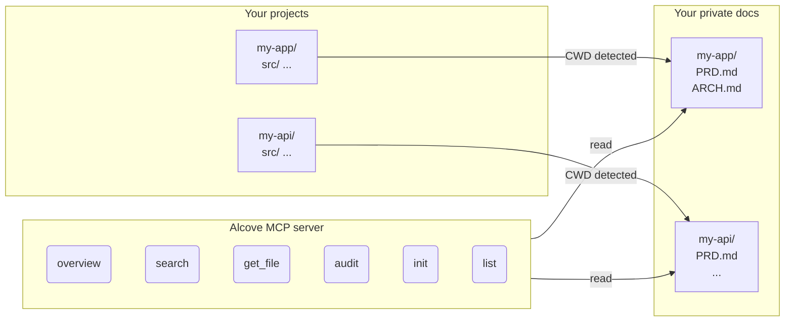

<p align="center">
  
</p>

<p align="center">A quiet place for your project docs.</p>

<p align="center">
  <a href="README.md">English</a> ·
  <a href="docs/README.ko.md">한국어</a> ·
  <a href="docs/README.ja.md">日本語</a> ·
  <a href="docs/README.zh-CN.md">简体中文</a> ·
  <a href="docs/README.es.md">Español</a> ·
  <a href="docs/README.hi.md">हिन्दी</a> ·
  <a href="docs/README.pt-BR.md">Português</a> ·
  <a href="docs/README.de.md">Deutsch</a> ·
  <a href="docs/README.fr.md">Français</a> ·
  <a href="docs/README.ru.md">Русский</a>
</p>

<p align="center">
  <a href="https://crates.io/crates/alcove"></a>
  <a href="https://crates.io/crates/alcove"></a>
  <a href="LICENSE"></a>
  <a href="https://buymeacoffee.com/epicsaga"></a>
</p>

Alcove is an MCP server that gives AI coding agents scoped, read-only access to your private project documentation — without leaking it into public repos.

## The problem

You have internal docs — PRDs, architecture decisions, deployment runbooks, secrets maps — that shouldn't live in your GitHub repo. But your AI agent can't help you if it can't read them.

Alcove sits between your private docs and your AI agents. It auto-detects which project you're working on from your terminal's CWD, and serves only that project's docs through the MCP protocol.

```
~/projects/my-app $ claude "how is auth implemented?"

  → Alcove detects project: my-app
  → Reads ~/documents/my-app/ARCHITECTURE.md
  → Agent answers with actual project context
```

## What it does

- **Auto-detects your project** from CWD — no config per project
- **Scoped access** — each project only sees its own docs
- **Private by design** — docs stay in your local documents repo, never exposed
- **Cross-repo audit** — finds internal docs accidentally pushed to GitHub, suggests fixes
- **Works with 8+ agents** — Claude Code, Cursor, Claude Desktop, Cline, OpenCode, Codex, Antigravity, Gemini CLI

## Quick start

```bash
cargo install alcove
alcove setup
```

That's it. `setup` walks you through everything interactively:

1. Where your docs live
2. Which document categories to track
3. Preferred diagram format
4. Which AI agents to configure (MCP + skill files)

Re-run `alcove setup` anytime to change settings. It remembers your previous choices.

## Install from source

```bash
git clone https://github.com/epicsagas/alcove.git
cd alcove
make install
```

## How it works



Your docs are organized in a separate directory (`DOCS_ROOT`). Alcove reads from there and serves it to your AI agent over MCP's stdio protocol. Your agent calls tools like `get_doc_file("PRD.md")` and gets project-specific answers.

## Document classification

Alcove classifies docs into three tiers:

| Classification | Where it lives | Examples |
|---------------|----------------|----------|
| **doc-repo-required** | Alcove (private) | PRD, Architecture, Decisions, Conventions |
| **doc-repo-supplementary** | Alcove (private) | Deployment, Onboarding, Testing, Runbook |
| **project-repo** | Your GitHub repo (public) | README, CHANGELOG, CONTRIBUTING |

The `audit` tool checks both locations and suggests actions — like generating a public README from your private PRD, or pulling misplaced reports back into alcove.

## MCP Tools

| Tool | What it does |
|------|-------------|
| `get_project_docs_overview` | List all docs with classification and sizes |
| `search_project_docs` | Keyword search across all project docs |
| `get_doc_file` | Read a specific doc by path |
| `list_projects` | Show all projects in your docs repo |
| `audit_project` | Cross-repo audit with suggested actions |
| `init_project` | Scaffold docs for a new project from template |

## CLI

```
alcove              Start MCP server (agents call this)
alcove setup        Interactive setup — re-run anytime to reconfigure
alcove uninstall    Remove skills, config, and legacy files
```

## Configuration

Config lives at `~/.config/alcove/config.toml`:

```toml
docs_root = "/Users/you/documents"

[core]
files = ["PRD.md", "ARCHITECTURE.md", "PROGRESS.md", "DECISIONS.md", "CONVENTIONS.md", "SECRETS_MAP.md", "DEBT.md"]

[team]
files = ["ENV_SETUP.md", "ONBOARDING.md", "DEPLOYMENT.md", "TESTING.md", ...]

[public]
files = ["README.md", "CHANGELOG.md", "CONTRIBUTING.md", "SECURITY.md", ...]

[diagram]
format = "mermaid"
```

All of this is set interactively via `alcove setup`. You can also edit the file directly.

## Update

```bash
cargo install alcove
```

## Uninstall

```bash
alcove uninstall          # remove skills & config
cargo uninstall alcove    # remove binary
```

## Supported agents

| Agent | MCP | Skill |
|-------|-----|-------|
| Claude Code | `~/.claude.json` | `~/.claude/skills/alcove/` |
| Cursor | `~/.cursor/mcp.json` | `~/.cursor/skills/alcove/` |
| Claude Desktop | platform config | — |
| Cline (VS Code) | VS Code globalStorage | — |
| OpenCode | `~/.config/opencode/opencode.json` | `~/.opencode/skills/alcove/` |
| Codex CLI | `~/.codex/config.toml` | — |
| Antigravity | `~/.antigravity/settings.json` | — |
| Gemini CLI | `~/.gemini/settings.json` | `~/.gemini/skills/alcove/` |

## Supported languages

The CLI automatically detects your system locale. You can also override it with the `ALCOVE_LANG` environment variable.

| Language | Code |
|----------|------|
| English | `en` |
| 한국어 | `ko` |
| 简体中文 | `zh-CN` |
| 日本語 | `ja` |
| Español | `es` |
| हिन्दी | `hi` |
| Português (Brasil) | `pt-BR` |
| Deutsch | `de` |
| Français | `fr` |
| Русский | `ru` |

```bash
# Override language
ALCOVE_LANG=ko alcove setup
```

## License

Apache-2.0
