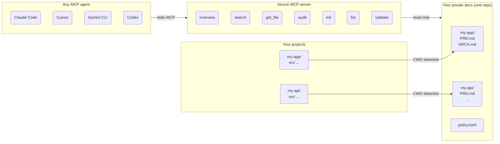

<p align="center">
  
</p>

<p align="center">A quiet place for your project docs.</p>

<p align="center">
  <a href="README.md">English</a> ·
  <a href="docs/README.ko.md">한국어</a> ·
  <a href="docs/README.ja.md">日本語</a> ·
  <a href="docs/README.zh-CN.md">简体中文</a> ·
  <a href="docs/README.es.md">Español</a> ·
  <a href="docs/README.hi.md">हिन्दी</a> ·
  <a href="docs/README.pt-BR.md">Português</a> ·
  <a href="docs/README.de.md">Deutsch</a> ·
  <a href="docs/README.fr.md">Français</a> ·
  <a href="docs/README.ru.md">Русский</a>
</p>

<p align="center">
  <a href="https://crates.io/crates/alcove"></a>
  <a href="https://crates.io/crates/alcove"></a>
  <a href="LICENSE"></a>
  <a href="https://buymeacoffee.com/epicsaga"></a>
</p>

Alcove lets any AI coding agent read your private project docs — without leaking them into public repos.

Keep PRDs, architecture decisions, secrets maps, and internal runbooks in one place. Every MCP-compatible agent gets the same access, across every project, with zero per-project config.

## The problem

You have internal docs that shouldn't live in your public GitHub repo. But your AI agent can't help you properly if it can't read them — it invents requirements and ignores constraints you already documented.

Now multiply that across several projects and several agents. Each has different config. Every time you switch, you lose context. And there's no standard way to organize or validate any of it.

## How Alcove solves this

Alcove keeps all your private docs in **one shared repository**, organized by project. Any MCP-compatible agent accesses them the same way — whether you're in Claude Code, Cursor, Gemini CLI, or Codex.

```
~/projects/my-app $ claude "how is auth implemented?"

  → Alcove detects project: my-app
  → Reads ~/documents/my-app/ARCHITECTURE.md
  → Agent answers with actual project context
```

```
~/projects/my-api $ codex "review the API design"

  → Alcove detects project: my-api
  → Same doc structure, same access pattern
  → Different project, same workflow
```

**Switch agents anytime. Switch projects anytime. The document layer stays standardized.**

## What it does

- **One doc-repo, multiple projects** — private docs organized by project, managed in a single place
- **One setup, any agent** — configure once, every MCP-compatible agent gets the same access
- **Auto-detects your project** from CWD — no per-project config needed
- **Scoped access** — each project only sees its own docs
- **Private docs stay private** — sensitive docs (secrets map, internal decisions, tech debt) never touch your public repo
- **Standardized doc structure** — `policy.toml` enforces consistent docs across all projects and teams
- **Cross-repo audit** — finds internal docs misplaced in your project repo, suggests fixes
- **Document validation** — checks for missing files, unfilled templates, required sections
- **Works with 8+ agents** — Claude Code, Cursor, Claude Desktop, Cline, OpenCode, Codex, Antigravity, Gemini CLI

## Why Alcove

| Without Alcove | With Alcove |
|----------------|-------------|
| Internal docs scattered across Notion, Google Docs, local files | One doc-repo, structured by project |
| Each AI agent configured separately for doc access | One setup, all agents share the same access |
| Switching projects means losing doc context | CWD auto-detection, instant project switch |
| Sensitive docs sitting in project repos or scattered locally | Private docs physically separated from project repos |
| Doc structure differs per project and team member | `policy.toml` enforces standards across all projects |
| No way to check if docs are complete | `validate` catches missing files, empty templates, missing sections |

## Quick start

```bash
cargo install alcove
alcove setup
```

That's it. `setup` walks you through everything interactively:

1. Where your docs live
2. Which document categories to track
3. Preferred diagram format
4. Which AI agents to configure (MCP + skill files)

Re-run `alcove setup` anytime to change settings. It remembers your previous choices.

## Install from source

```bash
git clone https://github.com/epicsagas/alcove.git
cd alcove
make install
```

## How it works



Your docs are organized in a separate directory (`DOCS_ROOT`), one folder per project. Alcove reads from there and serves it to any MCP-compatible AI agent over stdio. Your agent calls tools like `get_doc_file("PRD.md")` and gets project-specific answers — regardless of which agent you're using.

## Document classification

Alcove classifies docs into tiers:

| Classification | Where it lives | Examples |
|---------------|----------------|----------|
| **doc-repo-required** | Alcove (private) | PRD, Architecture, Decisions, Conventions |
| **doc-repo-supplementary** | Alcove (private) | Deployment, Onboarding, Testing, Runbook |
| **reference** | Alcove `reports/` folder | Audit reports, benchmarks, analysis |
| **project-repo** | Your GitHub repo (public) | README, CHANGELOG, CONTRIBUTING |

The `audit` tool scans both your doc-repo and local project directory, then suggests actions — like generating a public README from your private PRD, or pulling misplaced reports back into alcove.

## MCP Tools

| Tool | What it does |
|------|-------------|
| `get_project_docs_overview` | List all docs with classification and sizes |
| `search_project_docs` | Keyword search across doc-repo and project repo |
| `get_doc_file` | Read a specific doc by path (supports `offset`/`limit` for large files) |
| `list_projects` | Show all projects in your docs repo |
| `audit_project` | Cross-repo audit — scans doc-repo and local project repo, suggests actions |
| `init_project` | Scaffold docs for a new project (internal + external docs, selective file creation) |
| `validate_docs` | Validate docs against team policy (`policy.toml`) |

## CLI

```
alcove              Start MCP server (agents call this)
alcove setup        Interactive setup — re-run anytime to reconfigure
alcove validate     Validate docs against policy (--format json, --exit-code)
alcove uninstall    Remove skills, config, and legacy files
```

## Project detection

By default, Alcove detects the current project from your terminal's working directory (CWD). You can override this with the `MCP_PROJECT_NAME` environment variable:

```bash
MCP_PROJECT_NAME=my-api alcove
```

This is useful when your CWD doesn't match a project name in your docs repo.

## Document policy

Define team-wide documentation standards with `policy.toml` in your docs repo:

```toml
[policy]
enforce = "strict"    # strict | warn

[[policy.required]]
name = "PRD.md"
aliases = ["prd.md", "product-requirements.md"]

[[policy.required]]
name = "ARCHITECTURE.md"

  [[policy.required.sections]]
  heading = "## Overview"
  required = true

  [[policy.required.sections]]
  heading = "## Components"
  required = true
  min_items = 2
```

Policy files are resolved with priority: **project** (`<project>/.alcove/policy.toml`) > **team** (`DOCS_ROOT/.alcove/policy.toml`) > **built-in default** (from your `config.toml` core files). This ensures consistent doc quality across all your projects while allowing per-project overrides.

## Configuration

Config lives at `~/.config/alcove/config.toml`:

```toml
docs_root = "/Users/you/documents"

[core]
files = ["PRD.md", "ARCHITECTURE.md", "PROGRESS.md", "DECISIONS.md", "CONVENTIONS.md", "SECRETS_MAP.md", "DEBT.md"]

[team]
files = ["ENV_SETUP.md", "ONBOARDING.md", "DEPLOYMENT.md", "TESTING.md", ...]

[public]
files = ["README.md", "CHANGELOG.md", "CONTRIBUTING.md", "SECURITY.md", ...]

[diagram]
format = "mermaid"
```

All of this is set interactively via `alcove setup`. You can also edit the file directly.

## Supported agents

| Agent | MCP | Skill |
|-------|-----|-------|
| Claude Code | `~/.claude.json` | `~/.claude/skills/alcove/` |
| Cursor | `~/.cursor/mcp.json` | `~/.cursor/skills/alcove/` |
| Claude Desktop | platform config | — |
| Cline (VS Code) | VS Code globalStorage | — |
| OpenCode | `~/.config/opencode/opencode.json` | `~/.opencode/skills/alcove/` |
| Codex CLI | `~/.codex/config.toml` | — |
| Antigravity | `~/.antigravity/settings.json` | — |
| Gemini CLI | `~/.gemini/settings.json` | `~/.gemini/skills/alcove/` |

## Supported languages

The CLI automatically detects your system locale. You can also override it with the `ALCOVE_LANG` environment variable.

| Language | Code |
|----------|------|
| English | `en` |
| 한국어 | `ko` |
| 简体中文 | `zh-CN` |
| 日本語 | `ja` |
| Español | `es` |
| हिन्दी | `hi` |
| Português (Brasil) | `pt-BR` |
| Deutsch | `de` |
| Français | `fr` |
| Русский | `ru` |

```bash
# Override language
ALCOVE_LANG=ko alcove setup
```

## Update

```bash
cargo install alcove
```

## Uninstall

```bash
alcove uninstall          # remove skills & config
cargo uninstall alcove    # remove binary
```

## License

Apache-2.0
