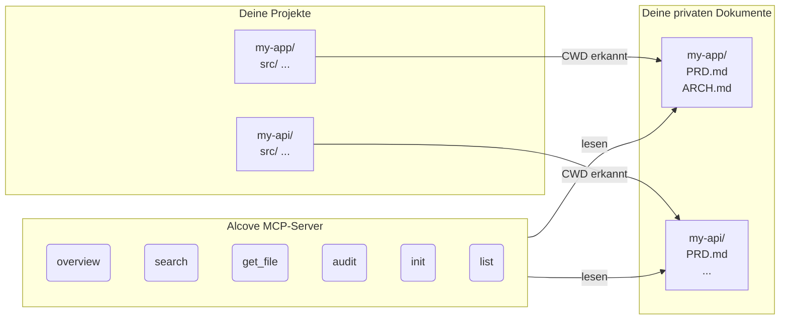

<p align="center">
  
</p>

<p align="center">Ein ruhiger Ort für deine Projektdokumentation.</p>

<p align="center">
  <a href="../README.md">English</a> ·
  <a href="README.ko.md">한국어</a> ·
  <a href="README.ja.md">日本語</a> ·
  <a href="README.zh-CN.md">简体中文</a> ·
  <a href="README.es.md">Español</a> ·
  <a href="README.hi.md">हिन्दी</a> ·
  <a href="README.pt-BR.md">Português</a> ·
  <a href="README.de.md">Deutsch</a> ·
  <a href="README.fr.md">Français</a> ·
  <a href="README.ru.md">Русский</a>
</p>

<p align="center">
  <a href="https://crates.io/crates/alcove"></a>
  <a href="https://crates.io/crates/alcove"></a>
  <a href="../LICENSE"></a>
  <a href="https://buymeacoffee.com/epicsaga"></a>
</p>

Alcove ist ein MCP-Server, der KI-Codierungs-Agenten einen bereichsbezogenen, schreibgeschützten Zugriff auf deine private Projektdokumentation ermöglicht — ohne sie in öffentliche Repositories zu leaken.

## Das Problem

Du hast interne Dokumente — PRDs, Architekturentscheidungen, Deployment-Runbooks, Secret-Maps — die nicht in deinem GitHub-Repository sein sollten. Aber dein KI-Agent kann dir nicht helfen, wenn er sie nicht lesen kann.

Alcove sitzt zwischen deinen privaten Dokumenten und deinen KI-Agenten. Es erkennt automatisch anhand des CWD deines Terminals, an welchem Projekt du arbeitest, und stellt nur die Dokumente dieses Projekts über das MCP-Protokoll bereit.

```
~/projects/my-app $ claude "Wie ist die Authentifizierung implementiert?"

  → Alcove erkennt Projekt: my-app
  → Liest ~/documents/my-app/ARCHITECTURE.md
  → Agent antwortet mit echtem Projektkontext
```

## Hauptfunktionen

- **Automatische Projekterkennung** — CWD-basiert, keine Konfiguration pro Projekt
- **Bereichsbezogener Zugriff** — jedes Projekt sieht nur seine eigenen Dokumente
- **Privacy by Design** — Dokumente bleiben in deinem lokalen Docs-Repository, werden nie exponiert
- **Cross-Repo-Audit** — findet versehentlich auf GitHub gepushte interne Dokumente und schlägt Korrekturen vor
- **Funktioniert mit 8+ Agenten** — Claude Code, Cursor, Claude Desktop, Cline, OpenCode, Codex, Antigravity, Gemini CLI

## Schnellstart

```bash
cargo install alcove
alcove setup
```

Das war's. `setup` führt dich interaktiv durch alles:

1. Wo deine Dokumente liegen
2. Welche Dokumentkategorien verfolgt werden sollen
3. Bevorzugtes Diagrammformat
4. Welche KI-Agenten konfiguriert werden sollen (MCP + Skill-Dateien)

Führe `alcove setup` jederzeit erneut aus, um Einstellungen zu ändern. Es merkt sich deine vorherigen Auswahlen.

## Aus Quellcode installieren

```bash
git clone https://github.com/epicsagas/alcove.git
cd alcove
make install
```

## Funktionsweise



Deine Dokumente sind in einem separaten Verzeichnis (`DOCS_ROOT`) organisiert. Alcove liest von dort und stellt sie deinem KI-Agenten über das stdio-Protokoll von MCP bereit. Dein Agent ruft Tools wie `get_doc_file("PRD.md")` auf und erhält projektspezifische Antworten.

## Dokumentklassifizierung

Alcove klassifiziert Dokumente in drei Stufen:

| Klassifizierung | Ort | Beispiele |
|----------------|-----|-----------|
| **doc-repo-required** | Alcove (privat) | PRD, Architecture, Decisions, Conventions |
| **doc-repo-supplementary** | Alcove (privat) | Deployment, Onboarding, Testing, Runbook |
| **project-repo** | GitHub-Repository (öffentlich) | README, CHANGELOG, CONTRIBUTING |

Das `audit`-Tool prüft beide Orte und schlägt Aktionen vor — wie das Generieren einer öffentlichen README aus deinem privaten PRD oder das Zurückholen fehlplatzierter Berichte nach Alcove.

## MCP-Tools

| Tool | Funktion |
|------|----------|
| `get_project_docs_overview` | Alle Dokumente mit Klassifizierung und Größen auflisten |
| `search_project_docs` | Schlüsselwortsuche über alle Projektdokumente |
| `get_doc_file` | Ein bestimmtes Dokument nach Pfad lesen |
| `list_projects` | Alle Projekte im Docs-Repository anzeigen |
| `audit_project` | Cross-Repo-Audit mit vorgeschlagenen Aktionen |
| `init_project` | Dokumente für ein neues Projekt aus Vorlage erstellen |

## CLI

```
alcove              MCP-Server starten (Agenten rufen das auf)
alcove setup        Interaktives Setup — jederzeit erneut ausführen
alcove uninstall    Skills, Konfiguration und Legacy-Dateien entfernen
```

## Konfiguration

Die Konfiguration liegt unter `~/.config/alcove/config.toml`:

```toml
docs_root = "/Users/you/documents"

[core]
files = ["PRD.md", "ARCHITECTURE.md", "PROGRESS.md", "DECISIONS.md", "CONVENTIONS.md", "SECRETS_MAP.md", "DEBT.md"]

[team]
files = ["ENV_SETUP.md", "ONBOARDING.md", "DEPLOYMENT.md", "TESTING.md", ...]

[public]
files = ["README.md", "CHANGELOG.md", "CONTRIBUTING.md", "SECURITY.md", ...]

[diagram]
format = "mermaid"
```

Alles wird interaktiv über `alcove setup` eingestellt. Du kannst die Datei auch direkt bearbeiten.

## Aktualisieren

```bash
cargo install alcove
```

## Deinstallieren

```bash
alcove uninstall          # Skills & Konfiguration entfernen
cargo uninstall alcove    # Binary entfernen
```

## Unterstützte Agenten

| Agent | MCP | Skill |
|-------|-----|-------|
| Claude Code | `~/.claude.json` | `~/.claude/skills/alcove/` |
| Cursor | `~/.cursor/mcp.json` | `~/.cursor/skills/alcove/` |
| Claude Desktop | Plattformkonfiguration | — |
| Cline (VS Code) | VS Code globalStorage | — |
| OpenCode | `~/.config/opencode/opencode.json` | `~/.opencode/skills/alcove/` |
| Codex CLI | `~/.codex/config.toml` | — |
| Antigravity | `~/.antigravity/settings.json` | — |
| Gemini CLI | `~/.gemini/settings.json` | `~/.gemini/skills/alcove/` |

## Unterstützte Sprachen

Das CLI erkennt automatisch deine Systemsprache. Du kannst sie auch mit der Umgebungsvariable `ALCOVE_LANG` überschreiben.

| Sprache | Code |
|---------|------|
| English | `en` |
| 한국어 | `ko` |
| 简体中文 | `zh-CN` |
| 日本語 | `ja` |
| Español | `es` |
| हिन्दी | `hi` |
| Português (Brasil) | `pt-BR` |
| Deutsch | `de` |
| Français | `fr` |
| Русский | `ru` |

```bash
# Sprache überschreiben
ALCOVE_LANG=de alcove setup
```

## Lizenz

Apache-2.0
