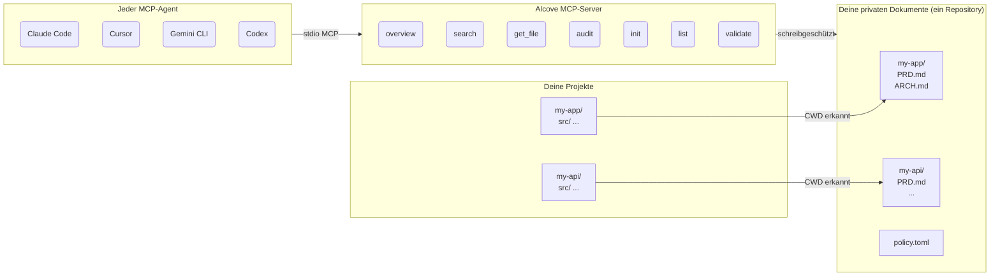

<p align="center">
  
</p>

<p align="center">Ein ruhiger Ort für deine Projektdokumentation.</p>

<p align="center">
  <a href="../README.md">English</a> ·
  <a href="README.ko.md">한국어</a> ·
  <a href="README.ja.md">日本語</a> ·
  <a href="README.zh-CN.md">简体中文</a> ·
  <a href="README.es.md">Español</a> ·
  <a href="README.hi.md">हिन्दी</a> ·
  <a href="README.pt-BR.md">Português</a> ·
  <a href="README.de.md">Deutsch</a> ·
  <a href="README.fr.md">Français</a> ·
  <a href="README.ru.md">Русский</a>
</p>

<p align="center">
  <a href="https://crates.io/crates/alcove"></a>
  <a href="https://crates.io/crates/alcove"></a>
  <a href="../LICENSE"></a>
  <a href="https://buymeacoffee.com/epicsaga"></a>
</p>

Alcove ist ein MCP-Server, der KI-Codierungs-Agenten einen bereichsbezogenen, schreibgeschützten Zugriff auf deine private Projektdokumentation ermöglicht — ohne sie in öffentliche Repositories zu leaken.

## Das Problem

Du entwickelst mehrere Projekte gleichzeitig und wechselst zwischen verschiedenen KI-Codierungs-Agenten. Jedes Projekt hat interne Dokumente — PRDs, Architekturentscheidungen, Deployment-Runbooks, Secret-Maps — die nicht in deinem öffentlichen GitHub-Repository sein sollten.

Aber dein KI-Agent kann dir nicht richtig helfen, wenn er sie nicht lesen kann. Er erfindet Anforderungen. Er ignoriert Einschränkungen, die du bereits dokumentiert hast. Und jedes Mal, wenn du den Agenten oder das Projekt wechselst, geht der Kontext verloren.

## Wie Alcove das löst

Alcove speichert alle deine privaten Dokumente in **einem gemeinsamen Repository**, organisiert nach Projekt. Jeder MCP-kompatible Agent greift auf dieselbe Weise darauf zu — egal ob du Claude Code, Cursor, Gemini CLI oder Codex verwendest.

```
~/projects/my-app $ claude "Wie ist die Authentifizierung implementiert?"

  → Alcove erkennt Projekt: my-app
  → Liest ~/documents/my-app/ARCHITECTURE.md
  → Agent antwortet mit echtem Projektkontext
```

```
~/projects/my-api $ codex "Überprüfe das API-Design"

  → Alcove erkennt Projekt: my-api
  → Gleiche Dokumentstruktur, gleiches Zugriffsmuster
  → Anderes Projekt, gleicher Workflow
```

**Wechsle den Agenten jederzeit. Wechsle das Projekt jederzeit. Die Dokumentschicht bleibt standardisiert.**

## Hauptfunktionen

- **Ein Docs-Repository, mehrere Projekte** — private Dokumente nach Projekt organisiert, an einem Ort verwaltet
- **Einmal einrichten, jeder Agent** — einmal konfigurieren, jeder MCP-kompatible Agent erhält denselben Zugriff
- **Automatische Projekterkennung** vom CWD — keine Konfiguration pro Projekt nötig
- **Bereichsbezogener Zugriff** — jedes Projekt sieht nur seine eigenen Dokumente
- **Private Dokumente bleiben privat** — sensible Dokumente (Secret-Map, interne Entscheidungen, technische Schulden) berühren nie dein öffentliches Repository
- **Standardisierte Dokumentstruktur** — `policy.toml` erzwingt konsistente Dokumente über alle Projekte und Teams
- **Cross-Repo-Audit** — findet versehentlich auf GitHub gepushte interne Dokumente und schlägt Korrekturen vor
- **Dokumentvalidierung** — prüft auf fehlende Dateien, unausgefüllte Templates, erforderliche Abschnitte
- **Funktioniert mit 8+ Agenten** — Claude Code, Cursor, Claude Desktop, Cline, OpenCode, Codex, Antigravity, Gemini CLI

## Warum Alcove

| Ohne Alcove | Mit Alcove |
|-------------|------------|
| Interne Dokumente verstreut über Notion, Google Docs, lokale Dateien | Ein Docs-Repository, nach Projekt strukturiert |
| Jeder KI-Agent separat für Dokumentzugriff konfiguriert | Einmal einrichten, alle Agenten teilen denselben Zugriff |
| Projektwechsel bedeutet Verlust des Dokumentkontexts | CWD-Autoerkennung, sofortiger Projektwechsel |
| Sensible Dokumente riskieren Leak in öffentliche Repos | Private Dokumente physisch von Projekt-Repos getrennt |
| Dokumentstruktur variiert pro Projekt und Teammitglied | `policy.toml` erzwingt Standards über alle Projekte |
| Keine Möglichkeit zu prüfen, ob Dokumente vollständig sind | `validate` erkennt fehlende Dateien, leere Templates, fehlende Abschnitte |

## Schnellstart

```bash
cargo install alcove
alcove setup
```

Das war's. `setup` führt dich interaktiv durch alles:

1. Wo deine Dokumente liegen
2. Welche Dokumentkategorien verfolgt werden sollen
3. Bevorzugtes Diagrammformat
4. Welche KI-Agenten konfiguriert werden sollen (MCP + Skill-Dateien)

Führe `alcove setup` jederzeit erneut aus, um Einstellungen zu ändern. Es merkt sich deine vorherigen Auswahlen.

## Aus Quellcode installieren

```bash
git clone https://github.com/epicsagas/alcove.git
cd alcove
make install
```

## Funktionsweise



Deine Dokumente sind in einem separaten Verzeichnis (`DOCS_ROOT`) organisiert, ein Ordner pro Projekt. Alcove liest von dort und stellt sie jedem MCP-kompatiblen KI-Agenten über stdio bereit. Dein Agent ruft Tools wie `get_doc_file("PRD.md")` auf und erhält projektspezifische Antworten — unabhängig davon, welchen Agenten du verwendest.

## Dokumentklassifizierung

Alcove klassifiziert Dokumente in drei Stufen:

| Klassifizierung | Ort | Beispiele |
|----------------|-----|-----------|
| **doc-repo-required** | Alcove (privat) | PRD, Architecture, Decisions, Conventions |
| **doc-repo-supplementary** | Alcove (privat) | Deployment, Onboarding, Testing, Runbook |
| **project-repo** | GitHub-Repository (öffentlich) | README, CHANGELOG, CONTRIBUTING |

Das `audit`-Tool prüft beide Orte und schlägt Aktionen vor — wie das Generieren einer öffentlichen README aus deinem privaten PRD oder das Zurückholen fehlplatzierter Berichte nach Alcove.

## MCP-Tools

| Tool | Funktion |
|------|----------|
| `get_project_docs_overview` | Alle Dokumente mit Klassifizierung und Größen auflisten |
| `search_project_docs` | Schlüsselwortsuche über alle Projektdokumente |
| `get_doc_file` | Ein bestimmtes Dokument nach Pfad lesen |
| `list_projects` | Alle Projekte im Docs-Repository anzeigen |
| `audit_project` | Cross-Repo-Audit mit vorgeschlagenen Aktionen |
| `init_project` | Dokumente für ein neues Projekt aus Vorlage erstellen |
| `validate_docs` | Dokumente gegen Team-Policy (`policy.toml`) validieren |

## CLI

```
alcove              MCP-Server starten (Agenten rufen das auf)
alcove setup        Interaktives Setup — jederzeit erneut ausführen
alcove validate     Dokumente gegen Policy validieren (--format json, --exit-code)
alcove uninstall    Skills, Konfiguration und Legacy-Dateien entfernen
```

## Dokumentrichtlinie

Definiere teamweite Dokumentationsstandards mit `policy.toml` in deinem Docs-Repository:

```toml
[policy]
enforce = "strict"    # strict | warn

[[policy.required]]
name = "PRD.md"
aliases = ["prd.md", "product-requirements.md"]

[[policy.required]]
name = "ARCHITECTURE.md"

  [[policy.required.sections]]
  heading = "## Overview"
  required = true

  [[policy.required.sections]]
  heading = "## Components"
  required = true
  min_items = 2
```

Policy-Dateien werden mit Priorität aufgelöst: **Projekt** > **Team** > **Standard**. Dies stellt konsistente Dokumentqualität über alle Projekte sicher und erlaubt projektspezifische Überschreibungen.

## Konfiguration

Die Konfiguration liegt unter `~/.config/alcove/config.toml`:

```toml
docs_root = "/Users/you/documents"

[core]
files = ["PRD.md", "ARCHITECTURE.md", "PROGRESS.md", "DECISIONS.md", "CONVENTIONS.md", "SECRETS_MAP.md", "DEBT.md"]

[team]
files = ["ENV_SETUP.md", "ONBOARDING.md", "DEPLOYMENT.md", "TESTING.md", ...]

[public]
files = ["README.md", "CHANGELOG.md", "CONTRIBUTING.md", "SECURITY.md", ...]

[diagram]
format = "mermaid"
```

Alles wird interaktiv über `alcove setup` eingestellt. Du kannst die Datei auch direkt bearbeiten.

## Unterstützte Agenten

| Agent | MCP | Skill |
|-------|-----|-------|
| Claude Code | `~/.claude.json` | `~/.claude/skills/alcove/` |
| Cursor | `~/.cursor/mcp.json` | `~/.cursor/skills/alcove/` |
| Claude Desktop | Plattformkonfiguration | — |
| Cline (VS Code) | VS Code globalStorage | — |
| OpenCode | `~/.config/opencode/opencode.json` | `~/.opencode/skills/alcove/` |
| Codex CLI | `~/.codex/config.toml` | — |
| Antigravity | `~/.antigravity/settings.json` | — |
| Gemini CLI | `~/.gemini/settings.json` | `~/.gemini/skills/alcove/` |

## Unterstützte Sprachen

Das CLI erkennt automatisch deine Systemsprache. Du kannst sie auch mit der Umgebungsvariable `ALCOVE_LANG` überschreiben.

| Sprache | Code |
|---------|------|
| English | `en` |
| 한국어 | `ko` |
| 简体中文 | `zh-CN` |
| 日本語 | `ja` |
| Español | `es` |
| हिन्दी | `hi` |
| Português (Brasil) | `pt-BR` |
| Deutsch | `de` |
| Français | `fr` |
| Русский | `ru` |

```bash
# Sprache überschreiben
ALCOVE_LANG=de alcove setup
```

## Aktualisieren

```bash
cargo install alcove
```

## Deinstallieren

```bash
alcove uninstall          # Skills & Konfiguration entfernen
cargo uninstall alcove    # Binary entfernen
```

## Lizenz

Apache-2.0
