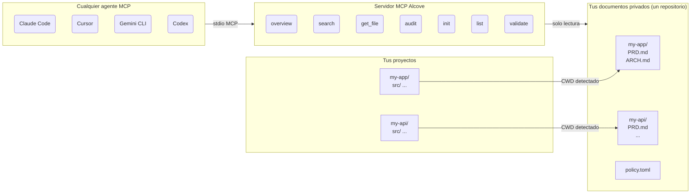

<p align="center">
  
</p>

<p align="center">Un lugar tranquilo para la documentacion de tu proyecto.</p>

<p align="center">
  <a href="../README.md">English</a> ·
  <a href="README.ko.md">한국어</a> ·
  <a href="README.ja.md">日本語</a> ·
  <a href="README.zh-CN.md">简体中文</a> ·
  <a href="README.es.md">Español</a> ·
  <a href="README.hi.md">हिन्दी</a> ·
  <a href="README.pt-BR.md">Português</a> ·
  <a href="README.de.md">Deutsch</a> ·
  <a href="README.fr.md">Français</a> ·
  <a href="README.ru.md">Русский</a>
</p>

<p align="center">
  <a href="https://crates.io/crates/alcove"></a>
  <a href="https://crates.io/crates/alcove"></a>
  <a href="../LICENSE"></a>
  <a href="https://buymeacoffee.com/epicsaga"></a>
</p>

Alcove es un servidor MCP que ofrece a los agentes de IA acceso de solo lectura y con alcance limitado a la documentacion privada de tu proyecto, sin exponerla en repositorios publicos.

## El problema

Estas desarrollando varios proyectos simultaneamente, alternando entre diferentes agentes de IA. Cada proyecto tiene documentacion interna -- PRDs, decisiones de arquitectura, guias de despliegue, mapas de secretos -- que no deberia estar en tu repositorio publico de GitHub.

Pero tu agente de IA no puede ayudarte correctamente si no puede leerlos. Inventa requisitos. Ignora restricciones que ya documentaste. Y cada vez que cambias de agente o de proyecto, pierdes el contexto.

## Como Alcove resuelve esto

Alcove mantiene toda tu documentacion privada en **un unico repositorio compartido**, organizado por proyecto. Cualquier agente compatible con MCP accede de la misma manera, ya sea que estes en Claude Code, Cursor, Gemini CLI o Codex.

```
~/projects/my-app $ claude "como esta implementada la autenticacion?"

  → Alcove detecta el proyecto: my-app
  → Lee ~/documents/my-app/ARCHITECTURE.md
  → El agente responde con el contexto real del proyecto
```

```
~/projects/my-api $ codex "revisa el diseno de la API"

  → Alcove detecta el proyecto: my-api
  → Misma estructura de documentos, mismo patron de acceso
  → Diferente proyecto, mismo flujo de trabajo
```

**Cambia de agente en cualquier momento. Cambia de proyecto en cualquier momento. La capa de documentacion permanece estandarizada.**

## Que hace

- **Un repositorio de documentos, multiples proyectos** -- documentos privados organizados por proyecto, gestionados en un solo lugar
- **Una configuracion, cualquier agente** -- configura una vez, cada agente compatible con MCP obtiene el mismo acceso
- **Detecta tu proyecto automaticamente** desde CWD -- no se necesita configuracion por proyecto
- **Acceso con alcance limitado** -- cada proyecto solo ve sus propios documentos
- **Los documentos privados permanecen privados** -- documentos sensibles (mapa de secretos, decisiones internas, deuda tecnica) nunca tocan tu repositorio publico
- **Estructura de documentos estandarizada** -- `policy.toml` impone documentacion consistente en todos los proyectos y equipos
- **Auditoria entre repositorios** -- detecta documentos internos publicados accidentalmente en GitHub y sugiere correcciones
- **Validacion de documentos** -- verifica archivos faltantes, plantillas sin completar, secciones requeridas
- **Funciona con mas de 8 agentes** -- Claude Code, Cursor, Claude Desktop, Cline, OpenCode, Codex, Antigravity, Gemini CLI

## Por que Alcove

| Sin Alcove | Con Alcove |
|------------|------------|
| Documentos internos dispersos en Notion, Google Docs, archivos locales | Un repositorio de documentos, estructurado por proyecto |
| Cada agente de IA configurado por separado para acceder a documentos | Una configuracion, todos los agentes comparten el mismo acceso |
| Cambiar de proyecto significa perder el contexto documental | Deteccion automatica por CWD, cambio instantaneo de proyecto |
| Documentos sensibles con riesgo de filtrarse en repositorios publicos | Documentos privados fisicamente separados de los repositorios del proyecto |
| La estructura de documentos varia por proyecto y miembro del equipo | `policy.toml` impone estandares en todos los proyectos |
| Sin forma de verificar si los documentos estan completos | `validate` detecta archivos faltantes, plantillas vacias, secciones ausentes |

## Inicio rapido

```bash
cargo install alcove
alcove setup
```

Eso es todo. `setup` te guia a traves de todo de forma interactiva:

1. Donde viven tus documentos
2. Que categorias de documentos rastrear
3. Formato preferido de diagramas
4. Que agentes de IA configurar (MCP + archivos de habilidades)

Ejecuta `alcove setup` en cualquier momento para cambiar la configuracion. Recuerda tus elecciones anteriores.

## Instalar desde el codigo fuente

```bash
git clone https://github.com/epicsagas/alcove.git
cd alcove
make install
```

## Como funciona



Tus documentos estan organizados en un directorio separado (`DOCS_ROOT`), una carpeta por proyecto. Alcove lee desde ahi y lo sirve a cualquier agente de IA compatible con MCP a traves de stdio. Tu agente llama a herramientas como `get_doc_file("PRD.md")` y obtiene respuestas especificas del proyecto, independientemente del agente que estes usando.

## Clasificacion de documentos

Alcove clasifica los documentos en tres niveles:

| Clasificacion | Donde se encuentra | Ejemplos |
|---------------|-------------------|----------|
| **doc-repo-required** | Alcove (privado) | PRD, Arquitectura, Decisiones, Convenciones |
| **doc-repo-supplementary** | Alcove (privado) | Despliegue, Incorporacion, Pruebas, Guia operativa |
| **project-repo** | Tu repositorio de GitHub (publico) | README, CHANGELOG, CONTRIBUTING |

La herramienta `audit` verifica ambas ubicaciones y sugiere acciones, como generar un README publico a partir de tu PRD privado, o mover informes mal ubicados de vuelta a Alcove.

## Herramientas MCP

| Herramienta | Que hace |
|-------------|----------|
| `get_project_docs_overview` | Lista todos los documentos con clasificacion y tamanos |
| `search_project_docs` | Busqueda por palabras clave en todos los documentos del proyecto |
| `get_doc_file` | Lee un documento especifico por ruta |
| `list_projects` | Muestra todos los proyectos en tu repositorio de documentos |
| `audit_project` | Auditoria entre repositorios con acciones sugeridas |
| `init_project` | Genera la estructura de documentos para un nuevo proyecto a partir de una plantilla |
| `validate_docs` | Valida documentos contra la politica del equipo (`policy.toml`) |

## CLI

```
alcove              Iniciar el servidor MCP (los agentes lo invocan)
alcove setup        Configuracion interactiva -- ejecuta en cualquier momento para reconfigurar
alcove validate     Validar documentos contra la politica (--format json, --exit-code)
alcove uninstall    Eliminar habilidades, configuracion y archivos heredados
```

## Politica de documentos

Define estandares de documentacion a nivel de equipo con `policy.toml` en tu repositorio de documentos:

```toml
[policy]
enforce = "strict"    # strict | warn

[[policy.required]]
name = "PRD.md"
aliases = ["prd.md", "product-requirements.md"]

[[policy.required]]
name = "ARCHITECTURE.md"

  [[policy.required.sections]]
  heading = "## Overview"
  required = true

  [[policy.required.sections]]
  heading = "## Components"
  required = true
  min_items = 2
```

Los archivos de politica se resuelven con prioridad: **proyecto** > **equipo** > **por defecto**. Esto asegura una calidad documental consistente en todos tus proyectos, permitiendo al mismo tiempo excepciones por proyecto.

## Configuracion

La configuracion se encuentra en `~/.config/alcove/config.toml`:

```toml
docs_root = "/Users/you/documents"

[core]
files = ["PRD.md", "ARCHITECTURE.md", "PROGRESS.md", "DECISIONS.md", "CONVENTIONS.md", "SECRETS_MAP.md", "DEBT.md"]

[team]
files = ["ENV_SETUP.md", "ONBOARDING.md", "DEPLOYMENT.md", "TESTING.md", ...]

[public]
files = ["README.md", "CHANGELOG.md", "CONTRIBUTING.md", "SECURITY.md", ...]

[diagram]
format = "mermaid"
```

Todo esto se configura de forma interactiva con `alcove setup`. Tambien puedes editar el archivo directamente.

## Agentes compatibles

| Agente | MCP | Habilidad |
|--------|-----|-----------|
| Claude Code | `~/.claude.json` | `~/.claude/skills/alcove/` |
| Cursor | `~/.cursor/mcp.json` | `~/.cursor/skills/alcove/` |
| Claude Desktop | configuracion de plataforma | -- |
| Cline (VS Code) | VS Code globalStorage | -- |
| OpenCode | `~/.config/opencode/opencode.json` | `~/.opencode/skills/alcove/` |
| Codex CLI | `~/.codex/config.toml` | -- |
| Antigravity | `~/.antigravity/settings.json` | -- |
| Gemini CLI | `~/.gemini/settings.json` | `~/.gemini/skills/alcove/` |

## Idiomas compatibles

La CLI detecta automaticamente la configuracion regional de tu sistema. Tambien puedes sobreescribirla con la variable de entorno `ALCOVE_LANG`.

| Idioma | Codigo |
|--------|--------|
| English | `en` |
| 한국어 | `ko` |
| 简体中文 | `zh-CN` |
| 日本語 | `ja` |
| Español | `es` |
| हिन्दी | `hi` |
| Português (Brasil) | `pt-BR` |
| Deutsch | `de` |
| Français | `fr` |
| Русский | `ru` |

```bash
# Sobreescribir idioma
ALCOVE_LANG=ko alcove setup
```

## Actualizar

```bash
cargo install alcove
```

## Desinstalar

```bash
alcove uninstall          # eliminar habilidades y configuracion
cargo uninstall alcove    # eliminar binario
```

## Licencia

Apache-2.0
