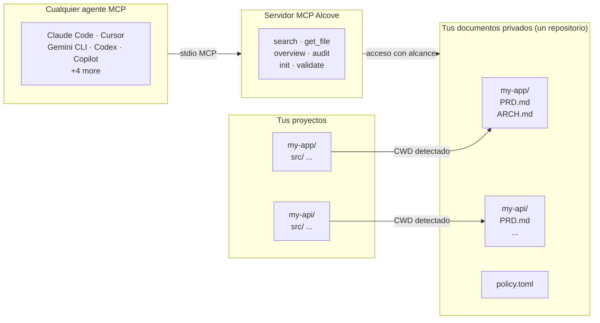

<p align="center">
  
</p>

<p align="center">Un lugar tranquilo para la documentacion de tu proyecto.</p>

<p align="center">
  <a href="../README.md">English</a> ·
  <a href="README.ko.md">한국어</a> ·
  <a href="README.ja.md">日本語</a> ·
  <a href="README.zh-CN.md">简体中文</a> ·
  <a href="README.es.md">Español</a> ·
  <a href="README.hi.md">हिन्दी</a> ·
  <a href="README.pt-BR.md">Português</a> ·
  <a href="README.de.md">Deutsch</a> ·
  <a href="README.fr.md">Français</a> ·
  <a href="README.ru.md">Русский</a>
</p>

<p align="center">
  <a href="https://crates.io/crates/alcove"></a>
  <a href="https://crates.io/crates/alcove"></a>
  <a href="../LICENSE"></a>
  <a href="https://buymeacoffee.com/epicsaga"></a>
</p>

Alcove permite que cualquier agente de codificacion con IA lea y gestione la documentacion privada de tu proyecto, sin exponerla en repositorios publicos.

Guarda PRDs, decisiones de arquitectura, mapas de secretos y runbooks internos en un solo lugar. Cada agente compatible con MCP obtiene las mismas herramientas, en todos los proyectos, sin configuracion por proyecto.

## El problema

Tienes documentos internos que no deberian estar en tu repositorio publico de GitHub. Pero tu agente de IA no puede ayudarte correctamente si no puede leerlos — inventa requisitos e ignora restricciones que ya documentaste.

Multiplica eso por varios proyectos y varios agentes. Cada uno tiene diferente configuracion. Cada vez que cambias, pierdes el contexto. Y no hay una forma estandar de organizar o validar nada.

## Como Alcove resuelve esto

Alcove mantiene toda tu documentacion privada en **un unico repositorio compartido**, organizado por proyecto. Cualquier agente compatible con MCP accede de la misma manera — ya sea Claude Code, Cursor, Gemini CLI o Codex.

```
~/projects/my-app $ claude "como esta implementada la autenticacion?"

  → Alcove detecta el proyecto: my-app
  → Lee ~/documents/my-app/ARCHITECTURE.md
  → El agente responde con el contexto real del proyecto
```

```
~/projects/my-api $ codex "revisa el diseno de la API"

  → Alcove detecta el proyecto: my-api
  → Misma estructura de documentos, mismo patron de acceso
  → Diferente proyecto, mismo flujo de trabajo
```

**Cambia de agente en cualquier momento. Cambia de proyecto en cualquier momento. La capa de documentacion permanece estandarizada.**

## Que hace

- **Un repositorio de documentos, multiples proyectos** — documentos privados organizados por proyecto, gestionados en un solo lugar
- **Una configuracion, cualquier agente** — configura una vez, cada agente compatible con MCP obtiene el mismo acceso
- **Detecta tu proyecto automaticamente** desde CWD — no se necesita configuracion por proyecto
- **Acceso con alcance limitado** — cada proyecto solo ve sus propios documentos
- **Busqueda inteligente** — busqueda BM25 con ranking e indexacion automatica; encuentra los documentos mas relevantes primero, recurre a grep cuando es necesario
- **Busqueda entre proyectos** — busca en todos los proyectos a la vez con `scope: "global"` — usalo como base de conocimiento personal
- **Los documentos privados permanecen privados** — documentos sensibles (mapa de secretos, decisiones internas, deuda tecnica) nunca tocan tu repositorio publico
- **Estructura de documentos estandarizada** — `policy.toml` impone documentacion consistente en todos los proyectos y equipos
- **Auditoria entre repositorios** — detecta documentos internos mal ubicados en tu repositorio de proyecto y sugiere correcciones
- **Validacion de documentos** — verifica archivos faltantes, plantillas sin completar, secciones requeridas
- **Funciona con mas de 9 agentes** — Claude Code, Cursor, Claude Desktop, Cline, OpenCode, Codex, Copilot, Antigravity, Gemini CLI

## Por que Alcove

| Sin Alcove | Con Alcove |
|------------|------------|
| Documentos internos dispersos en Notion, Google Docs, archivos locales | Un repositorio de documentos, estructurado por proyecto |
| Cada agente de IA configurado por separado para acceder a documentos | Una configuracion, todos los agentes comparten el mismo acceso |
| Cambiar de proyecto significa perder el contexto documental | Deteccion automatica por CWD, cambio instantaneo de proyecto |
| Las busquedas del agente devuelven lineas aleatorias | Busqueda BM25 con ranking — mejores coincidencias primero, indexacion automatica |
| "Buscar todas mis notas sobre autenticacion" — imposible | Busqueda global en todos los proyectos en una sola consulta |
| Documentos sensibles con riesgo de filtrarse en repositorios publicos | Documentos privados fisicamente separados de los repositorios del proyecto |
| La estructura de documentos varia por proyecto y miembro del equipo | `policy.toml` impone estandares en todos los proyectos |
| Sin forma de verificar si los documentos estan completos | `validate` detecta archivos faltantes, plantillas vacias, secciones ausentes |

## Inicio rapido

```bash
cargo install alcove
alcove setup
```

Eso es todo. `setup` te guia a traves de todo de forma interactiva:

1. Donde viven tus documentos
2. Que categorias de documentos rastrear
3. Formato preferido de diagramas
4. Que agentes de IA configurar (MCP + archivos de habilidades)

Ejecuta `alcove setup` en cualquier momento para cambiar la configuracion. Recuerda tus elecciones anteriores.

## Instalar desde el codigo fuente

```bash
git clone https://github.com/epicsagas/alcove.git
cd alcove
make install
```

## Como funciona



Tus documentos estan organizados en un directorio separado (`DOCS_ROOT`), una carpeta por proyecto. Alcove gestiona los documentos ahi y los sirve a cualquier agente de IA compatible con MCP a traves de stdio. Tu agente llama a herramientas como `get_doc_file("PRD.md")` y obtiene respuestas especificas del proyecto, independientemente del agente que estes usando.

## Clasificacion de documentos

Alcove clasifica los documentos en los siguientes niveles:

| Clasificacion | Donde se encuentra | Ejemplos |
|---------------|-------------------|----------|
| **doc-repo-required** | Alcove (privado) | PRD, Arquitectura, Decisiones, Convenciones |
| **doc-repo-supplementary** | Alcove (privado) | Despliegue, Incorporacion, Pruebas, Guia operativa |
| **reference** | Alcove carpeta `reports/` | Informes de auditoria, benchmarks, analisis |
| **project-repo** | Tu repositorio de GitHub (publico) | README, CHANGELOG, CONTRIBUTING |

La herramienta `audit` escanea tanto el repositorio de documentos como el directorio local del proyecto, y sugiere acciones — como generar un README publico a partir de tu PRD privado, o mover informes mal ubicados de vuelta a Alcove.

## Herramientas MCP

| Herramienta | Que hace |
|-------------|----------|
| `get_project_docs_overview` | Lista todos los documentos con clasificacion y tamanos |
| `search_project_docs` | Busqueda inteligente — selecciona automaticamente BM25 con ranking o grep, soporta `scope: "global"` para busqueda entre proyectos |
| `get_doc_file` | Lee un documento especifico por ruta (soporta `offset`/`limit` para archivos grandes) |
| `list_projects` | Muestra todos los proyectos en tu repositorio de documentos |
| `audit_project` | Auditoria entre repositorios — escanea el repo de documentos y el proyecto local, sugiere acciones |
| `init_project` | Genera la estructura de documentos para un nuevo proyecto (documentos internos+externos, creacion selectiva) |
| `validate_docs` | Valida documentos contra la politica del equipo (`policy.toml`) |
| `rebuild_index` | Reconstruye el indice de busqueda de texto completo (normalmente automatico) |

## CLI

```
alcove              Iniciar el servidor MCP (los agentes lo invocan)
alcove setup        Configuracion interactiva — ejecuta en cualquier momento para reconfigurar
alcove validate     Validar documentos contra la politica (--format json, --exit-code)
alcove index        Construir o reconstruir el indice de busqueda
alcove search       Buscar documentos desde la terminal
alcove uninstall    Eliminar habilidades, configuracion y archivos heredados
```

## Busqueda

Alcove selecciona automaticamente la mejor estrategia de busqueda. Cuando el indice de busqueda existe, usa **busqueda BM25 con ranking** (impulsada por [tantivy](https://github.com/quickwit-oss/tantivy)) para resultados ordenados por relevancia. Cuando no existe, recurre a grep. No necesitas preocuparte por ello.

```bash
# Buscar en el proyecto actual (auto-detectado desde CWD)
alcove search "authentication flow"

# Buscar en TODOS los proyectos — tu base de conocimiento personal
alcove search "OAuth token refresh" --scope global

# Forzar modo grep si necesitas coincidencia exacta de subcadenas
alcove search "FR-023" --mode grep
```

El indice se construye automaticamente en segundo plano cuando el servidor MCP se inicia, y se reconstruye cuando detecta cambios en los archivos. Sin cron jobs, sin pasos manuales.

**Como funciona para agentes:** los agentes simplemente llaman a `search_project_docs` con una consulta. Alcove se encarga del resto — ranking, deduplicacion (un resultado por archivo), busqueda entre proyectos y fallback. El agente nunca necesita elegir un modo de busqueda.

## Deteccion de proyecto

Por defecto, Alcove detecta el proyecto actual desde el directorio de trabajo de tu terminal (CWD). Puedes sobreescribirlo con la variable de entorno `MCP_PROJECT_NAME`:

```bash
MCP_PROJECT_NAME=my-api alcove
```

Util cuando tu CWD no coincide con un nombre de proyecto en tu repositorio de documentos.

## Politica de documentos

Define estandares de documentacion a nivel de equipo con `policy.toml` en tu repositorio de documentos:

```toml
[policy]
enforce = "strict"    # strict | warn

[[policy.required]]
name = "PRD.md"
aliases = ["prd.md", "product-requirements.md"]

[[policy.required]]
name = "ARCHITECTURE.md"

  [[policy.required.sections]]
  heading = "## Overview"
  required = true

  [[policy.required.sections]]
  heading = "## Components"
  required = true
  min_items = 2
```

Los archivos de politica se resuelven con prioridad: **proyecto** (`<project>/.alcove/policy.toml`) > **equipo** (`DOCS_ROOT/.alcove/policy.toml`) > **por defecto** (lista de archivos core de config.toml). Esto asegura calidad documental consistente en todos tus proyectos, permitiendo excepciones por proyecto.

## Configuracion

La configuracion se encuentra en `~/.config/alcove/config.toml`:

```toml
docs_root = "/Users/you/documents"

[core]
files = ["PRD.md", "ARCHITECTURE.md", "PROGRESS.md", "DECISIONS.md", "CONVENTIONS.md", "SECRETS_MAP.md", "DEBT.md"]

[team]
files = ["ENV_SETUP.md", "ONBOARDING.md", "DEPLOYMENT.md", "TESTING.md", ...]

[public]
files = ["README.md", "CHANGELOG.md", "CONTRIBUTING.md", "SECURITY.md", ...]

[diagram]
format = "mermaid"
```

Todo esto se configura de forma interactiva con `alcove setup`. Tambien puedes editar el archivo directamente.

## Agentes compatibles

| Agente | MCP | Habilidad |
|--------|-----|-----------|
| Claude Code | `~/.claude.json` | `~/.claude/skills/alcove/` |
| Cursor | `~/.cursor/mcp.json` | `~/.cursor/skills/alcove/` |
| Claude Desktop | configuracion de plataforma | — |
| Cline (VS Code) | VS Code globalStorage | `~/.cline/skills/alcove/` |
| OpenCode | `~/.config/opencode/opencode.json` | `~/.opencode/skills/alcove/` |
| Codex CLI | `~/.codex/config.toml` | `~/.codex/skills/alcove/` |
| Copilot CLI | `~/.copilot/mcp-config.json` | `~/.copilot/skills/alcove/` |
| Antigravity | `~/.gemini/antigravity/mcp_config.json` | — |
| Gemini CLI | `~/.gemini/settings.json` | `~/.gemini/skills/alcove/` |

## Idiomas compatibles

La CLI detecta automaticamente la configuracion regional de tu sistema. Tambien puedes sobreescribirla con la variable de entorno `ALCOVE_LANG`.

| Idioma | Codigo |
|--------|--------|
| English | `en` |
| 한국어 | `ko` |
| 简体中文 | `zh-CN` |
| 日本語 | `ja` |
| Español | `es` |
| हिन्दी | `hi` |
| Português (Brasil) | `pt-BR` |
| Deutsch | `de` |
| Français | `fr` |
| Русский | `ru` |

```bash
# Sobreescribir idioma
ALCOVE_LANG=es alcove setup
```

## Actualizar

```bash
cargo install alcove
```

## Desinstalar

```bash
alcove uninstall          # eliminar habilidades y configuracion
cargo uninstall alcove    # eliminar binario
```

## Licencia

Apache-2.0
