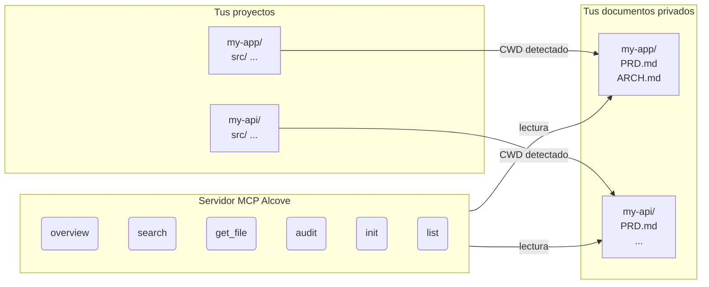

<p align="center">
  
</p>

<p align="center">Un lugar tranquilo para la documentación de tu proyecto.</p>

<p align="center">
  <a href="../README.md">English</a> ·
  <a href="README.ko.md">한국어</a> ·
  <a href="README.ja.md">日本語</a> ·
  <a href="README.zh-CN.md">简体中文</a> ·
  <a href="README.es.md">Español</a>
</p>

<p align="center">
  <a href="https://crates.io/crates/alcove"></a>
  <a href="https://crates.io/crates/alcove"></a>
  <a href="../LICENSE"></a>
  <a href="https://buymeacoffee.com/epicsaga"></a>
</p>

Alcove es un servidor MCP que proporciona a los agentes de codificación IA acceso de solo lectura con alcance a la documentación privada de tu proyecto — sin filtrarla a repositorios públicos.

## El problema

Tienes documentos internos — PRDs, decisiones de arquitectura, runbooks de despliegue, mapas de secretos — que no deberían estar en tu repositorio de GitHub. Pero tu agente IA no puede ayudarte si no puede leerlos.

Alcove se sitúa entre tus documentos privados y tus agentes IA. Detecta automáticamente en qué proyecto estás trabajando desde el CWD de tu terminal, y sirve solo los documentos de ese proyecto a través del protocolo MCP.

```
~/projects/my-app $ claude "¿cómo está implementada la autenticación?"

  → Alcove detecta el proyecto: my-app
  → Lee ~/documents/my-app/ARCHITECTURE.md
  → El agente responde con contexto real del proyecto
```

## Características principales

- **Detección automática del proyecto** — basada en CWD, sin configuración por proyecto
- **Acceso con alcance** — cada proyecto solo ve sus propios documentos
- **Privacidad por diseño** — los documentos permanecen en tu repositorio local de documentos, nunca se exponen
- **Auditoría entre repositorios** — encuentra documentos internos accidentalmente subidos a GitHub y sugiere correcciones
- **Compatible con 8+ agentes** — Claude Code, Cursor, Claude Desktop, Cline, OpenCode, Codex, Antigravity, Gemini CLI

## Inicio rápido

```bash
cargo install alcove
alcove setup
```

Eso es todo. `setup` te guía a través de todo de forma interactiva:

1. Dónde están tus documentos
2. Qué categorías de documentos rastrear
3. Formato de diagrama preferido
4. Qué agentes IA configurar (MCP + archivos de habilidades)

Vuelve a ejecutar `alcove setup` en cualquier momento para cambiar la configuración. Recuerda tus elecciones anteriores.

## Instalar desde el código fuente

```bash
git clone https://github.com/epicsagas/alcove.git
cd alcove
make install
```

## Cómo funciona



Tus documentos se organizan en un directorio separado (`DOCS_ROOT`). Alcove lee desde allí y los sirve a tu agente IA a través del protocolo stdio de MCP. Tu agente llama a herramientas como `get_doc_file("PRD.md")` y obtiene respuestas específicas del proyecto.

## Clasificación de documentos

Alcove clasifica los documentos en tres niveles:

| Clasificación | Ubicación | Ejemplos |
|--------------|-----------|----------|
| **doc-repo-required** | Alcove (privado) | PRD, Architecture, Decisions, Conventions |
| **doc-repo-supplementary** | Alcove (privado) | Deployment, Onboarding, Testing, Runbook |
| **project-repo** | Repositorio GitHub (público) | README, CHANGELOG, CONTRIBUTING |

La herramienta `audit` verifica ambas ubicaciones y sugiere acciones — como generar un README público a partir de tu PRD privado, o mover informes mal ubicados de vuelta a alcove.

## Herramientas MCP

| Herramienta | Función |
|------------|---------|
| `get_project_docs_overview` | Lista todos los documentos con clasificación y tamaños |
| `search_project_docs` | Búsqueda por palabras clave en todos los documentos del proyecto |
| `get_doc_file` | Lee un documento específico por ruta |
| `list_projects` | Muestra todos los proyectos en tu repositorio de documentos |
| `audit_project` | Auditoría entre repositorios con acciones sugeridas |
| `init_project` | Crea estructura de documentos para un nuevo proyecto desde plantilla |

## CLI

```
alcove              Iniciar servidor MCP (los agentes lo invocan)
alcove setup        Configuración interactiva — re-ejecutar en cualquier momento
alcove uninstall    Eliminar habilidades, configuración y archivos heredados
```

## Configuración

La configuración se encuentra en `~/.config/alcove/config.toml`:

```toml
docs_root = "/Users/you/documents"

[core]
files = ["PRD.md", "ARCHITECTURE.md", "PROGRESS.md", "DECISIONS.md", "CONVENTIONS.md", "SECRETS_MAP.md", "DEBT.md"]

[team]
files = ["ENV_SETUP.md", "ONBOARDING.md", "DEPLOYMENT.md", "TESTING.md", ...]

[public]
files = ["README.md", "CHANGELOG.md", "CONTRIBUTING.md", "SECURITY.md", ...]

[diagram]
format = "mermaid"
```

Todo se configura interactivamente mediante `alcove setup`. También puedes editar el archivo directamente.

## Actualizar

```bash
cargo install alcove
```

## Desinstalar

```bash
alcove uninstall          # eliminar habilidades y configuración
cargo uninstall alcove    # eliminar binario
```

## Agentes compatibles

| Agente | MCP | Habilidad |
|--------|-----|-----------|
| Claude Code | `~/.claude.json` | `~/.claude/skills/alcove/` |
| Cursor | `~/.cursor/mcp.json` | `~/.cursor/skills/alcove/` |
| Claude Desktop | configuración de plataforma | — |
| Cline (VS Code) | VS Code globalStorage | — |
| OpenCode | `~/.config/opencode/opencode.json` | `~/.opencode/skills/alcove/` |
| Codex CLI | `~/.codex/config.toml` | — |
| Antigravity | `~/.antigravity/settings.json` | — |
| Gemini CLI | `~/.gemini/settings.json` | `~/.gemini/skills/alcove/` |

## Idiomas soportados

El CLI detecta automáticamente la configuración regional del sistema. También puedes anularlo con la variable de entorno `ALCOVE_LANG`.

| Idioma | Código |
|--------|--------|
| English | `en` |
| 한국어 | `ko` |
| 简体中文 | `zh-CN` |
| 日本語 | `ja` |
| Español | `es` |
| हिन्दी | `hi` |
| Português (Brasil) | `pt-BR` |
| Deutsch | `de` |
| Français | `fr` |
| Русский | `ru` |

```bash
# Anular idioma
ALCOVE_LANG=es alcove setup
```

## Licencia

Apache-2.0
