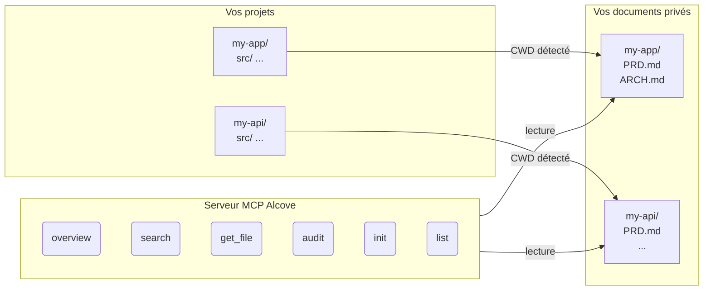

<p align="center">
  
</p>

<p align="center">Un endroit tranquille pour la documentation de votre projet.</p>

<p align="center">
  <a href="../README.md">English</a> ·
  <a href="README.ko.md">한국어</a> ·
  <a href="README.ja.md">日本語</a> ·
  <a href="README.zh-CN.md">简体中文</a> ·
  <a href="README.es.md">Español</a> ·
  <a href="README.hi.md">हिन्दी</a> ·
  <a href="README.pt-BR.md">Português</a> ·
  <a href="README.de.md">Deutsch</a> ·
  <a href="README.fr.md">Français</a> ·
  <a href="README.ru.md">Русский</a>
</p>

<p align="center">
  <a href="https://crates.io/crates/alcove"></a>
  <a href="https://crates.io/crates/alcove"></a>
  <a href="../LICENSE"></a>
  <a href="https://buymeacoffee.com/epicsaga"></a>
</p>

Alcove est un serveur MCP qui donne aux agents de codage IA un accès en lecture seule et ciblé à la documentation privée de votre projet — sans la divulguer dans les dépôts publics.

## Le problème

Vous avez des documents internes — PRDs, décisions d'architecture, runbooks de déploiement, cartes de secrets — qui ne devraient pas être dans votre dépôt GitHub. Mais votre agent IA ne peut pas vous aider s'il ne peut pas les lire.

Alcove se place entre vos documents privés et vos agents IA. Il détecte automatiquement sur quel projet vous travaillez à partir du CWD de votre terminal, et ne sert que les documents de ce projet via le protocole MCP.

```
~/projects/my-app $ claude "comment l'authentification est-elle implémentée ?"

  → Alcove détecte le projet : my-app
  → Lit ~/documents/my-app/ARCHITECTURE.md
  → L'agent répond avec le contexte réel du projet
```

## Fonctionnalités principales

- **Détection automatique du projet** — basée sur le CWD, pas de configuration par projet
- **Accès ciblé** — chaque projet ne voit que ses propres documents
- **Confidentialité par conception** — les documents restent dans votre dépôt local, jamais exposés
- **Audit inter-dépôts** — trouve les documents internes accidentellement poussés sur GitHub et suggère des corrections
- **Compatible avec 8+ agents** — Claude Code, Cursor, Claude Desktop, Cline, OpenCode, Codex, Antigravity, Gemini CLI

## Démarrage rapide

```bash
cargo install alcove
alcove setup
```

C'est tout. `setup` vous guide à travers tout de manière interactive :

1. Où se trouvent vos documents
2. Quelles catégories de documents suivre
3. Format de diagramme préféré
4. Quels agents IA configurer (MCP + fichiers de compétences)

Relancez `alcove setup` à tout moment pour modifier les paramètres. Il se souvient de vos choix précédents.

## Installer depuis les sources

```bash
git clone https://github.com/epicsagas/alcove.git
cd alcove
make install
```

## Fonctionnement



Vos documents sont organisés dans un répertoire séparé (`DOCS_ROOT`). Alcove lit depuis là et les sert à votre agent IA via le protocole stdio de MCP. Votre agent appelle des outils comme `get_doc_file("PRD.md")` et obtient des réponses spécifiques au projet.

## Classification des documents

Alcove classe les documents en trois niveaux :

| Classification | Emplacement | Exemples |
|---------------|-------------|----------|
| **doc-repo-required** | Alcove (privé) | PRD, Architecture, Decisions, Conventions |
| **doc-repo-supplementary** | Alcove (privé) | Deployment, Onboarding, Testing, Runbook |
| **project-repo** | Dépôt GitHub (public) | README, CHANGELOG, CONTRIBUTING |

L'outil `audit` vérifie les deux emplacements et suggère des actions — comme générer un README public à partir de votre PRD privé, ou ramener des rapports mal placés dans alcove.

## Outils MCP

| Outil | Fonction |
|-------|----------|
| `get_project_docs_overview` | Lister tous les documents avec classification et tailles |
| `search_project_docs` | Recherche par mots-clés dans tous les documents du projet |
| `get_doc_file` | Lire un document spécifique par chemin |
| `list_projects` | Afficher tous les projets dans le dépôt de documents |
| `audit_project` | Audit inter-dépôts avec actions suggérées |
| `init_project` | Créer la structure de documents pour un nouveau projet à partir d'un modèle |

## CLI

```
alcove              Démarrer le serveur MCP (les agents l'appellent)
alcove setup        Configuration interactive — relancez à tout moment
alcove uninstall    Supprimer compétences, configuration et fichiers hérités
```

## Configuration

La configuration se trouve dans `~/.config/alcove/config.toml` :

```toml
docs_root = "/Users/you/documents"

[core]
files = ["PRD.md", "ARCHITECTURE.md", "PROGRESS.md", "DECISIONS.md", "CONVENTIONS.md", "SECRETS_MAP.md", "DEBT.md"]

[team]
files = ["ENV_SETUP.md", "ONBOARDING.md", "DEPLOYMENT.md", "TESTING.md", ...]

[public]
files = ["README.md", "CHANGELOG.md", "CONTRIBUTING.md", "SECURITY.md", ...]

[diagram]
format = "mermaid"
```

Tout est configuré interactivement via `alcove setup`. Vous pouvez aussi éditer le fichier directement.

## Mise à jour

```bash
cargo install alcove
```

## Désinstallation

```bash
alcove uninstall          # supprimer compétences et configuration
cargo uninstall alcove    # supprimer le binaire
```

## Agents supportés

| Agent | MCP | Compétence |
|-------|-----|-----------|
| Claude Code | `~/.claude.json` | `~/.claude/skills/alcove/` |
| Cursor | `~/.cursor/mcp.json` | `~/.cursor/skills/alcove/` |
| Claude Desktop | configuration plateforme | — |
| Cline (VS Code) | VS Code globalStorage | — |
| OpenCode | `~/.config/opencode/opencode.json` | `~/.opencode/skills/alcove/` |
| Codex CLI | `~/.codex/config.toml` | — |
| Antigravity | `~/.antigravity/settings.json` | — |
| Gemini CLI | `~/.gemini/settings.json` | `~/.gemini/skills/alcove/` |

## Langues supportées

Le CLI détecte automatiquement la langue de votre système. Vous pouvez aussi la remplacer avec la variable d'environnement `ALCOVE_LANG`.

| Langue | Code |
|--------|------|
| English | `en` |
| 한국어 | `ko` |
| 简体中文 | `zh-CN` |
| 日本語 | `ja` |
| Español | `es` |
| हिन्दी | `hi` |
| Português (Brasil) | `pt-BR` |
| Deutsch | `de` |
| Français | `fr` |
| Русский | `ru` |

```bash
# Remplacer la langue
ALCOVE_LANG=fr alcove setup
```

## Licence

Apache-2.0
