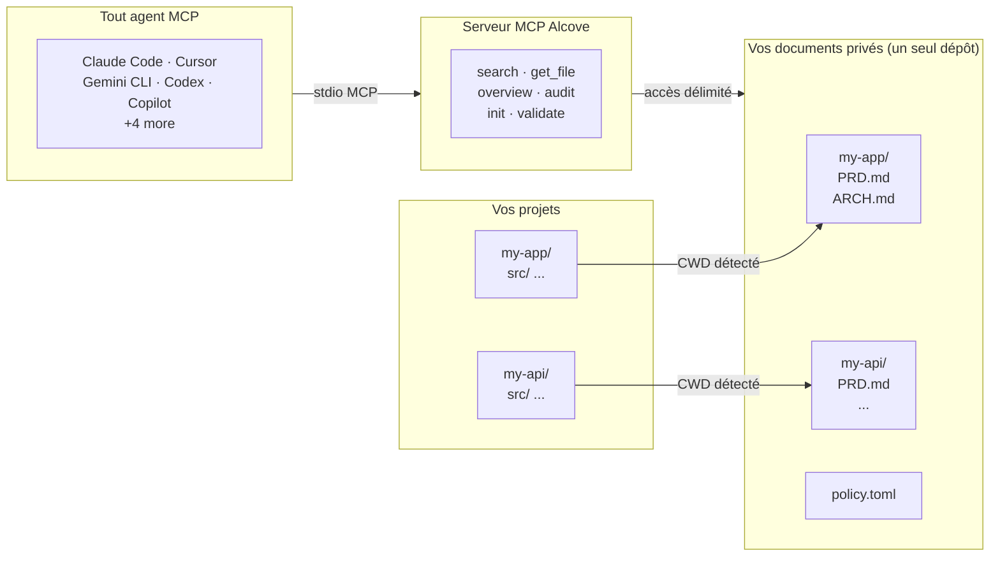

<p align="center">
  
</p>

<p align="center">Un endroit tranquille pour la documentation de votre projet.</p>

<p align="center">
  <a href="../README.md">English</a> ·
  <a href="README.ko.md">한국어</a> ·
  <a href="README.ja.md">日本語</a> ·
  <a href="README.zh-CN.md">简体中文</a> ·
  <a href="README.es.md">Español</a> ·
  <a href="README.hi.md">हिन्दी</a> ·
  <a href="README.pt-BR.md">Português</a> ·
  <a href="README.de.md">Deutsch</a> ·
  <a href="README.fr.md">Français</a> ·
  <a href="README.ru.md">Русский</a>
</p>

<p align="center">
  <a href="https://crates.io/crates/alcove"></a>
  <a href="https://crates.io/crates/alcove"></a>
  <a href="../LICENSE"></a>
  <a href="https://buymeacoffee.com/epicsaga"></a>
</p>

Alcove permet à tout agent de codage IA de lire et gérer la documentation privée de votre projet — sans la divulguer dans les dépôts publics.

Gardez les PRDs, décisions d'architecture, cartes de secrets et runbooks internes en un seul endroit. Chaque agent compatible MCP obtient les mêmes outils, sur tous les projets, sans configuration par projet.

## Le problème

Vous avez des documents internes qui ne devraient pas être dans votre dépôt GitHub public. Mais votre agent IA ne peut pas vous aider correctement s'il ne peut pas les lire — il invente des exigences et ignore les contraintes que vous avez déjà documentées.

Multipliez cela par plusieurs projets et plusieurs agents. Chacun a une configuration différente. À chaque changement, vous perdez le contexte. Et il n'y a pas de méthode standard pour organiser ou valider tout cela.

## Comment Alcove résout ce problème

Alcove conserve tous vos documents privés dans **un seul dépôt partagé**, organisé par projet. Tout agent compatible MCP y accède de la même manière — que vous utilisiez Claude Code, Cursor, Gemini CLI ou Codex.

```
~/projects/my-app $ claude "comment l'authentification est-elle implémentée ?"

  → Alcove détecte le projet : my-app
  → Lit ~/documents/my-app/ARCHITECTURE.md
  → L'agent répond avec le contexte réel du projet
```

```
~/projects/my-api $ codex "révise la conception de l'API"

  → Alcove détecte le projet : my-api
  → Même structure de documents, même schéma d'accès
  → Projet différent, même flux de travail
```

**Changez d'agent à tout moment. Changez de projet à tout moment. La couche documentaire reste standardisée.**

## Fonctionnalités principales

- **Un dépôt de documents, plusieurs projets** — documents privés organisés par projet, gérés en un seul endroit
- **Une seule configuration, tous les agents** — configurez une fois, chaque agent compatible MCP obtient le même accès
- **Détection automatique du projet** à partir du CWD — pas de configuration par projet nécessaire
- **Accès ciblé** — chaque projet ne voit que ses propres documents
- **Recherche intelligente** — recherche BM25 classée avec indexation automatique ; trouve les documents les plus pertinents en premier, recourt au grep si nécessaire
- **Recherche inter-projets** — recherchez dans tous les projets à la fois avec `scope: "global"` — utilisez-le comme base de connaissances personnelle
- **Les documents privés restent privés** — les documents sensibles (carte de secrets, décisions internes, dette technique) ne touchent jamais votre dépôt public
- **Structure documentaire standardisée** — `policy.toml` impose des documents cohérents à travers tous les projets et équipes
- **Audit inter-dépôts** — trouve les documents internes mal placés dans le dépôt du projet et suggère des corrections
- **Validation des documents** — vérifie les fichiers manquants, les templates non remplis, les sections requises
- **Compatible avec 9+ agents** — Claude Code, Cursor, Claude Desktop, Cline, OpenCode, Codex, Copilot, Antigravity, Gemini CLI

## Pourquoi Alcove

| Sans Alcove | Avec Alcove |
|-------------|-------------|
| Documents internes éparpillés entre Notion, Google Docs, fichiers locaux | Un dépôt de documents, structuré par projet |
| Chaque agent IA configuré séparément pour l'accès aux documents | Une seule configuration, tous les agents partagent le même accès |
| Changer de projet signifie perdre le contexte documentaire | Détection automatique par CWD, changement de projet instantané |
| Les recherches de l'agent renvoient des lignes aléatoires | Recherche BM25 classée — meilleures correspondances en premier, indexation automatique |
| "Chercher toutes mes notes sur l'authentification" — impossible | Recherche globale dans tous les projets en une seule requête |
| Documents sensibles risquent de fuiter dans les dépôts publics | Documents privés physiquement séparés des dépôts de projet |
| La structure documentaire varie par projet et par membre de l'équipe | `policy.toml` impose des standards à travers tous les projets |
| Aucun moyen de vérifier si les documents sont complets | `validate` détecte les fichiers manquants, les templates vides, les sections manquantes |

## Démarrage rapide

```bash
cargo install alcove
alcove setup
```

C'est tout. `setup` vous guide à travers tout de manière interactive :

1. Où se trouvent vos documents
2. Quelles catégories de documents suivre
3. Format de diagramme préféré
4. Quels agents IA configurer (MCP + fichiers de compétences)

Relancez `alcove setup` à tout moment pour modifier les paramètres. Il se souvient de vos choix précédents.

## Installer depuis les sources

```bash
git clone https://github.com/epicsagas/alcove.git
cd alcove
make install
```

## Fonctionnement



Vos documents sont organisés dans un répertoire séparé (`DOCS_ROOT`), un dossier par projet. Alcove gère les documents et les sert à tout agent IA compatible MCP via stdio. Votre agent appelle des outils comme `get_doc_file("PRD.md")` et obtient des réponses spécifiques au projet — quel que soit l'agent que vous utilisez.

## Classification des documents

Alcove classe les documents dans les niveaux suivants :

| Classification | Emplacement | Exemples |
|---------------|-------------|----------|
| **doc-repo-required** | Alcove (privé) | PRD, Architecture, Decisions, Conventions |
| **doc-repo-supplementary** | Alcove (privé) | Deployment, Onboarding, Testing, Runbook |
| **reference** | Alcove dossier `reports/` | Rapports d'audit, benchmarks, analyses |
| **project-repo** | Dépôt GitHub (public) | README, CHANGELOG, CONTRIBUTING |

L'outil `audit` scanne le dépôt de documents et le répertoire local du projet, puis suggère des actions — comme générer un README public à partir de votre PRD privé, ou ramener des rapports mal placés dans alcove.

## Outils MCP

| Outil | Fonction |
|-------|----------|
| `get_project_docs_overview` | Lister tous les documents avec classification et tailles |
| `search_project_docs` | Recherche intelligente — sélectionne automatiquement BM25 classé ou grep, supporte `scope: "global"` pour la recherche inter-projets |
| `get_doc_file` | Lire un document spécifique par chemin (supporte `offset`/`limit` pour les gros fichiers) |
| `list_projects` | Afficher tous les projets dans le dépôt de documents |
| `audit_project` | Audit inter-dépôts — scanne le dépôt de documents et le projet local, suggère des actions |
| `init_project` | Créer la structure de documents pour un nouveau projet (documents internes+externes, création sélective) |
| `validate_docs` | Valider les documents contre la politique d'équipe (`policy.toml`) |
| `rebuild_index` | Reconstruire l'index de recherche plein texte (normalement automatique) |

## CLI

```
alcove              Démarrer le serveur MCP (les agents l'appellent)
alcove setup        Configuration interactive — relancez à tout moment pour reconfigurer
alcove validate     Valider les documents contre la politique (--format json, --exit-code)
alcove index        Construire ou reconstruire l'index de recherche
alcove search       Rechercher des documents depuis le terminal
alcove uninstall    Supprimer compétences, configuration et fichiers hérités
```

## Recherche

Alcove sélectionne automatiquement la meilleure stratégie de recherche. Quand l'index de recherche existe, il utilise la **recherche BM25 classée** (basée sur [tantivy](https://github.com/quickwit-oss/tantivy)) pour des résultats triés par pertinence. Sans index, il recourt au grep. Vous n'avez jamais à y penser.

```bash
# Rechercher dans le projet actuel (auto-détecté depuis le CWD)
alcove search "authentication flow"

# Rechercher dans TOUS les projets — votre base de connaissances personnelle
alcove search "OAuth token refresh" --scope global

# Forcer le mode grep pour une correspondance exacte de sous-chaîne
alcove search "FR-023" --mode grep
```

L'index se construit automatiquement en arrière-plan au démarrage du serveur MCP, et se reconstruit lorsqu'il détecte des modifications de fichiers. Pas de cron jobs, pas d'étapes manuelles.

**Comment ça marche pour les agents :** les agents appellent simplement `search_project_docs` avec une requête. Alcove gère le reste — classement, déduplication (un résultat par fichier), recherche inter-projets et fallback. L'agent n'a jamais besoin de choisir un mode de recherche.

## Détection de projet

Par défaut, Alcove détecte le projet actuel à partir du répertoire de travail de votre terminal (CWD). Vous pouvez le remplacer avec la variable d'environnement `MCP_PROJECT_NAME` :

```bash
MCP_PROJECT_NAME=my-api alcove
```

Utile quand votre CWD ne correspond pas à un nom de projet dans votre dépôt de documents.

## Politique documentaire

Définissez des standards de documentation à l'échelle de l'équipe avec `policy.toml` dans votre dépôt de documents :

```toml
[policy]
enforce = "strict"    # strict | warn

[[policy.required]]
name = "PRD.md"
aliases = ["prd.md", "product-requirements.md"]

[[policy.required]]
name = "ARCHITECTURE.md"

  [[policy.required.sections]]
  heading = "## Overview"
  required = true

  [[policy.required.sections]]
  heading = "## Components"
  required = true
  min_items = 2
```

Les fichiers de politique sont résolus avec priorité : **projet** (`<project>/.alcove/policy.toml`) > **équipe** (`DOCS_ROOT/.alcove/policy.toml`) > **défaut intégré** (liste de fichiers core de config.toml). Cela garantit une qualité documentaire cohérente à travers tous vos projets tout en permettant des remplacements par projet.

## Configuration

La configuration se trouve dans `~/.config/alcove/config.toml` :

```toml
docs_root = "/Users/you/documents"

[core]
files = ["PRD.md", "ARCHITECTURE.md", "PROGRESS.md", "DECISIONS.md", "CONVENTIONS.md", "SECRETS_MAP.md", "DEBT.md"]

[team]
files = ["ENV_SETUP.md", "ONBOARDING.md", "DEPLOYMENT.md", "TESTING.md", ...]

[public]
files = ["README.md", "CHANGELOG.md", "CONTRIBUTING.md", "SECURITY.md", ...]

[diagram]
format = "mermaid"
```

Tout est configuré interactivement via `alcove setup`. Vous pouvez aussi éditer le fichier directement.

## Agents supportés

| Agent | MCP | Compétence |
|-------|-----|-----------|
| Claude Code | `~/.claude.json` | `~/.claude/skills/alcove/` |
| Cursor | `~/.cursor/mcp.json` | `~/.cursor/skills/alcove/` |
| Claude Desktop | configuration plateforme | — |
| Cline (VS Code) | VS Code globalStorage | `~/.cline/skills/alcove/` |
| OpenCode | `~/.config/opencode/opencode.json` | `~/.opencode/skills/alcove/` |
| Codex CLI | `~/.codex/config.toml` | `~/.codex/skills/alcove/` |
| Copilot CLI | `~/.copilot/mcp-config.json` | `~/.copilot/skills/alcove/` |
| Antigravity | `~/.gemini/antigravity/mcp_config.json` | — |
| Gemini CLI | `~/.gemini/settings.json` | `~/.gemini/skills/alcove/` |

## Langues supportées

Le CLI détecte automatiquement la langue de votre système. Vous pouvez aussi la remplacer avec la variable d'environnement `ALCOVE_LANG`.

| Langue | Code |
|--------|------|
| English | `en` |
| 한국어 | `ko` |
| 简体中文 | `zh-CN` |
| 日本語 | `ja` |
| Español | `es` |
| हिन्दी | `hi` |
| Português (Brasil) | `pt-BR` |
| Deutsch | `de` |
| Français | `fr` |
| Русский | `ru` |

```bash
# Remplacer la langue
ALCOVE_LANG=fr alcove setup
```

## Mise à jour

```bash
cargo install alcove
```

## Désinstallation

```bash
alcove uninstall          # supprimer compétences et configuration
cargo uninstall alcove    # supprimer le binaire
```

## Licence

Apache-2.0
