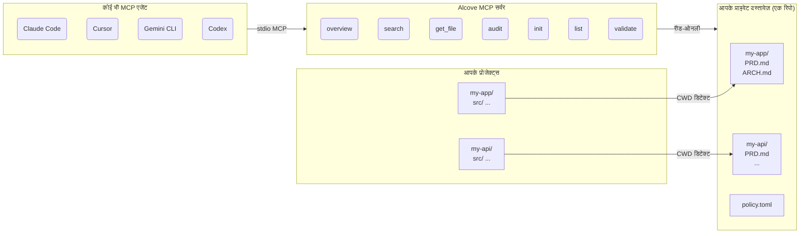

<p align="center">
  
</p>

<p align="center">आपके प्रोजेक्ट दस्तावेज़ों के लिए एक शांत जगह।</p>

<p align="center">
  <a href="../README.md">English</a> ·
  <a href="README.ko.md">한국어</a> ·
  <a href="README.ja.md">日本語</a> ·
  <a href="README.zh-CN.md">简体中文</a> ·
  <a href="README.es.md">Español</a> ·
  <a href="README.hi.md">हिन्दी</a> ·
  <a href="README.pt-BR.md">Português</a> ·
  <a href="README.de.md">Deutsch</a> ·
  <a href="README.fr.md">Français</a> ·
  <a href="README.ru.md">Русский</a>
</p>

<p align="center">
  <a href="https://crates.io/crates/alcove"></a>
  <a href="https://crates.io/crates/alcove"></a>
  <a href="../LICENSE"></a>
  <a href="https://buymeacoffee.com/epicsaga"></a>
</p>

Alcove एक MCP सर्वर है जो AI कोडिंग एजेंट्स को आपके प्राइवेट प्रोजेक्ट दस्तावेज़ों तक स्कोप्ड, रीड-ओनली एक्सेस प्रदान करता है — बिना उन्हें पब्लिक रिपॉज़िटरी में लीक किए।

## समस्या

आप एक साथ कई प्रोजेक्ट्स पर काम कर रहे हैं, अलग-अलग AI कोडिंग एजेंट्स के बीच स्विच कर रहे हैं। हर प्रोजेक्ट के पास इंटरनल दस्तावेज़ हैं — PRDs, आर्किटेक्चर निर्णय, डिप्लॉयमेंट रनबुक, सीक्रेट्स मैप — जो आपके पब्लिक GitHub रिपॉज़िटरी में नहीं होने चाहिए।

लेकिन अगर आपका AI एजेंट इन्हें पढ़ नहीं सकता, तो वह आपकी ठीक से मदद नहीं कर सकता। वह आवश्यकताएं गढ़ लेता है। वह उन प्रतिबंधों को अनदेखा करता है जो आपने पहले से दस्तावेज़ित किए हैं। और हर बार जब आप एजेंट या प्रोजेक्ट बदलते हैं, तो संदर्भ खो जाता है।

## Alcove इसे कैसे हल करता है

Alcove आपके सभी प्राइवेट दस्तावेज़ों को **एक साझा रिपॉज़िटरी** में रखता है, प्रोजेक्ट के अनुसार व्यवस्थित। कोई भी MCP-संगत एजेंट उन्हें एक ही तरीके से एक्सेस करता है — चाहे आप Claude Code में हों, Cursor में, Gemini CLI में, या Codex में।

```
~/projects/my-app $ claude "ऑथेंटिकेशन कैसे इम्प्लीमेंट किया गया है?"

  → Alcove प्रोजेक्ट डिटेक्ट करता है: my-app
  → ~/documents/my-app/ARCHITECTURE.md पढ़ता है
  → एजेंट वास्तविक प्रोजेक्ट संदर्भ के साथ जवाब देता है
```

```
~/projects/my-api $ codex "API डिज़ाइन की समीक्षा करें"

  → Alcove प्रोजेक्ट डिटेक्ट करता है: my-api
  → वही दस्तावेज़ संरचना, वही एक्सेस पैटर्न
  → अलग प्रोजेक्ट, वही वर्कफ़्लो
```

**कभी भी एजेंट बदलें। कभी भी प्रोजेक्ट बदलें। दस्तावेज़ परत मानकीकृत रहती है।**

## यह क्या करता है

- **एक डॉक-रिपो, कई प्रोजेक्ट** — प्राइवेट दस्तावेज़ प्रोजेक्ट के अनुसार व्यवस्थित, एक ही जगह से प्रबंधित
- **एक सेटअप, कोई भी एजेंट** — एक बार कॉन्फ़िगर करें, हर MCP-संगत एजेंट को समान एक्सेस मिलता है
- **CWD से प्रोजेक्ट ऑटो-डिटेक्ट** — प्रति-प्रोजेक्ट कॉन्फ़िग अनावश्यक
- **स्कोप्ड एक्सेस** — हर प्रोजेक्ट केवल अपने दस्तावेज़ देखता है
- **प्राइवेट दस्तावेज़ प्राइवेट रहते हैं** — संवेदनशील दस्तावेज़ (सीक्रेट्स मैप, इंटरनल निर्णय, टेक डेट) आपके पब्लिक रिपो को कभी नहीं छूते
- **मानकीकृत दस्तावेज़ संरचना** — `policy.toml` सभी प्रोजेक्ट्स और टीमों में एकसमान दस्तावेज़ लागू करता है
- **क्रॉस-रिपो ऑडिट** — GitHub पर गलती से पुश किए गए इंटरनल दस्तावेज़ खोजता है, सुधार सुझाता है
- **दस्तावेज़ सत्यापन** — गुम फ़ाइलों, अधूरे टेम्पलेट्स, आवश्यक सेक्शनों की जांच करता है
- **8+ एजेंट्स के साथ काम करता है** — Claude Code, Cursor, Claude Desktop, Cline, OpenCode, Codex, Antigravity, Gemini CLI

## Alcove क्यों

| Alcove के बिना | Alcove के साथ |
|----------------|---------------|
| इंटरनल दस्तावेज़ Notion, Google Docs, लोकल फ़ाइलों में बिखरे हुए | एक डॉक-रिपो, प्रोजेक्ट के अनुसार संरचित |
| हर AI एजेंट अलग से दस्तावेज़ एक्सेस के लिए कॉन्फ़िगर | एक सेटअप, सभी एजेंट्स समान एक्सेस साझा करते हैं |
| प्रोजेक्ट बदलने पर दस्तावेज़ संदर्भ खो जाता है | CWD ऑटो-डिटेक्शन, तुरंत प्रोजेक्ट स्विच |
| संवेदनशील दस्तावेज़ पब्लिक रिपो में लीक होने का खतरा | प्राइवेट दस्तावेज़ प्रोजेक्ट रिपो से भौतिक रूप से अलग |
| दस्तावेज़ संरचना हर प्रोजेक्ट और टीम सदस्य में भिन्न | `policy.toml` सभी प्रोजेक्ट्स में मानक लागू करता है |
| दस्तावेज़ पूरे हैं या नहीं, जांचने का कोई तरीका नहीं | `validate` गुम फ़ाइलें, खाली टेम्पलेट्स, गायब सेक्शन पकड़ता है |

## क्विक स्टार्ट

```bash
cargo install alcove
alcove setup
```

बस इतना ही। `setup` इंटरैक्टिव तरीके से सब कुछ गाइड करता है:

1. आपके दस्तावेज़ कहां हैं
2. कौन सी दस्तावेज़ कैटेगरी ट्रैक करनी है
3. पसंदीदा डायग्राम फ़ॉर्मेट
4. कौन से AI एजेंट्स कॉन्फ़िगर करने हैं (MCP + स्किल फ़ाइलें)

सेटिंग्स बदलने के लिए कभी भी `alcove setup` फिर से चलाएं। यह आपकी पिछली पसंद याद रखता है।

## सोर्स से इंस्टॉल

```bash
git clone https://github.com/epicsagas/alcove.git
cd alcove
make install
```

## कैसे काम करता है



आपके दस्तावेज़ एक अलग डायरेक्टरी (`DOCS_ROOT`) में व्यवस्थित होते हैं, प्रति प्रोजेक्ट एक फ़ोल्डर। Alcove वहां से पढ़ता है और stdio के माध्यम से किसी भी MCP-संगत AI एजेंट को सर्व करता है। आपका एजेंट `get_doc_file("PRD.md")` जैसे टूल्स कॉल करता है और प्रोजेक्ट-विशिष्ट उत्तर प्राप्त करता है — चाहे आप किसी भी एजेंट का उपयोग कर रहे हों।

## दस्तावेज़ वर्गीकरण

Alcove दस्तावेज़ों को तीन स्तरों में वर्गीकृत करता है:

| वर्गीकरण | स्थान | उदाहरण |
|-----------|--------|--------|
| **doc-repo-required** | Alcove (प्राइवेट) | PRD, Architecture, Decisions, Conventions |
| **doc-repo-supplementary** | Alcove (प्राइवेट) | Deployment, Onboarding, Testing, Runbook |
| **project-repo** | आपका GitHub रिपो (पब्लिक) | README, CHANGELOG, CONTRIBUTING |

`audit` टूल दोनों स्थानों की जांच करता है और कार्रवाई सुझाता है — जैसे आपके प्राइवेट PRD से पब्लिक README जनरेट करना, या गलत जगह रखी रिपोर्ट्स को alcove में वापस लाना।

## MCP टूल्स

| टूल | कार्य |
|------|-------|
| `get_project_docs_overview` | वर्गीकरण और साइज़ के साथ सभी दस्तावेज़ सूचीबद्ध करें |
| `search_project_docs` | सभी प्रोजेक्ट दस्तावेज़ों में कीवर्ड सर्च |
| `get_doc_file` | पाथ से विशिष्ट दस्तावेज़ पढ़ें |
| `list_projects` | डॉक्स रिपो में सभी प्रोजेक्ट दिखाएं |
| `audit_project` | सुझाई गई कार्रवाइयों के साथ क्रॉस-रिपो ऑडिट |
| `init_project` | टेम्पलेट से नए प्रोजेक्ट के दस्तावेज़ स्कैफ़ोल्ड करें |
| `validate_docs` | टीम पॉलिसी (`policy.toml`) के विरुद्ध दस्तावेज़ सत्यापित करें |

## CLI

```
alcove              MCP सर्वर शुरू करें (एजेंट्स इसे कॉल करते हैं)
alcove setup        इंटरैक्टिव सेटअप — कभी भी री-कॉन्फ़िगर करने के लिए फिर चलाएं
alcove validate     पॉलिसी के विरुद्ध दस्तावेज़ सत्यापित करें (--format json, --exit-code)
alcove uninstall    स्किल्स, कॉन्फ़िग और लेगेसी फ़ाइलें हटाएं
```

## दस्तावेज़ पॉलिसी

अपने डॉक्स रिपो में `policy.toml` के साथ टीम-व्यापी दस्तावेज़ीकरण मानक परिभाषित करें:

```toml
[policy]
enforce = "strict"    # strict | warn | off

[[policy.required_docs]]
file = "PRD.md"
aliases = ["prd.md", "product-requirements.md"]

[[policy.required_docs]]
file = "ARCHITECTURE.md"
sections = [
  { heading = "## Overview" },
  { heading = "## Components", min_items = 2 },
]
```

पॉलिसी फ़ाइलें प्राथमिकता के अनुसार हल होती हैं: **प्रोजेक्ट** > **टीम** > **डिफ़ॉल्ट**। यह प्रति-प्रोजेक्ट ओवरराइड की अनुमति देते हुए आपके सभी प्रोजेक्ट्स में एकसमान दस्तावेज़ गुणवत्ता सुनिश्चित करता है।

## कॉन्फ़िगरेशन

कॉन्फ़िग `~/.config/alcove/config.toml` पर स्थित है:

```toml
docs_root = "/Users/you/documents"

[core]
files = ["PRD.md", "ARCHITECTURE.md", "PROGRESS.md", "DECISIONS.md", "CONVENTIONS.md", "SECRETS_MAP.md", "DEBT.md"]

[team]
files = ["ENV_SETUP.md", "ONBOARDING.md", "DEPLOYMENT.md", "TESTING.md", ...]

[public]
files = ["README.md", "CHANGELOG.md", "CONTRIBUTING.md", "SECURITY.md", ...]

[diagram]
format = "mermaid"
```

सभी सेटिंग्स `alcove setup` के माध्यम से इंटरैक्टिव तरीके से की जा सकती हैं। आप फ़ाइल को सीधे भी संपादित कर सकते हैं।

## समर्थित एजेंट्स

| एजेंट | MCP | स्किल |
|--------|-----|-------|
| Claude Code | `~/.claude.json` | `~/.claude/skills/alcove/` |
| Cursor | `~/.cursor/mcp.json` | `~/.cursor/skills/alcove/` |
| Claude Desktop | प्लेटफ़ॉर्म कॉन्फ़िग | — |
| Cline (VS Code) | VS Code globalStorage | — |
| OpenCode | `~/.config/opencode/opencode.json` | `~/.opencode/skills/alcove/` |
| Codex CLI | `~/.codex/config.toml` | — |
| Antigravity | `~/.antigravity/settings.json` | — |
| Gemini CLI | `~/.gemini/settings.json` | `~/.gemini/skills/alcove/` |

## समर्थित भाषाएं

CLI स्वचालित रूप से आपके सिस्टम लोकेल का पता लगाता है। आप `ALCOVE_LANG` एनवायरनमेंट वेरिएबल से भी ओवरराइड कर सकते हैं।

| भाषा | कोड |
|------|------|
| English | `en` |
| 한국어 | `ko` |
| 简体中文 | `zh-CN` |
| 日本語 | `ja` |
| Español | `es` |
| हिन्दी | `hi` |
| Português (Brasil) | `pt-BR` |
| Deutsch | `de` |
| Français | `fr` |
| Русский | `ru` |

```bash
# भाषा ओवरराइड
ALCOVE_LANG=hi alcove setup
```

## अपडेट

```bash
cargo install alcove
```

## अनइंस्टॉल

```bash
alcove uninstall          # स्किल्स और कॉन्फ़िग हटाएं
cargo uninstall alcove    # बाइनरी हटाएं
```

## लाइसेंस

Apache-2.0
