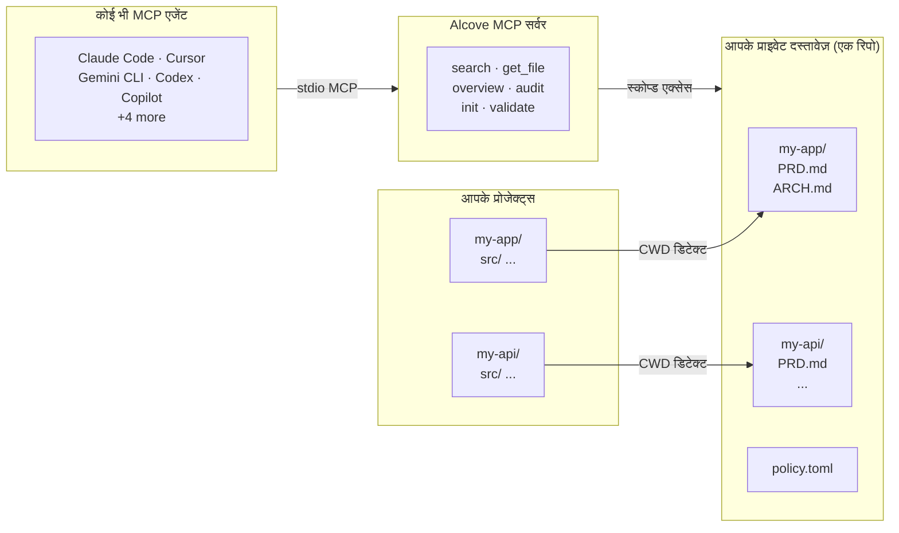

<p align="center">
  
</p>

<p align="center"><strong>आपका AI एजेंट आपका प्रोजेक्ट नहीं जानता। Alcove इसे ठीक करता है।</strong></p>

<p align="center">
  <a href="../README.md">English</a> ·
  <a href="README.ko.md">한국어</a> ·
  <a href="README.ja.md">日本語</a> ·
  <a href="README.zh-CN.md">简体中文</a> ·
  <a href="README.es.md">Español</a> ·
  <a href="README.hi.md">हिन्दी</a> ·
  <a href="README.pt-BR.md">Português</a> ·
  <a href="README.de.md">Deutsch</a> ·
  <a href="README.fr.md">Français</a> ·
  <a href="README.ru.md">Русский</a>
</p>

<p align="center">
  <a href="https://crates.io/crates/alcove"></a>
  <a href="https://crates.io/crates/alcove"></a>
  <a href="../LICENSE"></a>
  <a href="https://buymeacoffee.com/epicsaga"></a>
</p>

Alcove किसी भी AI कोडिंग एजेंट को आपके प्राइवेट प्रोजेक्ट दस्तावेज़ पढ़ने और प्रबंधित करने देता है — बिना उन्हें पब्लिक रिपॉज़िटरी में लीक किए।

PRDs, आर्किटेक्चर निर्णय, सीक्रेट्स मैप, और इंटरनल रनबुक एक जगह रखें। हर MCP-संगत एजेंट को समान टूल्स मिलता है, हर प्रोजेक्ट में, बिना किसी प्रति-प्रोजेक्ट कॉन्फ़िग के।

## समस्या

आपके पास दो बुरे विकल्प हैं।

**विकल्प A: `CLAUDE.md` / `AGENTS.md` में दस्तावेज़ डालें**
हर रन पर हर फ़ाइल कंटेक्स्ट विंडो में इंजेक्ट होती है।
छोटे नियमों के लिए काम करता है। असली प्रोजेक्ट दस्तावेज़ के साथ टूट जाता है।
10 आर्किटेक्चर फ़ाइलें = कंटेक्स्ट ब्लोट = धीमे, महंगे, कम सटीक उत्तर।

**विकल्प B: दस्तावेज़ न डालें**
आपका एजेंट वे आवश्यकताएं गढ़ता है जो आपने पहले ही दस्तावेज़ीकृत की हैं।
आपके पहले से लिए गए निर्णयों की बाधाओं को अनदेखा करता है।
हर सेशन में एक ही चीज़ें समझाने को कहता है।

कोई भी विकल्प स्केल नहीं होता। 5 प्रोजेक्ट और 3 एजेंट से गुणा करें, हर एक अलग तरह से कॉन्फ़िगर। हर बार स्विच करने पर कंटेक्स्ट खो जाता है।

## Alcove इसे कैसे हल करता है

Alcove आपके सभी प्राइवेट दस्तावेज़ों को **एक साझा रिपॉज़िटरी** में रखता है, प्रोजेक्ट के अनुसार व्यवस्थित। कोई भी MCP-संगत एजेंट उन्हें एक ही तरीके से एक्सेस करता है — चाहे आप Claude Code में हों, Cursor में, Gemini CLI में, या Codex में।

```
~/projects/my-app $ claude "ऑथेंटिकेशन कैसे इम्प्लीमेंट किया गया है?"

  → Alcove प्रोजेक्ट डिटेक्ट करता है: my-app
  → ~/documents/my-app/ARCHITECTURE.md पढ़ता है
  → एजेंट वास्तविक प्रोजेक्ट संदर्भ के साथ जवाब देता है
```

```
~/projects/my-api $ codex "API डिज़ाइन की समीक्षा करें"

  → Alcove प्रोजेक्ट डिटेक्ट करता है: my-api
  → वही दस्तावेज़ संरचना, वही एक्सेस पैटर्न
  → अलग प्रोजेक्ट, वही वर्कफ़्लो
```

**कभी भी एजेंट बदलें। कभी भी प्रोजेक्ट बदलें। दस्तावेज़ परत मानकीकृत रहती है।**

## यह क्या करता है

- **एक डॉक-रिपो, कई प्रोजेक्ट** — प्राइवेट दस्तावेज़ प्रोजेक्ट के अनुसार व्यवस्थित, एक ही जगह से प्रबंधित
- **एक सेटअप, कोई भी एजेंट** — एक बार कॉन्फ़िगर करें, हर MCP-संगत एजेंट को समान टूल्स मिलता है
- **CWD से प्रोजेक्ट ऑटो-डिटेक्ट** — प्रति-प्रोजेक्ट कॉन्फ़िग अनावश्यक
- **स्कोप्ड एक्सेस** — हर प्रोजेक्ट केवल अपने दस्तावेज़ देखता है
- **स्मार्ट सर्च** — BM25 रैंकिंग सर्च और ऑटो-इंडेक्सिंग; सबसे प्रासंगिक दस्तावेज़ पहले दिखाता है, ज़रूरत पड़ने पर grep पर फ़ॉलबैक
- **क्रॉस-प्रोजेक्ट सर्च** — `scope: "global"` से सभी प्रोजेक्ट्स में एक साथ खोजें — व्यक्तिगत ज्ञान आधार के रूप में उपयोग करें
- **प्राइवेट दस्तावेज़ प्राइवेट रहते हैं** — संवेदनशील दस्तावेज़ (सीक्रेट्स मैप, इंटरनल निर्णय, टेक डेट) आपके पब्लिक रिपो को कभी नहीं छूते
- **मानकीकृत दस्तावेज़ संरचना** — `policy.toml` सभी प्रोजेक्ट्स और टीमों में एकसमान दस्तावेज़ लागू करता है
- **क्रॉस-रिपो ऑडिट** — प्रोजेक्ट रिपो में गलत जगह रखे इंटरनल दस्तावेज़ खोजता है, सुधार सुझाता है
- **दस्तावेज़ सत्यापन** — गुम फ़ाइलों, अधूरे टेम्पलेट्स, आवश्यक सेक्शनों की जांच करता है
- **9+ एजेंट्स के साथ काम करता है** — Claude Code, Cursor, Claude Desktop, Cline, OpenCode, Codex, Copilot, Antigravity, Gemini CLI

## Alcove क्यों

| Alcove के बिना | Alcove के साथ |
|----------------|---------------|
| इंटरनल दस्तावेज़ Notion, Google Docs, लोकल फ़ाइलों में बिखरे हुए | एक डॉक-रिपो, प्रोजेक्ट के अनुसार संरचित |
| हर AI एजेंट अलग से दस्तावेज़ एक्सेस के लिए कॉन्फ़िगर | एक सेटअप, सभी एजेंट्स समान टूल्स साझा करते हैं |
| प्रोजेक्ट बदलने पर दस्तावेज़ संदर्भ खो जाता है | CWD ऑटो-डिटेक्शन, तुरंत प्रोजेक्ट स्विच |
| एजेंट सर्च रैंडम मैचिंग लाइनें लौटाता है | BM25 रैंकिंग सर्च — सर्वश्रेष्ठ मैच पहले, ऑटो-इंडेक्सिंग |
| "ऑथेंटिकेशन पर मेरे सभी नोट्स खोजें" — असंभव | ग्लोबल सर्च से सभी प्रोजेक्ट्स एक क्वेरी में |
| संवेदनशील दस्तावेज़ पब्लिक रिपो में लीक होने का खतरा | प्राइवेट दस्तावेज़ प्रोजेक्ट रिपो से भौतिक रूप से अलग |
| दस्तावेज़ संरचना हर प्रोजेक्ट और टीम सदस्य में भिन्न | `policy.toml` सभी प्रोजेक्ट्स में मानक लागू करता है |
| दस्तावेज़ पूरे हैं या नहीं, जांचने का कोई तरीका नहीं | `validate` गुम फ़ाइलें, खाली टेम्पलेट्स, गायब सेक्शन पकड़ता है |

## क्विक स्टार्ट

```bash
# macOS
brew install epicsagas/alcove/alcove

# Linux / Windows — पूर्व-निर्मित बाइनरी (तेज़, बिना संकलन)
cargo install cargo-binstall
cargo binstall alcove

# कोई भी प्लेटफ़ॉर्म — सोर्स से बिल्ड
cargo install alcove

# क्लोन करें और बिल्ड करें
git clone https://github.com/epicsagas/alcove.git
cd alcove
make install

alcove setup
```

बस इतना ही। `setup` इंटरैक्टिव तरीके से सब कुछ गाइड करता है:

1. आपके दस्तावेज़ कहां हैं
2. कौन सी दस्तावेज़ कैटेगरी ट्रैक करनी है
3. पसंदीदा डायग्राम फ़ॉर्मेट
4. कौन से AI एजेंट्स कॉन्फ़िगर करने हैं (MCP + स्किल फ़ाइलें)

सेटिंग्स बदलने के लिए कभी भी `alcove setup` फिर से चलाएं। यह आपकी पिछली पसंद याद रखता है।

## कैसे काम करता है



आपके दस्तावेज़ एक अलग डायरेक्टरी (`DOCS_ROOT`) में व्यवस्थित होते हैं, प्रति प्रोजेक्ट एक फ़ोल्डर। Alcove वहां से प्रबंधित करता है और stdio के माध्यम से किसी भी MCP-संगत AI एजेंट को सर्व करता है। आपका एजेंट `get_doc_file("PRD.md")` जैसे टूल्स कॉल करता है और प्रोजेक्ट-विशिष्ट उत्तर प्राप्त करता है — चाहे आप किसी भी एजेंट का उपयोग कर रहे हों।

## दस्तावेज़ वर्गीकरण

Alcove दस्तावेज़ों को निम्न प्रकार से वर्गीकृत करता है:

| वर्गीकरण | स्थान | उदाहरण |
|-----------|--------|--------|
| **doc-repo-required** | Alcove (प्राइवेट) | PRD, Architecture, Decisions, Conventions |
| **doc-repo-supplementary** | Alcove (प्राइवेट) | Deployment, Onboarding, Testing, Runbook |
| **reference** | Alcove `reports/` फ़ोल्डर | ऑडिट रिपोर्ट, बेंचमार्क, विश्लेषण |
| **project-repo** | आपका GitHub रिपो (पब्लिक) | README, CHANGELOG, CONTRIBUTING |

`audit` टूल डॉक-रिपो और लोकल प्रोजेक्ट डायरेक्टरी दोनों को स्कैन करता है और कार्रवाई सुझाता है — जैसे प्राइवेट PRD से पब्लिक README जनरेट करना, या गलत जगह रखी रिपोर्ट्स को alcove में वापस लाना।

## MCP टूल्स

| टूल | कार्य |
|------|-------|
| `get_project_docs_overview` | वर्गीकरण और साइज़ के साथ सभी दस्तावेज़ सूचीबद्ध करें |
| `search_project_docs` | स्मार्ट सर्च — BM25 रैंक्ड या grep ऑटो-सेलेक्ट, `scope: "global"` से क्रॉस-प्रोजेक्ट सर्च सपोर्ट |
| `get_doc_file` | पाथ से विशिष्ट दस्तावेज़ पढ़ें (बड़ी फ़ाइलों के लिए `offset`/`limit` सपोर्ट) |
| `list_projects` | डॉक्स रिपो में सभी प्रोजेक्ट दिखाएं |
| `audit_project` | क्रॉस-रिपो ऑडिट — डॉक-रिपो और लोकल प्रोजेक्ट रिपो स्कैन करके कार्रवाई सुझाएं |
| `init_project` | नए प्रोजेक्ट के दस्तावेज़ स्कैफ़ोल्ड करें (इंटरनल+एक्सटर्नल दस्तावेज़, चयनात्मक फ़ाइल निर्माण) |
| `validate_docs` | टीम पॉलिसी (`policy.toml`) के विरुद्ध दस्तावेज़ सत्यापित करें |
| `rebuild_index` | फ़ुल-टेक्स्ट सर्च इंडेक्स रीबिल्ड करें (आमतौर पर ऑटोमैटिक) |
| `check_doc_changes` | अंतिम इंडेक्स बिल्ड के बाद जोड़े, बदले या हटाए गए दस्तावेज़ पहचानें |

## CLI

```
alcove              MCP सर्वर शुरू करें (एजेंट्स इसे कॉल करते हैं)
alcove setup        इंटरैक्टिव सेटअप — कभी भी री-कॉन्फ़िगर करने के लिए फिर चलाएं
alcove doctor       Alcove इंस्टॉलेशन की स्थिति जांचें
alcove validate     पॉलिसी के विरुद्ध दस्तावेज़ सत्यापित करें (--format json, --exit-code)
alcove index        सर्च इंडेक्स बिल्ड या रीबिल्ड करें
alcove search       टर्मिनल से दस्तावेज़ खोजें
alcove uninstall    स्किल्स, कॉन्फ़िग और लेगेसी फ़ाइलें हटाएं
```

## सर्च

Alcove स्वचालित रूप से सर्वश्रेष्ठ सर्च रणनीति चुनता है। जब सर्च इंडेक्स मौजूद है, तो **BM25 रैंकिंग सर्च** ([tantivy](https://github.com/quickwit-oss/tantivy) द्वारा संचालित) का उपयोग करता है जो प्रासंगिकता स्कोर के अनुसार परिणाम देता है। जब इंडेक्स नहीं है, तो grep पर फ़ॉलबैक करता है। आपको इसके बारे में सोचने की ज़रूरत नहीं।

```bash
# वर्तमान प्रोजेक्ट खोजें (CWD से ऑटो-डिटेक्ट)
alcove search "authentication flow"

# सभी प्रोजेक्ट्स में खोजें — आपका व्यक्तिगत ज्ञान आधार
alcove search "OAuth token refresh" --scope global

# सटीक सबस्ट्रिंग मैचिंग के लिए grep मोड फ़ोर्स करें
alcove search "FR-023" --mode grep
```

इंडेक्स MCP सर्वर शुरू होने पर बैकग्राउंड में ऑटोमैटिक बिल्ड होता है, और फ़ाइल बदलाव डिटेक्ट होने पर ऑटोमैटिक रीबिल्ड होता है। कोई क्रॉन जॉब नहीं, कोई मैनुअल स्टेप्स नहीं।

**एजेंट्स के लिए कैसे काम करता है:** एजेंट्स बस क्वेरी के साथ `search_project_docs` कॉल करते हैं। Alcove बाकी सब संभालता है — रैंकिंग, डीडुप्लीकेशन (प्रति फ़ाइल एक परिणाम), क्रॉस-प्रोजेक्ट सर्च, और फ़ॉलबैक। एजेंट को कभी सर्च मोड चुनने की ज़रूरत नहीं।

## प्रोजेक्ट डिटेक्शन

डिफ़ॉल्ट रूप से, Alcove आपके टर्मिनल की वर्किंग डायरेक्टरी (CWD) से वर्तमान प्रोजेक्ट का पता लगाता है। आप `MCP_PROJECT_NAME` एनवायरनमेंट वेरिएबल से ओवरराइड कर सकते हैं:

```bash
MCP_PROJECT_NAME=my-api alcove
```

यह तब उपयोगी है जब आपका CWD डॉक्स रिपो में प्रोजेक्ट नाम से मेल नहीं खाता।

## दस्तावेज़ पॉलिसी

अपने डॉक्स रिपो में `policy.toml` के साथ टीम-व्यापी दस्तावेज़ीकरण मानक परिभाषित करें:

```toml
[policy]
enforce = "strict"    # strict | warn

[[policy.required]]
name = "PRD.md"
aliases = ["prd.md", "product-requirements.md"]

[[policy.required]]
name = "ARCHITECTURE.md"

  [[policy.required.sections]]
  heading = "## Overview"
  required = true

  [[policy.required.sections]]
  heading = "## Components"
  required = true
  min_items = 2
```

पॉलिसी फ़ाइलें प्राथमिकता के अनुसार हल होती हैं: **प्रोजेक्ट** (`<project>/.alcove/policy.toml`) > **टीम** (`DOCS_ROOT/.alcove/policy.toml`) > **बिल्ट-इन डिफ़ॉल्ट** (config.toml की core फ़ाइल सूची)। यह प्रति-प्रोजेक्ट ओवरराइड की अनुमति देते हुए सभी प्रोजेक्ट्स में एकसमान दस्तावेज़ गुणवत्ता सुनिश्चित करता है।

## कॉन्फ़िगरेशन

कॉन्फ़िग `~/.config/alcove/config.toml` पर स्थित है:

```toml
docs_root = "/Users/you/documents"

[core]
files = ["PRD.md", "ARCHITECTURE.md", "PROGRESS.md", "DECISIONS.md", "CONVENTIONS.md", "SECRETS_MAP.md", "DEBT.md"]

[team]
files = ["ENV_SETUP.md", "ONBOARDING.md", "DEPLOYMENT.md", "TESTING.md", ...]

[public]
files = ["README.md", "CHANGELOG.md", "CONTRIBUTING.md", "SECURITY.md", ...]

[diagram]
format = "mermaid"
```

सभी सेटिंग्स `alcove setup` के माध्यम से इंटरैक्टिव तरीके से की जा सकती हैं। आप फ़ाइल को सीधे भी संपादित कर सकते हैं।

## समर्थित एजेंट्स

| एजेंट | MCP | स्किल |
|--------|-----|-------|
| Claude Code | `~/.claude.json` | `~/.claude/skills/alcove/` |
| Cursor | `~/.cursor/mcp.json` | `~/.cursor/skills/alcove/` |
| Claude Desktop | प्लेटफ़ॉर्म कॉन्फ़िग | — |
| Cline (VS Code) | VS Code globalStorage | `~/.cline/skills/alcove/` |
| OpenCode | `~/.config/opencode/opencode.json` | `~/.opencode/skills/alcove/` |
| Codex CLI | `~/.codex/config.toml` | `~/.codex/skills/alcove/` |
| Copilot CLI | `~/.copilot/mcp-config.json` | `~/.copilot/skills/alcove/` |
| Antigravity | `~/.gemini/antigravity/mcp_config.json` | — |
| Gemini CLI | `~/.gemini/settings.json` | `~/.gemini/skills/alcove/` |

## समर्थित भाषाएं

CLI स्वचालित रूप से आपके सिस्टम लोकेल का पता लगाता है। आप `ALCOVE_LANG` एनवायरनमेंट वेरिएबल से भी ओवरराइड कर सकते हैं।

| भाषा | कोड |
|------|------|
| English | `en` |
| 한국어 | `ko` |
| 简体中文 | `zh-CN` |
| 日本語 | `ja` |
| Español | `es` |
| हिन्दी | `hi` |
| Português (Brasil) | `pt-BR` |
| Deutsch | `de` |
| Français | `fr` |
| Русский | `ru` |

```bash
# भाषा ओवरराइड
ALCOVE_LANG=hi alcove setup
```

## अपडेट

```bash
# Homebrew
brew upgrade epicsagas/alcove/alcove

# cargo-binstall
cargo binstall alcove

# सोर्स से
cargo install alcove
```

## अनइंस्टॉल

```bash
alcove uninstall          # स्किल्स और कॉन्फ़िग हटाएं
cargo uninstall alcove    # बाइनरी हटाएं
```

## योगदान

बग रिपोर्ट, फ़ीचर रिक्वेस्ट और पुल रिक्वेस्ट का स्वागत है। चर्चा शुरू करने के लिए [GitHub](https://github.com/epicsagas/alcove/issues) पर एक इश्यू खोलें।

## लाइसेंस

Apache-2.0
