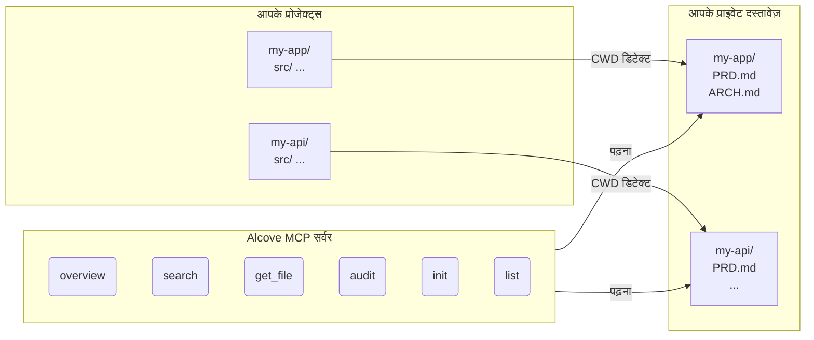

<p align="center">
  
</p>

<p align="center">आपके प्रोजेक्ट दस्तावेज़ों के लिए एक शांत जगह।</p>

<p align="center">
  <a href="../README.md">English</a> ·
  <a href="README.ko.md">한국어</a> ·
  <a href="README.ja.md">日本語</a> ·
  <a href="README.zh-CN.md">简体中文</a> ·
  <a href="README.es.md">Español</a> ·
  <a href="README.hi.md">हिन्दी</a> ·
  <a href="README.pt-BR.md">Português</a> ·
  <a href="README.de.md">Deutsch</a> ·
  <a href="README.fr.md">Français</a> ·
  <a href="README.ru.md">Русский</a>
</p>

<p align="center">
  <a href="https://crates.io/crates/alcove"></a>
  <a href="https://crates.io/crates/alcove"></a>
  <a href="../LICENSE"></a>
  <a href="https://buymeacoffee.com/epicsaga"></a>
</p>

Alcove एक MCP सर्वर है जो AI कोडिंग एजेंट्स को आपके प्राइवेट प्रोजेक्ट दस्तावेज़ों तक स्कोप्ड, रीड-ओनली एक्सेस प्रदान करता है — बिना उन्हें पब्लिक रिपॉज़िटरी में लीक किए।

## समस्या

आपके पास इंटरनल दस्तावेज़ हैं — PRDs, आर्किटेक्चर निर्णय, डिप्लॉयमेंट रनबुक, सीक्रेट्स मैप — जो आपके GitHub रिपॉज़िटरी में नहीं होने चाहिए। लेकिन अगर आपका AI एजेंट इन्हें पढ़ नहीं सकता, तो वह आपकी मदद नहीं कर सकता।

Alcove आपके प्राइवेट दस्तावेज़ों और AI एजेंट्स के बीच बैठता है। यह आपके टर्मिनल के CWD से ऑटो-डिटेक्ट करता है कि आप किस प्रोजेक्ट पर काम कर रहे हैं, और केवल उस प्रोजेक्ट के दस्तावेज़ MCP प्रोटोकॉल के माध्यम से सर्व करता है।

```
~/projects/my-app $ claude "ऑथेंटिकेशन कैसे इम्प्लीमेंट किया गया है?"

  → Alcove प्रोजेक्ट डिटेक्ट करता है: my-app
  → ~/documents/my-app/ARCHITECTURE.md पढ़ता है
  → एजेंट वास्तविक प्रोजेक्ट कॉन्टेक्स्ट के साथ जवाब देता है
```

## मुख्य विशेषताएं

- **प्रोजेक्ट ऑटो-डिटेक्शन** — CWD आधारित, प्रति प्रोजेक्ट कॉन्फ़िग अनावश्यक
- **स्कोप्ड एक्सेस** — प्रत्येक प्रोजेक्ट केवल अपने दस्तावेज़ देख सकता है
- **प्राइवेसी डिज़ाइन** — दस्तावेज़ आपके लोकल डॉक्स रिपॉज़िटरी में रहते हैं, कभी एक्सपोज़ नहीं होते
- **क्रॉस-रिपो ऑडिट** — GitHub पर गलती से पुश किए गए इंटरनल दस्तावेज़ खोजता है और फ़िक्स सुझाता है
- **8+ एजेंट्स सपोर्ट** — Claude Code, Cursor, Claude Desktop, Cline, OpenCode, Codex, Antigravity, Gemini CLI

## क्विक स्टार्ट

```bash
cargo install alcove
alcove setup
```

बस इतना ही। `setup` इंटरैक्टिव तरीके से सब कुछ गाइड करता है:

1. आपके दस्तावेज़ कहाँ हैं
2. कौन सी दस्तावेज़ कैटेगरी ट्रैक करनी है
3. पसंदीदा डायग्राम फ़ॉर्मेट
4. कौन से AI एजेंट्स कॉन्फ़िगर करने हैं (MCP + स्किल फ़ाइलें)

सेटिंग्स बदलने के लिए कभी भी `alcove setup` फिर से चलाएं। यह आपकी पिछली चॉइस याद रखता है।

## सोर्स से इंस्टॉल

```bash
git clone https://github.com/epicsagas/alcove.git
cd alcove
make install
```

## कैसे काम करता है



दस्तावेज़ एक अलग डायरेक्टरी (`DOCS_ROOT`) में ऑर्गनाइज़ होते हैं। Alcove वहां से पढ़ता है और MCP के stdio प्रोटोकॉल के माध्यम से AI एजेंट को सर्व करता है। एजेंट `get_doc_file("PRD.md")` जैसे टूल्स कॉल करता है और प्रोजेक्ट-स्पेसिफ़िक जवाब प्राप्त करता है।

## दस्तावेज़ वर्गीकरण

Alcove दस्तावेज़ों को तीन स्तरों में वर्गीकृत करता है:

| वर्गीकरण | स्थान | उदाहरण |
|-----------|--------|--------|
| **doc-repo-required** | Alcove (प्राइवेट) | PRD, Architecture, Decisions, Conventions |
| **doc-repo-supplementary** | Alcove (प्राइवेट) | Deployment, Onboarding, Testing, Runbook |
| **project-repo** | GitHub रिपॉज़िटरी (पब्लिक) | README, CHANGELOG, CONTRIBUTING |

`audit` टूल दोनों स्थानों की जांच करता है और कार्रवाई सुझाता है — जैसे प्राइवेट PRD से पब्लिक README जनरेट करना, या गलत जगह रखी रिपोर्ट्स को alcove में वापस लाना।

## MCP टूल्स

| टूल | कार्य |
|------|-------|
| `get_project_docs_overview` | वर्गीकरण और साइज़ के साथ सभी दस्तावेज़ सूचीबद्ध करें |
| `search_project_docs` | सभी प्रोजेक्ट दस्तावेज़ों में कीवर्ड सर्च |
| `get_doc_file` | पाथ से विशिष्ट दस्तावेज़ पढ़ें |
| `list_projects` | डॉक्स रिपॉज़िटरी में सभी प्रोजेक्ट दिखाएं |
| `audit_project` | क्रॉस-रिपो ऑडिट और सुझाई गई कार्रवाइयां |
| `init_project` | टेम्पलेट से नए प्रोजेक्ट के दस्तावेज़ स्कैफ़ोल्ड करें |

## CLI

```
alcove              MCP सर्वर शुरू करें (एजेंट्स इसे कॉल करते हैं)
alcove setup        इंटरैक्टिव सेटअप — कभी भी री-कॉन्फ़िगर करने के लिए फिर चलाएं
alcove uninstall    स्किल्स, कॉन्फ़िग और लेगेसी फ़ाइलें हटाएं
```

## कॉन्फ़िगरेशन

कॉन्फ़िग `~/.config/alcove/config.toml` पर है:

```toml
docs_root = "/Users/you/documents"

[core]
files = ["PRD.md", "ARCHITECTURE.md", "PROGRESS.md", "DECISIONS.md", "CONVENTIONS.md", "SECRETS_MAP.md", "DEBT.md"]

[team]
files = ["ENV_SETUP.md", "ONBOARDING.md", "DEPLOYMENT.md", "TESTING.md", ...]

[public]
files = ["README.md", "CHANGELOG.md", "CONTRIBUTING.md", "SECURITY.md", ...]

[diagram]
format = "mermaid"
```

सभी सेटिंग्स `alcove setup` के माध्यम से इंटरैक्टिव तरीके से की जा सकती हैं। आप फ़ाइल को सीधे भी एडिट कर सकते हैं।

## अपडेट

```bash
cargo install alcove
```

## अनइंस्टॉल

```bash
alcove uninstall          # स्किल्स और कॉन्फ़िग हटाएं
cargo uninstall alcove    # बाइनरी हटाएं
```

## समर्थित एजेंट्स

| एजेंट | MCP | स्किल |
|--------|-----|-------|
| Claude Code | `~/.claude.json` | `~/.claude/skills/alcove/` |
| Cursor | `~/.cursor/mcp.json` | `~/.cursor/skills/alcove/` |
| Claude Desktop | प्लेटफ़ॉर्म कॉन्फ़िग | — |
| Cline (VS Code) | VS Code globalStorage | — |
| OpenCode | `~/.config/opencode/opencode.json` | `~/.opencode/skills/alcove/` |
| Codex CLI | `~/.codex/config.toml` | — |
| Antigravity | `~/.antigravity/settings.json` | — |
| Gemini CLI | `~/.gemini/settings.json` | `~/.gemini/skills/alcove/` |

## समर्थित भाषाएं

CLI स्वचालित रूप से आपके सिस्टम लोकेल का पता लगाता है। आप `ALCOVE_LANG` एनवायरनमेंट वेरिएबल से ओवरराइड भी कर सकते हैं।

| भाषा | कोड |
|------|------|
| English | `en` |
| 한국어 | `ko` |
| 简体中文 | `zh-CN` |
| 日本語 | `ja` |
| Español | `es` |
| हिन्दी | `hi` |
| Português (Brasil) | `pt-BR` |
| Deutsch | `de` |
| Français | `fr` |
| Русский | `ru` |

```bash
# भाषा ओवरराइड
ALCOVE_LANG=hi alcove setup
```

## लाइसेंस

Apache-2.0
