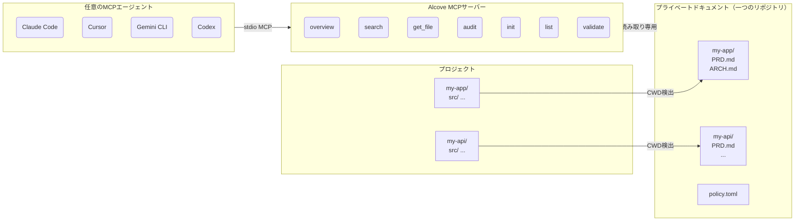

<p align="center">
  
</p>

<p align="center">プロジェクトドキュメントのための静かな場所。</p>

<p align="center">
  <a href="../README.md">English</a> ·
  <a href="README.ko.md">한국어</a> ·
  <a href="README.ja.md">日本語</a> ·
  <a href="README.zh-CN.md">简体中文</a> ·
  <a href="README.es.md">Español</a> ·
  <a href="README.hi.md">हिन्दी</a> ·
  <a href="README.pt-BR.md">Português</a> ·
  <a href="README.de.md">Deutsch</a> ·
  <a href="README.fr.md">Français</a> ·
  <a href="README.ru.md">Русский</a>
</p>

<p align="center">
  <a href="https://crates.io/crates/alcove"></a>
  <a href="https://crates.io/crates/alcove"></a>
  <a href="../LICENSE"></a>
  <a href="https://buymeacoffee.com/epicsaga"></a>
</p>

Alcoveは、AIコーディングエージェントにプライベートなプロジェクトドキュメントへのスコープ付き読み取り専用アクセスを提供するMCPサーバーです。パブリックリポジトリへの漏洩を防ぎます。

## 課題

複数のプロジェクトを同時に開発しながら、異なるAIコーディングエージェントを切り替えて使っています。各プロジェクトには内部ドキュメント（PRD、アーキテクチャ決定、デプロイ手順書、シークレットマップなど）がありますが、パブリックなGitHubリポジトリに置くべきではありません。

しかし、AIエージェントがそれらを読めなければ、適切な支援はできません。要件を勝手に作り上げ、すでに文書化された制約を無視します。エージェントやプロジェクトを切り替えるたびに、コンテキストが失われます。

## Alcoveの解決方法

Alcoveはすべてのプライベートドキュメントを**一つの共有リポジトリ**に、プロジェクトごとに整理して保管します。MCP互換のエージェントであれば、Claude Code、Cursor、Gemini CLI、Codexのいずれでも同じ方法でアクセスできます。

```
~/projects/my-app $ claude "認証はどう実装されている？"

  → Alcoveがプロジェクトを検出: my-app
  → ~/documents/my-app/ARCHITECTURE.md を読み込み
  → エージェントが実際のプロジェクトコンテキストに基づいて回答
```

```
~/projects/my-api $ codex "APIデザインをレビューして"

  → Alcoveがプロジェクトを検出: my-api
  → 同じドキュメント構造、同じアクセスパターン
  → 別のプロジェクト、同じワークフロー
```

**エージェントをいつでも切り替え。プロジェクトをいつでも切り替え。ドキュメントレイヤーは標準化されたまま。**

## 機能

- **一つのドキュメントリポジトリ、複数プロジェクト** — プライベートドキュメントをプロジェクトごとに整理し、一箇所で管理
- **一度の設定で、あらゆるエージェント** — 一度設定すれば、すべてのMCP互換エージェントが同じアクセスを取得
- **CWDからプロジェクトを自動検出** — プロジェクトごとの設定不要
- **スコープ付きアクセス** — 各プロジェクトは自分のドキュメントのみ参照可能
- **プライベートドキュメントはプライベートのまま** — 機密ドキュメント（シークレットマップ、内部決定事項、技術的負債）がパブリックリポジトリに触れることはない
- **標準化されたドキュメント構造** — `policy.toml`がすべてのプロジェクトとチームに一貫したドキュメントを強制
- **クロスリポジトリ監査** — GitHubに誤ってプッシュされた内部ドキュメントを発見し、修正を提案
- **ドキュメント検証** — 不足ファイル、未記入テンプレート、必須セクションをチェック
- **8つ以上のエージェントに対応** — Claude Code、Cursor、Claude Desktop、Cline、OpenCode、Codex、Antigravity、Gemini CLI

## なぜAlcoveなのか

| Alcoveなし | Alcoveあり |
|------------|-----------|
| 内部ドキュメントがNotion、Google Docs、ローカルファイルに散在 | 一つのドキュメントリポジトリ、プロジェクトごとに構造化 |
| 各AIエージェントごとにドキュメントアクセスを個別設定 | 一度の設定で、すべてのエージェントが同じアクセスを共有 |
| プロジェクト切り替え時にドキュメントコンテキストが失われる | CWD自動検出で、即座にプロジェクト切り替え |
| 機密ドキュメントがパブリックリポジトリに漏洩するリスク | プライベートドキュメントをプロジェクトリポジトリから物理的に分離 |
| ドキュメント構造がプロジェクトやチームメンバーごとに異なる | `policy.toml`がすべてのプロジェクトに標準を強制 |
| ドキュメントが完全かどうか確認する方法がない | `validate`が不足ファイル、空テンプレート、不足セクションを検出 |

## クイックスタート

```bash
cargo install alcove
alcove setup
```

以上です。`setup`がすべてを対話的にガイドします:

1. ドキュメントの保存場所
2. 追跡するドキュメントカテゴリ
3. 希望する図表フォーマット
4. 設定するAIエージェント（MCP + スキルファイル）

設定を変更したいときはいつでも`alcove setup`を再実行できます。以前の選択内容を記憶しています。

## ソースからインストール

```bash
git clone https://github.com/epicsagas/alcove.git
cd alcove
make install
```

## 仕組み



ドキュメントは別ディレクトリ（`DOCS_ROOT`）にプロジェクトごとのフォルダで整理されています。Alcoveはそこからドキュメントを読み取り、stdioを通じて任意のMCP互換AIエージェントに提供します。エージェントが`get_doc_file("PRD.md")`のようなツールを呼び出すと、使用しているエージェントに関係なく、プロジェクト固有の回答が得られます。

## ドキュメント分類

Alcoveはドキュメントを3つの階層に分類します:

| 分類 | 保存場所 | 例 |
|------|----------|-----|
| **doc-repo-required** | Alcove（プライベート） | PRD、アーキテクチャ、決定事項、コンベンション |
| **doc-repo-supplementary** | Alcove（プライベート） | デプロイ、オンボーディング、テスト、ランブック |
| **project-repo** | GitHubリポジトリ（パブリック） | README、CHANGELOG、CONTRIBUTING |

`audit`ツールは両方の場所をチェックし、アクションを提案します。例えば、プライベートPRDからパブリックREADMEを生成したり、誤って配置されたレポートをAlcoveに戻したりすることを提案します。

## MCPツール

| ツール | 機能 |
|--------|------|
| `get_project_docs_overview` | すべてのドキュメントを分類とサイズ付きで一覧表示 |
| `search_project_docs` | プロジェクトの全ドキュメントをキーワード検索 |
| `get_doc_file` | パスを指定して特定のドキュメントを読み取り |
| `list_projects` | ドキュメントリポジトリ内のすべてのプロジェクトを表示 |
| `audit_project` | クロスリポジトリ監査とアクション提案 |
| `init_project` | テンプレートから新規プロジェクトのドキュメントをスキャフォールド |
| `validate_docs` | チームポリシー（`policy.toml`）に対してドキュメントを検証 |

## CLI

```
alcove              MCPサーバーを起動（エージェントがこれを呼び出す）
alcove setup        対話的セットアップ — いつでも再実行して再設定可能
alcove validate     ポリシーに対してドキュメントを検証（--format json, --exit-code）
alcove uninstall    スキル、設定、レガシーファイルを削除
```

## ドキュメントポリシー

ドキュメントリポジトリの`policy.toml`でチーム全体のドキュメント標準を定義します:

```toml
[policy]
enforce = "strict"    # strict | warn

[[policy.required]]
name = "PRD.md"
aliases = ["prd.md", "product-requirements.md"]

[[policy.required]]
name = "ARCHITECTURE.md"

  [[policy.required.sections]]
  heading = "## Overview"
  required = true

  [[policy.required.sections]]
  heading = "## Components"
  required = true
  min_items = 2
```

ポリシーファイルは**プロジェクト** > **チーム** > **デフォルト**の優先順位で解決されます。これにより、プロジェクトごとのオーバーライドを許可しつつ、すべてのプロジェクトで一貫したドキュメント品質を確保します。

## 設定

設定ファイルは`~/.config/alcove/config.toml`にあります:

```toml
docs_root = "/Users/you/documents"

[core]
files = ["PRD.md", "ARCHITECTURE.md", "PROGRESS.md", "DECISIONS.md", "CONVENTIONS.md", "SECRETS_MAP.md", "DEBT.md"]

[team]
files = ["ENV_SETUP.md", "ONBOARDING.md", "DEPLOYMENT.md", "TESTING.md", ...]

[public]
files = ["README.md", "CHANGELOG.md", "CONTRIBUTING.md", "SECURITY.md", ...]

[diagram]
format = "mermaid"
```

すべて`alcove setup`で対話的に設定できます。ファイルを直接編集することも可能です。

## 対応エージェント

| エージェント | MCP | スキル |
|-------------|-----|--------|
| Claude Code | `~/.claude.json` | `~/.claude/skills/alcove/` |
| Cursor | `~/.cursor/mcp.json` | `~/.cursor/skills/alcove/` |
| Claude Desktop | プラットフォーム設定 | — |
| Cline (VS Code) | VS Code globalStorage | — |
| OpenCode | `~/.config/opencode/opencode.json` | `~/.opencode/skills/alcove/` |
| Codex CLI | `~/.codex/config.toml` | — |
| Antigravity | `~/.antigravity/settings.json` | — |
| Gemini CLI | `~/.gemini/settings.json` | `~/.gemini/skills/alcove/` |

## 対応言語

CLIはシステムロケールを自動検出します。`ALCOVE_LANG`環境変数で手動設定することもできます。

| 言語 | コード |
|------|--------|
| English | `en` |
| 한국어 | `ko` |
| 简体中文 | `zh-CN` |
| 日本語 | `ja` |
| Español | `es` |
| हिन्दी | `hi` |
| Português (Brasil) | `pt-BR` |
| Deutsch | `de` |
| Français | `fr` |
| Русский | `ru` |

```bash
# 言語を上書き
ALCOVE_LANG=ko alcove setup
```

## アップデート

```bash
cargo install alcove
```

## アンインストール

```bash
alcove uninstall          # スキルと設定を削除
cargo uninstall alcove    # バイナリを削除
```

## ライセンス

Apache-2.0
