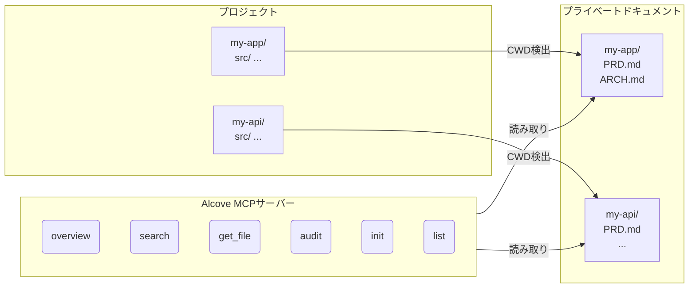

<p align="center">
  
</p>

<p align="center">プロジェクトドキュメントのための静かな場所。</p>

<p align="center">
  <a href="../README.md">English</a> ·
  <a href="README.ko.md">한국어</a> ·
  <a href="README.ja.md">日本語</a> ·
  <a href="README.zh-CN.md">简体中文</a> ·
  <a href="README.es.md">Español</a> ·
  <a href="README.hi.md">हिन्दी</a> ·
  <a href="README.pt-BR.md">Português</a> ·
  <a href="README.de.md">Deutsch</a> ·
  <a href="README.fr.md">Français</a> ·
  <a href="README.ru.md">Русский</a>
</p>

<p align="center">
  <a href="https://crates.io/crates/alcove"></a>
  <a href="https://crates.io/crates/alcove"></a>
  <a href="../LICENSE"></a>
  <a href="https://buymeacoffee.com/epicsaga"></a>
</p>

Alcoveは、AIコーディングエージェントにプライベートプロジェクトドキュメントへのスコープ付き読み取り専用アクセスを提供するMCPサーバーです — パブリックリポジトリにドキュメントが漏洩しません。

## 課題

PRD、アーキテクチャ決定、デプロイランブック、シークレットマップなど、GitHubリポジトリに置くべきでない内部ドキュメントがあります。しかし、AIエージェントがこれらを読めなければ、支援することができません。

Alcoveはプライベートドキュメントとエージェントの間に位置します。ターミナルのCWDから作業中のプロジェクトを自動検出し、そのプロジェクトのドキュメントのみをMCPプロトコルを通じて提供します。

```
~/projects/my-app $ claude "認証はどう実装されていますか？"

  → Alcoveがプロジェクトを検出: my-app
  → ~/documents/my-app/ARCHITECTURE.md を読み込み
  → エージェントが実際のプロジェクトコンテキストで回答
```

## 主な機能

- **プロジェクト自動検出** — CWDベース、プロジェクトごとの設定不要
- **スコープ付きアクセス** — 各プロジェクトは自分のドキュメントのみ参照可能
- **プライバシー設計** — ドキュメントはローカルドキュメントリポジトリに保管、外部公開なし
- **クロスリポ監査** — GitHubに誤ってプッシュされた内部ドキュメントを検出し修正を提案
- **8+エージェント対応** — Claude Code、Cursor、Claude Desktop、Cline、OpenCode、Codex、Antigravity、Gemini CLI

## クイックスタート

```bash
cargo install alcove
alcove setup
```

これだけです。`setup`が対話的にすべてをガイドします：

1. ドキュメントの場所
2. 追跡するドキュメントカテゴリ
3. 好みのダイアグラム形式
4. 設定するAIエージェント（MCP + スキルファイル）

設定を変更するにはいつでも`alcove setup`を再実行してください。以前の選択を記憶しています。

## ソースからインストール

```bash
git clone https://github.com/epicsagas/alcove.git
cd alcove
make install
```

## 仕組み



ドキュメントは別のディレクトリ（`DOCS_ROOT`）に整理されます。Alcoveはそこから読み取り、MCPのstdioプロトコルを通じてAIエージェントに提供します。エージェントは`get_doc_file("PRD.md")`のようなツールを呼び出し、プロジェクト固有の回答を得ます。

## ドキュメント分類

Alcoveはドキュメントを3段階に分類します：

| 分類 | 場所 | 例 |
|------|------|-----|
| **doc-repo-required** | Alcove（プライベート） | PRD, Architecture, Decisions, Conventions |
| **doc-repo-supplementary** | Alcove（プライベート） | Deployment, Onboarding, Testing, Runbook |
| **project-repo** | GitHubリポジトリ（公開） | README, CHANGELOG, CONTRIBUTING |

`audit`ツールは両方の場所を確認し、アクションを提案します — プライベートPRDからパブリックREADMEを生成したり、誤って配置されたレポートをalcoveに移動したりなど。

## MCPツール

| ツール | 機能 |
|--------|------|
| `get_project_docs_overview` | 分類とサイズ付きで全ドキュメントを一覧 |
| `search_project_docs` | 全プロジェクトドキュメントでキーワード検索 |
| `get_doc_file` | パスで特定のドキュメントを読み取り |
| `list_projects` | ドキュメントリポジトリの全プロジェクトを表示 |
| `audit_project` | クロスリポ監査とアクション提案 |
| `init_project` | テンプレートから新プロジェクトのドキュメントをスキャフォールド |

## CLI

```
alcove              MCPサーバー起動（エージェントが呼び出し）
alcove setup        対話的セットアップ — いつでも再実行して再設定
alcove uninstall    スキル、設定、レガシーファイルを削除
```

## 設定

設定ファイルの場所：`~/.config/alcove/config.toml`：

```toml
docs_root = "/Users/you/documents"

[core]
files = ["PRD.md", "ARCHITECTURE.md", "PROGRESS.md", "DECISIONS.md", "CONVENTIONS.md", "SECRETS_MAP.md", "DEBT.md"]

[team]
files = ["ENV_SETUP.md", "ONBOARDING.md", "DEPLOYMENT.md", "TESTING.md", ...]

[public]
files = ["README.md", "CHANGELOG.md", "CONTRIBUTING.md", "SECURITY.md", ...]

[diagram]
format = "mermaid"
```

すべての設定は`alcove setup`で対話的に行えます。ファイルを直接編集することもできます。

## アップデート

```bash
cargo install alcove
```

## アンインストール

```bash
alcove uninstall          # スキル＆設定を削除
cargo uninstall alcove    # バイナリを削除
```

## 対応エージェント

| エージェント | MCP | スキル |
|-------------|-----|--------|
| Claude Code | `~/.claude.json` | `~/.claude/skills/alcove/` |
| Cursor | `~/.cursor/mcp.json` | `~/.cursor/skills/alcove/` |
| Claude Desktop | プラットフォーム設定 | — |
| Cline (VS Code) | VS Code globalStorage | — |
| OpenCode | `~/.config/opencode/opencode.json` | `~/.opencode/skills/alcove/` |
| Codex CLI | `~/.codex/config.toml` | — |
| Antigravity | `~/.antigravity/settings.json` | — |
| Gemini CLI | `~/.gemini/settings.json` | `~/.gemini/skills/alcove/` |

## 対応言語

CLIはシステムロケールを自動検出します。`ALCOVE_LANG`環境変数でオーバーライドすることもできます。

| 言語 | コード |
|------|--------|
| English | `en` |
| 한국어 | `ko` |
| 简体中文 | `zh-CN` |
| 日本語 | `ja` |
| Español | `es` |
| हिन्दी | `hi` |
| Português (Brasil) | `pt-BR` |
| Deutsch | `de` |
| Français | `fr` |
| Русский | `ru` |

```bash
# 言語オーバーライド
ALCOVE_LANG=ja alcove setup
```

## ライセンス

Apache-2.0
