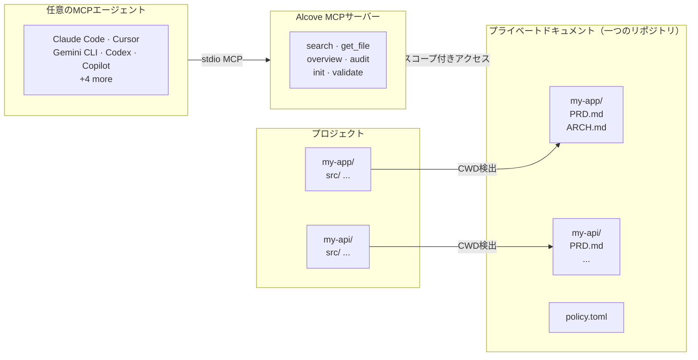

<p align="center">
  
</p>

<p align="center"><strong>AIエージェントはあなたのプロジェクトを知らない。Alcoveが解決します。</strong></p>

<p align="center">
  <a href="../README.md">English</a> ·
  <a href="README.ko.md">한국어</a> ·
  <a href="README.ja.md">日本語</a> ·
  <a href="README.zh-CN.md">简体中文</a> ·
  <a href="README.es.md">Español</a> ·
  <a href="README.hi.md">हिन्दी</a> ·
  <a href="README.pt-BR.md">Português</a> ·
  <a href="README.de.md">Deutsch</a> ·
  <a href="README.fr.md">Français</a> ·
  <a href="README.ru.md">Русский</a>
</p>

<p align="center">
  <a href="https://crates.io/crates/alcove"></a>
  <a href="https://crates.io/crates/alcove"></a>
  <a href="../LICENSE"></a>
  <a href="https://buymeacoffee.com/epicsaga"></a>
</p>

Alcoveは、あらゆるAIコーディングエージェントにプライベートなプロジェクトドキュメントの読み取り・管理するアクセスを提供します — パブリックリポジトリへの漏洩を防ぎながら。

PRD、アーキテクチャ決定、シークレットマップ、内部ランブックを一箇所に保管。すべてのMCP互換エージェントが同じツールを取得し、すべてのプロジェクトで動作し、プロジェクトごとの設定は不要です。

## 課題

二つの悪い選択肢があります。

**選択肢A：`CLAUDE.md` / `AGENTS.md`にドキュメントを入れる**
毎回すべてのファイルがコンテキストウィンドウに注入されます。
短い規約には通用しますが、実際のプロジェクトドキュメントでは破綻します。
アーキテクチャファイル10個 = コンテキスト肥大 = 遅く、高価で、精度の低い応答。

**選択肢B：ドキュメントを入れない**
エージェントがすでに文書化された要件を作り上げます。
すでに決定した制約を無視します。
毎セッション同じことを説明するよう求めてきます。

どちらも拡張できません。5つのプロジェクトと3つのエージェントで掛け算すると、それぞれ異なる設定になります。切り替えるたびにコンテキストが失われます。

## Alcoveの解決方法

Alcoveはすべてのプライベートドキュメントを**一つの共有リポジトリ**に、プロジェクトごとに整理して保管します。MCP互換のエージェントであれば、Claude Code、Cursor、Gemini CLI、Codexのいずれでも同じ方法でアクセスできます。

```
~/projects/my-app $ claude "認証はどう実装されている？"

  → Alcoveがプロジェクトを検出: my-app
  → ~/documents/my-app/ARCHITECTURE.md を読み込み
  → エージェントが実際のプロジェクトコンテキストに基づいて回答
```

```
~/projects/my-api $ codex "APIデザインをレビューして"

  → Alcoveがプロジェクトを検出: my-api
  → 同じドキュメント構造、同じアクセスパターン
  → 別のプロジェクト、同じワークフロー
```

**エージェントをいつでも切り替え。プロジェクトをいつでも切り替え。ドキュメントレイヤーは標準化されたまま。**

## 機能

- **一つのドキュメントリポジトリ、複数プロジェクト** — プライベートドキュメントをプロジェクトごとに整理し、一箇所で管理
- **一度の設定で、あらゆるエージェント** — 一度設定すれば、すべてのMCP互換エージェントが同じアクセスを取得
- **CWDからプロジェクトを自動検出** — プロジェクトごとの設定不要
- **スコープ付きアクセス** — 各プロジェクトは自分のドキュメントのみ参照可能
- **スマート検索** — BM25ランキング検索と自動インデクシング。最も関連性の高いドキュメントを最初に表示し、必要に応じてgrepにフォールバック
- **クロスプロジェクト検索** — `scope: "global"`で全プロジェクトを一括検索 — パーソナルナレッジベースとして活用
- **プライベートドキュメントはプライベートのまま** — 機密ドキュメント（シークレットマップ、内部決定事項、技術的負債）がパブリックリポジトリに触れることはない
- **標準化されたドキュメント構造** — `policy.toml`がすべてのプロジェクトとチームに一貫したドキュメントを強制
- **クロスリポジトリ監査** — プロジェクトリポジトリに誤って配置された内部ドキュメントを発見し、修正を提案
- **ドキュメント検証** — 不足ファイル、未記入テンプレート、必須セクションをチェック
- **9つ以上のエージェントに対応** — Claude Code、Cursor、Claude Desktop、Cline、OpenCode、Codex、Copilot、Antigravity、Gemini CLI

## なぜAlcoveなのか

| Alcoveなし | Alcoveあり |
|------------|-----------|
| 内部ドキュメントがNotion、Google Docs、ローカルファイルに散在 | 一つのドキュメントリポジトリ、プロジェクトごとに構造化 |
| 各AIエージェントごとにドキュメントアクセスを個別設定 | 一度の設定で、すべてのエージェントが同じアクセスを共有 |
| プロジェクト切り替え時にドキュメントコンテキストが失われる | CWD自動検出で、即座にプロジェクト切り替え |
| エージェント検索がランダムなマッチ行を返す | BM25ランキング検索 — 最適なマッチを優先、自動インデクシング |
| 「認証に関するノートをすべて検索」— 不可能 | グローバル検索で全プロジェクトを一括クエリ |
| 機密ドキュメントがパブリックリポジトリに漏洩するリスク | プライベートドキュメントをプロジェクトリポジトリから物理的に分離 |
| ドキュメント構造がプロジェクトやチームメンバーごとに異なる | `policy.toml`がすべてのプロジェクトに標準を強制 |
| ドキュメントが完全かどうか確認する方法がない | `validate`が不足ファイル、空テンプレート、不足セクションを検出 |

## クイックスタート

```bash
# macOS
brew install epicsagas/alcove/alcove

# Linux / Windows — ビルド済みバイナリ（高速、コンパイル不要）
cargo install cargo-binstall
cargo binstall alcove

# 任意のプラットフォーム — ソースからビルド
cargo install alcove

# クローンしてビルド
git clone https://github.com/epicsagas/alcove.git
cd alcove
make install

alcove setup
```

以上です。`setup`がすべてを対話的にガイドします:

1. ドキュメントの保存場所
2. 追跡するドキュメントカテゴリ
3. 希望する図表フォーマット
4. 設定するAIエージェント（MCP + スキルファイル）

設定を変更したいときはいつでも`alcove setup`を再実行できます。以前の選択内容を記憶しています。

## 仕組み



ドキュメントは別ディレクトリ（`DOCS_ROOT`）にプロジェクトごとのフォルダで整理されています。Alcoveはそこからドキュメントを管理し、提供します — stdioを通じて任意のMCP互換AIエージェントに。エージェントが`get_doc_file("PRD.md")`のようなツールを呼び出すと、使用しているエージェントに関係なく、プロジェクト固有の回答が得られます。

## ドキュメント分類

Alcoveはドキュメントを以下のように分類します:

| 分類 | 保存場所 | 例 |
|------|----------|-----|
| **doc-repo-required** | Alcove（プライベート） | PRD、アーキテクチャ、決定事項、コンベンション |
| **doc-repo-supplementary** | Alcove（プライベート） | デプロイ、オンボーディング、テスト、ランブック |
| **reference** | Alcove `reports/` フォルダ | 監査レポート、ベンチマーク、分析 |
| **project-repo** | GitHubリポジトリ（パブリック） | README、CHANGELOG、CONTRIBUTING |

`audit`ツールはドキュメントリポジトリとローカルプロジェクトディレクトリの両方をスキャンし、アクションを提案します — プライベートPRDからパブリックREADMEの生成や、誤って配置されたレポートのAlcoveへの移動など。

## MCPツール

| ツール | 機能 |
|--------|------|
| `get_project_docs_overview` | すべてのドキュメントを分類とサイズ付きで一覧表示 |
| `search_project_docs` | スマート検索 — BM25ランキングまたはgrepを自動選択、`scope: "global"`でクロスプロジェクト検索対応 |
| `get_doc_file` | パスを指定して特定のドキュメントを読み取り（大きなファイルは`offset`/`limit`対応） |
| `list_projects` | ドキュメントリポジトリ内のすべてのプロジェクトを表示 |
| `audit_project` | クロスリポジトリ監査 — ドキュメントリポジトリとローカルプロジェクトをスキャンしてアクション提案 |
| `init_project` | 新規プロジェクトのドキュメントをスキャフォールド（内部+外部ドキュメント、選択的ファイル作成） |
| `validate_docs` | チームポリシー（`policy.toml`）に対してドキュメントを検証 |
| `rebuild_index` | 全文検索インデックスの再構築（通常は自動） |
| `check_doc_changes` | 前回のインデックスビルド以降に追加・変更・削除されたドキュメントを検出 |

## CLI

```
alcove              MCPサーバーを起動（エージェントがこれを呼び出す）
alcove setup        対話的セットアップ — いつでも再実行して再設定可能
alcove doctor       インストール状態を診断
alcove validate     ポリシーに対してドキュメントを検証（--format json, --exit-code）
alcove index        検索インデックスのビルドまたは再ビルド
alcove search       ターミナルからドキュメントを検索
alcove uninstall    スキル、設定、レガシーファイルを削除
```

## 検索

Alcoveは自動的に最適な検索戦略を選択します。検索インデックスが存在する場合、**BM25ランキング検索**（[tantivy](https://github.com/quickwit-oss/tantivy)搭載）で関連度スコア付きの結果を返します。インデックスがない場合はgrepにフォールバックします。ユーザーが気にする必要はありません。

```bash
# 現在のプロジェクトを検索（CWDから自動検出）
alcove search "authentication flow"

# すべてのプロジェクトを一括検索 — パーソナルナレッジベース
alcove search "OAuth token refresh" --scope global

# 完全一致の部分文字列マッチングが必要な場合はgrepモードを強制
alcove search "FR-023" --mode grep
```

インデックスはMCPサーバー起動時にバックグラウンドで自動的にビルドされ、ファイルの変更を検出すると自動的にリビルドします。cronジョブも手動操作も不要です。

**エージェントでの使い方:** エージェントはクエリで`search_project_docs`を呼び出すだけです。Alcoveがランキング、重複排除（ファイルごとに1結果）、クロスプロジェクト検索、フォールバックをすべて処理します。エージェントが検索モードを選択する必要はありません。

## プロジェクト検出

デフォルトでは、Alcoveはターミナルの作業ディレクトリ（CWD）から現在のプロジェクトを検出します。`MCP_PROJECT_NAME`環境変数でオーバーライドできます:

```bash
MCP_PROJECT_NAME=my-api alcove
```

CWDがドキュメントリポジトリのプロジェクト名と一致しない場合に便利です。

## ドキュメントポリシー

ドキュメントリポジトリの`policy.toml`でチーム全体のドキュメント標準を定義します:

```toml
[policy]
enforce = "strict"    # strict | warn

[[policy.required]]
name = "PRD.md"
aliases = ["prd.md", "product-requirements.md"]

[[policy.required]]
name = "ARCHITECTURE.md"

  [[policy.required.sections]]
  heading = "## Overview"
  required = true

  [[policy.required.sections]]
  heading = "## Components"
  required = true
  min_items = 2
```

ポリシーファイルは**プロジェクト**（`<project>/.alcove/policy.toml`）> **チーム**（`DOCS_ROOT/.alcove/policy.toml`）> **組み込みデフォルト**（config.tomlのcoreファイルリスト）の優先順位で解決されます。プロジェクトごとのオーバーライドを許可しつつ、すべてのプロジェクトで一貫したドキュメント品質を確保します。

## 設定

設定ファイルは`~/.config/alcove/config.toml`にあります:

```toml
docs_root = "/Users/you/documents"

[core]
files = ["PRD.md", "ARCHITECTURE.md", "PROGRESS.md", "DECISIONS.md", "CONVENTIONS.md", "SECRETS_MAP.md", "DEBT.md"]

[team]
files = ["ENV_SETUP.md", "ONBOARDING.md", "DEPLOYMENT.md", "TESTING.md", ...]

[public]
files = ["README.md", "CHANGELOG.md", "CONTRIBUTING.md", "SECURITY.md", ...]

[diagram]
format = "mermaid"
```

すべて`alcove setup`で対話的に設定できます。ファイルを直接編集することも可能です。

## 対応エージェント

| エージェント | MCP | スキル |
|-------------|-----|--------|
| Claude Code | `~/.claude.json` | `~/.claude/skills/alcove/` |
| Cursor | `~/.cursor/mcp.json` | `~/.cursor/skills/alcove/` |
| Claude Desktop | プラットフォーム設定 | — |
| Cline (VS Code) | VS Code globalStorage | `~/.cline/skills/alcove/` |
| OpenCode | `~/.config/opencode/opencode.json` | `~/.opencode/skills/alcove/` |
| Codex CLI | `~/.codex/config.toml` | `~/.codex/skills/alcove/` |
| Copilot CLI | `~/.copilot/mcp-config.json` | `~/.copilot/skills/alcove/` |
| Antigravity | `~/.gemini/antigravity/mcp_config.json` | — |
| Gemini CLI | `~/.gemini/settings.json` | `~/.gemini/skills/alcove/` |

## 対応言語

CLIはシステムロケールを自動検出します。`ALCOVE_LANG`環境変数で手動設定することもできます。

| 言語 | コード |
|------|--------|
| English | `en` |
| 한국어 | `ko` |
| 简体中文 | `zh-CN` |
| 日本語 | `ja` |
| Español | `es` |
| हिन्दी | `hi` |
| Português (Brasil) | `pt-BR` |
| Deutsch | `de` |
| Français | `fr` |
| Русский | `ru` |

```bash
# 言語を上書き
ALCOVE_LANG=ja alcove setup
```

## アップデート

```bash
# Homebrew
brew upgrade epicsagas/alcove/alcove

# cargo-binstall
cargo binstall alcove

# ソースから
cargo install alcove
```

## アンインストール

```bash
alcove uninstall          # スキルと設定を削除
cargo uninstall alcove    # バイナリを削除
```

## コントリビュート

バグレポート、機能リクエスト、プルリクエストを歓迎します。議論を始めるには[GitHub](https://github.com/epicsagas/alcove/issues)でIssueを開いてください。

## ライセンス

Apache-2.0
