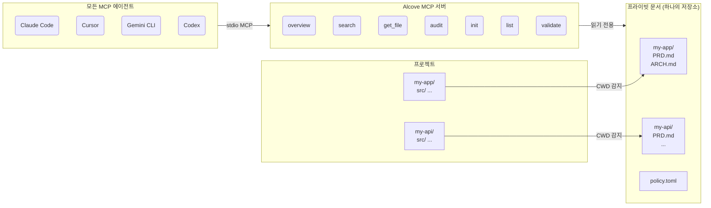

<p align="center">
  
</p>

<p align="center">프로젝트 문서를 위한 조용한 공간.</p>

<p align="center">
  <a href="../README.md">English</a> ·
  <a href="README.ko.md">한국어</a> ·
  <a href="README.ja.md">日本語</a> ·
  <a href="README.zh-CN.md">简体中文</a> ·
  <a href="README.es.md">Español</a> ·
  <a href="README.hi.md">हिन्दी</a> ·
  <a href="README.pt-BR.md">Português</a> ·
  <a href="README.de.md">Deutsch</a> ·
  <a href="README.fr.md">Français</a> ·
  <a href="README.ru.md">Русский</a>
</p>

<p align="center">
  <a href="https://crates.io/crates/alcove"></a>
  <a href="https://crates.io/crates/alcove"></a>
  <a href="../LICENSE"></a>
  <a href="https://buymeacoffee.com/epicsaga"></a>
</p>

Alcove는 모든 AI 코딩 에이전트가 프라이빗 프로젝트 문서를 읽을 수 있게 해줍니다 — 공개 저장소에 유출되지 않으면서.

PRD, 아키텍처 결정, 시크릿 맵, 내부 런북을 한 곳에 보관하세요. 모든 MCP 호환 에이전트가 동일한 접근 권한을 얻고, 모든 프로젝트에서 동작하며, 프로젝트별 설정이 필요 없습니다.

## 문제

공개 GitHub 저장소에 올려서는 안 되는 내부 문서가 있습니다. 하지만 AI 에이전트가 이 문서를 읽지 못하면 제대로 도움을 줄 수 없습니다 — 요구사항을 지어내고, 이미 문서화한 제약 사항을 무시합니다.

여기에 여러 프로젝트와 여러 에이전트를 곱하면 상황이 더 복잡해집니다. 에이전트마다 설정이 다르고, 전환할 때마다 컨텍스트를 잃습니다. 그리고 이 문서들을 체계적으로 정리하거나 검증할 표준 방법도 없습니다.

## Alcove가 해결하는 방법

Alcove는 모든 프라이빗 문서를 프로젝트별로 정리된 **하나의 공유 저장소**에 보관합니다. MCP 호환 에이전트라면 동일한 방식으로 접근할 수 있습니다 — Claude Code, Cursor, Gemini CLI, Codex 어디서든 상관없습니다.

```
~/projects/my-app $ claude "인증은 어떻게 구현되어 있나요?"

  → Alcove가 프로젝트 감지: my-app
  → ~/documents/my-app/ARCHITECTURE.md 읽기
  → 에이전트가 실제 프로젝트 컨텍스트로 답변
```

```
~/projects/my-api $ codex "API 설계를 검토해줘"

  → Alcove가 프로젝트 감지: my-api
  → 동일한 문서 구조, 동일한 접근 패턴
  → 다른 프로젝트, 같은 워크플로우
```

**에이전트를 언제든 전환하세요. 프로젝트를 언제든 전환하세요. 문서 레이어는 표준화되어 있습니다.**

## 주요 기능

- **하나의 문서 저장소, 여러 프로젝트** — 프라이빗 문서를 프로젝트별로 정리하고 한 곳에서 관리
- **한 번 설정, 모든 에이전트** — 한 번 설정하면 모든 MCP 호환 에이전트가 동일한 접근 권한을 얻음
- **CWD 기반 프로젝트 자동 감지** — 프로젝트별 설정 불필요
- **범위 지정 접근** — 각 프로젝트는 자신의 문서만 볼 수 있음
- **프라이빗 문서는 프라이빗으로 유지** — 민감한 문서(시크릿 맵, 내부 결정, 기술 부채)가 공개 저장소에 들어가지 않음
- **표준화된 문서 구조** — `policy.toml`로 모든 프로젝트와 팀에 일관된 문서를 적용
- **크로스 레포 감사** — 프로젝트 저장소에 잘못 배치된 내부 문서를 찾아 수정 제안
- **문서 검증** — 누락된 파일, 미작성 템플릿, 필수 섹션 확인
- **8개 이상 에이전트 지원** — Claude Code, Cursor, Claude Desktop, Cline, OpenCode, Codex, Antigravity, Gemini CLI

## Alcove를 사용하는 이유

| Alcove 없이 | Alcove와 함께 |
|-------------|--------------|
| 내부 문서가 Notion, Google Docs, 로컬 파일에 흩어져 있음 | 하나의 문서 저장소, 프로젝트별로 구조화 |
| 각 AI 에이전트마다 문서 접근을 별도로 설정 | 한 번 설정, 모든 에이전트가 동일한 접근 공유 |
| 프로젝트를 전환하면 문서 컨텍스트를 잃음 | CWD 자동 감지, 즉시 프로젝트 전환 |
| 민감한 문서가 프로젝트 저장소에 섞여 있거나 여기저기 흩어져 있음 | 프라이빗 문서는 프로젝트 저장소와 물리적으로 분리 |
| 프로젝트와 팀원마다 문서 구조가 다름 | `policy.toml`로 모든 프로젝트에 표준 적용 |
| 문서가 완성되었는지 확인할 방법이 없음 | `validate`가 누락된 파일, 빈 템플릿, 누락된 섹션을 감지 |

## 빠른 시작

```bash
cargo install alcove
alcove setup
```

이것만 하면 됩니다. `setup`이 대화형으로 모든 것을 안내합니다:

1. 문서가 어디에 있는지
2. 어떤 문서 카테고리를 추적할지
3. 선호하는 다이어그램 형식
4. 어떤 AI 에이전트를 설정할지 (MCP + 스킬 파일)

설정을 변경하려면 언제든 `alcove setup`을 다시 실행하세요. 이전 선택을 기억합니다.

## 소스에서 설치

```bash
git clone https://github.com/epicsagas/alcove.git
cd alcove
make install
```

## 작동 방식



문서는 별도 디렉토리(`DOCS_ROOT`)에 프로젝트별 폴더로 정리됩니다. Alcove는 거기서 읽어 stdio를 통해 MCP 호환 AI 에이전트에게 제공합니다. 에이전트는 `get_doc_file("PRD.md")` 같은 도구를 호출하여 어떤 에이전트를 사용하든 프로젝트별 답변을 얻습니다.

## 문서 분류

Alcove는 문서를 다음과 같이 분류합니다:

| 분류 | 위치 | 예시 |
|------|------|------|
| **doc-repo-required** | Alcove (프라이빗) | PRD, Architecture, Decisions, Conventions |
| **doc-repo-supplementary** | Alcove (프라이빗) | Deployment, Onboarding, Testing, Runbook |
| **reference** | Alcove `reports/` 폴더 | 감사 보고서, 벤치마크, 분석 |
| **project-repo** | GitHub 저장소 (공개) | README, CHANGELOG, CONTRIBUTING |

`audit` 도구는 doc-repo와 로컬 프로젝트 디렉토리를 양쪽 모두 스캔하고 조치를 제안합니다 — 프라이빗 PRD에서 공개 README를 생성하거나, 잘못 배치된 리포트를 alcove로 가져오는 등.

## MCP 도구

| 도구 | 기능 |
|------|------|
| `get_project_docs_overview` | 분류 및 크기와 함께 모든 문서 목록 표시 |
| `search_project_docs` | doc-repo와 프로젝트 저장소 양쪽에서 키워드 검색 |
| `get_doc_file` | 경로로 특정 문서 읽기 (대용량 파일은 `offset`/`limit` 지원) |
| `list_projects` | 문서 저장소의 모든 프로젝트 표시 |
| `audit_project` | 크로스 레포 감사 — doc-repo와 로컬 프로젝트 디렉토리를 스캔하고 조치 제안 |
| `init_project` | 새 프로젝트 문서 스캐폴딩 (내부+외부 문서, 선택적 파일 생성) |
| `validate_docs` | 팀 정책(`policy.toml`)에 따라 문서 검증 |

## CLI

```
alcove              MCP 서버 시작 (에이전트가 호출)
alcove setup        대화형 설정 — 언제든 다시 실행하여 재설정
alcove validate     정책에 따라 문서 검증 (--format json, --exit-code)
alcove uninstall    스킬, 설정 및 레거시 파일 제거
```

## 프로젝트 감지

기본적으로 Alcove는 터미널의 작업 디렉토리(CWD)에서 현재 프로젝트를 감지합니다. `MCP_PROJECT_NAME` 환경 변수로 오버라이드할 수 있습니다:

```bash
MCP_PROJECT_NAME=my-api alcove
```

CWD가 문서 저장소의 프로젝트 이름과 일치하지 않을 때 유용합니다.

## 문서 정책

문서 저장소의 `policy.toml`로 팀 전체 문서 표준을 정의합니다:

```toml
[policy]
enforce = "strict"    # strict | warn

[[policy.required]]
name = "PRD.md"
aliases = ["prd.md", "product-requirements.md"]

[[policy.required]]
name = "ARCHITECTURE.md"

  [[policy.required.sections]]
  heading = "## Overview"
  required = true

  [[policy.required.sections]]
  heading = "## Components"
  required = true
  min_items = 2
```

정책 파일은 **프로젝트** (`<project>/.alcove/policy.toml`) > **팀** (`DOCS_ROOT/.alcove/policy.toml`) > **내장 기본값** (config.toml의 core 파일 목록) 우선순위로 적용됩니다. 이를 통해 모든 프로젝트에 일관된 문서 품질을 보장하면서 프로젝트별 오버라이드를 허용합니다.

## 설정

설정 파일 위치: `~/.config/alcove/config.toml`:

```toml
docs_root = "/Users/you/documents"

[core]
files = ["PRD.md", "ARCHITECTURE.md", "PROGRESS.md", "DECISIONS.md", "CONVENTIONS.md", "SECRETS_MAP.md", "DEBT.md"]

[team]
files = ["ENV_SETUP.md", "ONBOARDING.md", "DEPLOYMENT.md", "TESTING.md", ...]

[public]
files = ["README.md", "CHANGELOG.md", "CONTRIBUTING.md", "SECURITY.md", ...]

[diagram]
format = "mermaid"
```

모든 설정은 `alcove setup`으로 대화형으로 진행됩니다. 파일을 직접 편집할 수도 있습니다.

## 지원 에이전트

| 에이전트 | MCP | 스킬 |
|----------|-----|------|
| Claude Code | `~/.claude.json` | `~/.claude/skills/alcove/` |
| Cursor | `~/.cursor/mcp.json` | `~/.cursor/skills/alcove/` |
| Claude Desktop | 플랫폼 설정 | — |
| Cline (VS Code) | VS Code globalStorage | — |
| OpenCode | `~/.config/opencode/opencode.json` | `~/.opencode/skills/alcove/` |
| Codex CLI | `~/.codex/config.toml` | — |
| Antigravity | `~/.antigravity/settings.json` | — |
| Gemini CLI | `~/.gemini/settings.json` | `~/.gemini/skills/alcove/` |

## 지원 언어

CLI는 시스템 로케일을 자동 감지합니다. `ALCOVE_LANG` 환경 변수로 오버라이드할 수도 있습니다.

| 언어 | 코드 |
|------|------|
| English | `en` |
| 한국어 | `ko` |
| 简体中文 | `zh-CN` |
| 日本語 | `ja` |
| Español | `es` |
| हिन्दी | `hi` |
| Português (Brasil) | `pt-BR` |
| Deutsch | `de` |
| Français | `fr` |
| Русский | `ru` |

```bash
# 언어 오버라이드
ALCOVE_LANG=ko alcove setup
```

## 업데이트

```bash
cargo install alcove
```

## 삭제

```bash
alcove uninstall          # 스킬 & 설정 제거
cargo uninstall alcove    # 바이너리 제거
```

## 라이선스

Apache-2.0
