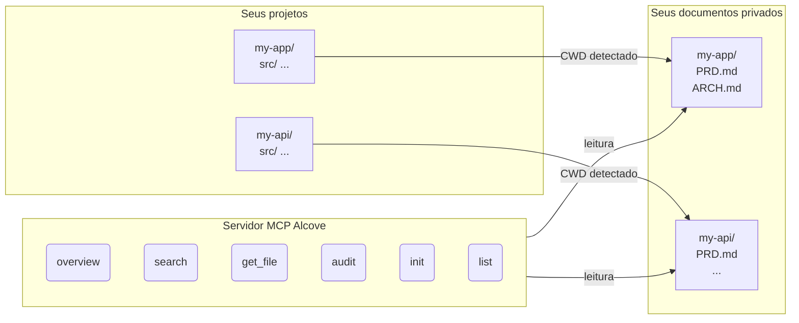

<p align="center">
  
</p>

<p align="center">Um lugar tranquilo para a documentação do seu projeto.</p>

<p align="center">
  <a href="../README.md">English</a> ·
  <a href="README.ko.md">한국어</a> ·
  <a href="README.ja.md">日本語</a> ·
  <a href="README.zh-CN.md">简体中文</a> ·
  <a href="README.es.md">Español</a> ·
  <a href="README.hi.md">हिन्दी</a> ·
  <a href="README.pt-BR.md">Português</a> ·
  <a href="README.de.md">Deutsch</a> ·
  <a href="README.fr.md">Français</a> ·
  <a href="README.ru.md">Русский</a>
</p>

<p align="center">
  <a href="https://crates.io/crates/alcove"></a>
  <a href="https://crates.io/crates/alcove"></a>
  <a href="../LICENSE"></a>
  <a href="https://buymeacoffee.com/epicsaga"></a>
</p>

Alcove é um servidor MCP que fornece aos agentes de codificação IA acesso somente leitura com escopo à documentação privada do seu projeto — sem vazar para repositórios públicos.

## O problema

Você tem documentos internos — PRDs, decisões de arquitetura, runbooks de deploy, mapas de segredos — que não devem estar no seu repositório GitHub. Mas seu agente IA não pode ajudá-lo se não conseguir lê-los.

O Alcove fica entre seus documentos privados e seus agentes IA. Ele detecta automaticamente em qual projeto você está trabalhando a partir do CWD do seu terminal, e serve apenas os documentos desse projeto através do protocolo MCP.

```
~/projects/my-app $ claude "como a autenticação está implementada?"

  → Alcove detecta o projeto: my-app
  → Lê ~/documents/my-app/ARCHITECTURE.md
  → Agente responde com contexto real do projeto
```

## Principais funcionalidades

- **Detecção automática do projeto** — baseada no CWD, sem configuração por projeto
- **Acesso com escopo** — cada projeto vê apenas seus próprios documentos
- **Privacidade por design** — documentos ficam no seu repositório local, nunca expostos
- **Auditoria entre repositórios** — encontra documentos internos acidentalmente enviados ao GitHub e sugere correções
- **Compatível com 8+ agentes** — Claude Code, Cursor, Claude Desktop, Cline, OpenCode, Codex, Antigravity, Gemini CLI

## Início rápido

```bash
cargo install alcove
alcove setup
```

É só isso. O `setup` guia você interativamente por tudo:

1. Onde seus documentos estão
2. Quais categorias de documentos rastrear
3. Formato de diagrama preferido
4. Quais agentes IA configurar (MCP + arquivos de habilidades)

Execute `alcove setup` novamente a qualquer momento para alterar configurações. Ele lembra suas escolhas anteriores.

## Instalar a partir do código fonte

```bash
git clone https://github.com/epicsagas/alcove.git
cd alcove
make install
```

## Como funciona



Seus documentos são organizados em um diretório separado (`DOCS_ROOT`). O Alcove lê de lá e serve ao seu agente IA através do protocolo stdio do MCP. Seu agente chama ferramentas como `get_doc_file("PRD.md")` e obtém respostas específicas do projeto.

## Classificação de documentos

O Alcove classifica documentos em três níveis:

| Classificação | Localização | Exemplos |
|--------------|-------------|----------|
| **doc-repo-required** | Alcove (privado) | PRD, Architecture, Decisions, Conventions |
| **doc-repo-supplementary** | Alcove (privado) | Deployment, Onboarding, Testing, Runbook |
| **project-repo** | Repositório GitHub (público) | README, CHANGELOG, CONTRIBUTING |

A ferramenta `audit` verifica ambos os locais e sugere ações — como gerar um README público a partir do seu PRD privado, ou mover relatórios mal posicionados de volta para o alcove.

## Ferramentas MCP

| Ferramenta | Função |
|-----------|--------|
| `get_project_docs_overview` | Lista todos os documentos com classificação e tamanhos |
| `search_project_docs` | Busca por palavras-chave em todos os documentos do projeto |
| `get_doc_file` | Lê um documento específico pelo caminho |
| `list_projects` | Mostra todos os projetos no repositório de documentos |
| `audit_project` | Auditoria entre repositórios com ações sugeridas |
| `init_project` | Cria estrutura de documentos para novo projeto a partir de template |

## CLI

```
alcove              Iniciar servidor MCP (agentes chamam isso)
alcove setup        Configuração interativa — re-execute a qualquer momento
alcove uninstall    Remover habilidades, configuração e arquivos legados
```

## Configuração

A configuração fica em `~/.config/alcove/config.toml`:

```toml
docs_root = "/Users/you/documents"

[core]
files = ["PRD.md", "ARCHITECTURE.md", "PROGRESS.md", "DECISIONS.md", "CONVENTIONS.md", "SECRETS_MAP.md", "DEBT.md"]

[team]
files = ["ENV_SETUP.md", "ONBOARDING.md", "DEPLOYMENT.md", "TESTING.md", ...]

[public]
files = ["README.md", "CHANGELOG.md", "CONTRIBUTING.md", "SECURITY.md", ...]

[diagram]
format = "mermaid"
```

Tudo é configurado interativamente via `alcove setup`. Você também pode editar o arquivo diretamente.

## Atualizar

```bash
cargo install alcove
```

## Desinstalar

```bash
alcove uninstall          # remover habilidades e configuração
cargo uninstall alcove    # remover binário
```

## Agentes suportados

| Agente | MCP | Habilidade |
|--------|-----|-----------|
| Claude Code | `~/.claude.json` | `~/.claude/skills/alcove/` |
| Cursor | `~/.cursor/mcp.json` | `~/.cursor/skills/alcove/` |
| Claude Desktop | configuração da plataforma | — |
| Cline (VS Code) | VS Code globalStorage | — |
| OpenCode | `~/.config/opencode/opencode.json` | `~/.opencode/skills/alcove/` |
| Codex CLI | `~/.codex/config.toml` | — |
| Antigravity | `~/.antigravity/settings.json` | — |
| Gemini CLI | `~/.gemini/settings.json` | `~/.gemini/skills/alcove/` |

## Idiomas suportados

O CLI detecta automaticamente a localidade do sistema. Você também pode substituir com a variável de ambiente `ALCOVE_LANG`.

| Idioma | Código |
|--------|--------|
| English | `en` |
| 한국어 | `ko` |
| 简体中文 | `zh-CN` |
| 日本語 | `ja` |
| Español | `es` |
| हिन्दी | `hi` |
| Português (Brasil) | `pt-BR` |
| Deutsch | `de` |
| Français | `fr` |
| Русский | `ru` |

```bash
# Substituir idioma
ALCOVE_LANG=pt-BR alcove setup
```

## Licença

Apache-2.0
