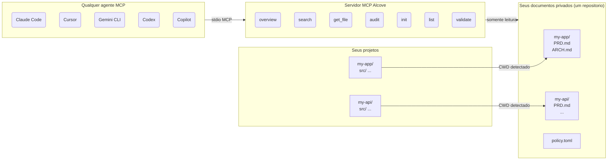

<p align="center">
  
</p>

<p align="center">Um lugar tranquilo para a documentacao do seu projeto.</p>

<p align="center">
  <a href="../README.md">English</a> ·
  <a href="README.ko.md">한국어</a> ·
  <a href="README.ja.md">日本語</a> ·
  <a href="README.zh-CN.md">简体中文</a> ·
  <a href="README.es.md">Español</a> ·
  <a href="README.hi.md">हिन्दी</a> ·
  <a href="README.pt-BR.md">Português</a> ·
  <a href="README.de.md">Deutsch</a> ·
  <a href="README.fr.md">Français</a> ·
  <a href="README.ru.md">Русский</a>
</p>

<p align="center">
  <a href="https://crates.io/crates/alcove"></a>
  <a href="https://crates.io/crates/alcove"></a>
  <a href="../LICENSE"></a>
  <a href="https://buymeacoffee.com/epicsaga"></a>
</p>

Alcove e um servidor MCP que fornece aos agentes de codificacao com IA acesso somente leitura e com escopo definido a documentacao privada do seu projeto — sem vaza-la em repositorios publicos.

## O problema

Voce esta desenvolvendo varios projetos simultaneamente, alternando entre diferentes agentes de codificacao com IA. Cada projeto tem documentos internos — PRDs, decisoes de arquitetura, runbooks de implantacao, mapas de segredos — que nao devem estar no seu repositorio publico do GitHub.

Mas seu agente de IA nao consegue te ajudar adequadamente se nao puder le-los. Ele inventa requisitos. Ignora restricoes que voce ja documentou. E toda vez que voce troca de agente ou projeto, perde o contexto.

## Como o Alcove resolve isso

O Alcove mantem todos os seus documentos privados em **um unico repositorio compartilhado**, organizado por projeto. Qualquer agente compativel com MCP os acessa da mesma forma — seja no Claude Code, Cursor, Gemini CLI ou Codex.

```
~/projects/my-app $ claude "como a autenticacao e implementada?"

  → Alcove detecta o projeto: my-app
  → Le ~/documents/my-app/ARCHITECTURE.md
  → Agente responde com o contexto real do projeto
```

```
~/projects/my-api $ codex "revise o design da API"

  → Alcove detecta o projeto: my-api
  → Mesma estrutura de documentos, mesmo padrao de acesso
  → Projeto diferente, mesmo fluxo de trabalho
```

**Troque de agente a qualquer momento. Troque de projeto a qualquer momento. A camada de documentos permanece padronizada.**

## O que ele faz

- **Um repositorio de documentos, varios projetos** — documentos privados organizados por projeto, gerenciados em um unico lugar
- **Uma configuracao, qualquer agente** — configure uma vez, todo agente compativel com MCP recebe o mesmo acesso
- **Detecta automaticamente seu projeto** a partir do CWD — sem necessidade de configuracao por projeto
- **Acesso com escopo** — cada projeto ve apenas seus proprios documentos
- **Documentos privados permanecem privados** — documentos sensiveis (mapa de segredos, decisoes internas, divida tecnica) nunca tocam seu repositorio publico
- **Estrutura de documentos padronizada** — `policy.toml` garante documentos consistentes em todos os projetos e equipes
- **Auditoria entre repositorios** — encontra documentos internos acidentalmente enviados ao GitHub, sugere correcoes
- **Validacao de documentos** — verifica arquivos ausentes, templates nao preenchidos, secoes obrigatorias
- **Funciona com mais de 9 agentes** — Claude Code, Cursor, Claude Desktop, Cline, OpenCode, Codex, Copilot, Antigravity, Gemini CLI

## Por que Alcove

| Sem Alcove | Com Alcove |
|------------|------------|
| Documentos internos espalhados entre Notion, Google Docs, arquivos locais | Um repositorio de documentos, estruturado por projeto |
| Cada agente de IA configurado separadamente para acesso a documentos | Uma configuracao, todos os agentes compartilham o mesmo acesso |
| Trocar de projeto significa perder o contexto dos documentos | Deteccao automatica por CWD, troca instantanea de projeto |
| Documentos sensiveis com risco de vazar em repositorios publicos | Documentos privados fisicamente separados dos repositorios de projeto |
| Estrutura de documentos varia por projeto e membro da equipe | `policy.toml` garante padroes em todos os projetos |
| Sem como verificar se os documentos estao completos | `validate` detecta arquivos ausentes, templates vazios, secoes faltando |

## Inicio rapido

```bash
cargo install alcove
alcove setup
```

Isso e tudo. `setup` guia voce por tudo interativamente:

1. Onde seus documentos ficam
2. Quais categorias de documentos rastrear
3. Formato de diagrama preferido
4. Quais agentes de IA configurar (MCP + arquivos de habilidades)

Execute `alcove setup` novamente a qualquer momento para alterar as configuracoes. Ele lembra das suas escolhas anteriores.

## Instalar a partir do codigo-fonte

```bash
git clone https://github.com/epicsagas/alcove.git
cd alcove
make install
```

## Como funciona



Seus documentos sao organizados em um diretorio separado (`DOCS_ROOT`), uma pasta por projeto. O Alcove le a partir dali e serve para qualquer agente de IA compativel com MCP via stdio. Seu agente chama ferramentas como `get_doc_file("PRD.md")` e obtem respostas especificas do projeto — independentemente de qual agente voce esta usando.

## Classificacao de documentos

O Alcove classifica documentos em tres niveis:

| Classificacao | Onde fica | Exemplos |
|---------------|-----------|----------|
| **doc-repo-required** | Alcove (privado) | PRD, Arquitetura, Decisoes, Convencoes |
| **doc-repo-supplementary** | Alcove (privado) | Implantacao, Integracao, Testes, Runbook |
| **project-repo** | Seu repositorio GitHub (publico) | README, CHANGELOG, CONTRIBUTING |

A ferramenta `audit` verifica ambos os locais e sugere acoes — como gerar um README publico a partir do seu PRD privado, ou mover relatorios mal posicionados de volta para o alcove.

## Ferramentas MCP

| Ferramenta | O que faz |
|------------|-----------|
| `get_project_docs_overview` | Lista todos os documentos com classificacao e tamanhos |
| `search_project_docs` | Busca por palavras-chave em todos os documentos do projeto |
| `get_doc_file` | Le um documento especifico pelo caminho |
| `list_projects` | Mostra todos os projetos no seu repositorio de documentos |
| `audit_project` | Auditoria entre repositorios com acoes sugeridas |
| `init_project` | Cria estrutura de documentos para um novo projeto a partir de template |
| `validate_docs` | Valida documentos contra a politica da equipe (`policy.toml`) |

## CLI

```
alcove              Inicia o servidor MCP (agentes chamam isso)
alcove setup        Configuracao interativa — execute novamente a qualquer momento para reconfigurar
alcove validate     Valida documentos contra a politica (--format json, --exit-code)
alcove uninstall    Remove habilidades, configuracao e arquivos legados
```

## Politica de documentos

Defina padroes de documentacao para toda a equipe com `policy.toml` no seu repositorio de documentos:

```toml
[policy]
enforce = "strict"    # strict | warn

[[policy.required]]
name = "PRD.md"
aliases = ["prd.md", "product-requirements.md"]

[[policy.required]]
name = "ARCHITECTURE.md"

  [[policy.required.sections]]
  heading = "## Overview"
  required = true

  [[policy.required.sections]]
  heading = "## Components"
  required = true
  min_items = 2
```

Arquivos de politica sao resolvidos com prioridade: **projeto** > **equipe** > **padrao**. Isso garante qualidade consistente dos documentos em todos os seus projetos, permitindo substituicoes por projeto.

## Configuracao

A configuracao fica em `~/.config/alcove/config.toml`:

```toml
docs_root = "/Users/you/documents"

[core]
files = ["PRD.md", "ARCHITECTURE.md", "PROGRESS.md", "DECISIONS.md", "CONVENTIONS.md", "SECRETS_MAP.md", "DEBT.md"]

[team]
files = ["ENV_SETUP.md", "ONBOARDING.md", "DEPLOYMENT.md", "TESTING.md", ...]

[public]
files = ["README.md", "CHANGELOG.md", "CONTRIBUTING.md", "SECURITY.md", ...]

[diagram]
format = "mermaid"
```

Tudo isso e configurado interativamente via `alcove setup`. Voce tambem pode editar o arquivo diretamente.

## Agentes suportados

| Agente | MCP | Habilidade |
|--------|-----|------------|
| Claude Code | `~/.claude.json` | `~/.claude/skills/alcove/` |
| Cursor | `~/.cursor/mcp.json` | `~/.cursor/skills/alcove/` |
| Claude Desktop | configuracao da plataforma | — |
| Cline (VS Code) | VS Code globalStorage | `~/.cline/skills/alcove/` |
| OpenCode | `~/.config/opencode/opencode.json` | `~/.opencode/skills/alcove/` |
| Codex CLI | `~/.codex/config.toml` | `~/.codex/skills/alcove/` |
| Copilot CLI | `~/.copilot/mcp-config.json` | `~/.copilot/skills/alcove/` |
| Antigravity | `~/.gemini/antigravity/mcp_config.json` | — |
| Gemini CLI | `~/.gemini/settings.json` | `~/.gemini/skills/alcove/` |

## Idiomas suportados

O CLI detecta automaticamente o locale do seu sistema. Voce tambem pode substitui-lo com a variavel de ambiente `ALCOVE_LANG`.

| Idioma | Codigo |
|--------|--------|
| English | `en` |
| 한국어 | `ko` |
| 简体中文 | `zh-CN` |
| 日本語 | `ja` |
| Español | `es` |
| हिन्दी | `hi` |
| Português (Brasil) | `pt-BR` |
| Deutsch | `de` |
| Français | `fr` |
| Русский | `ru` |

```bash
# Substituir idioma
ALCOVE_LANG=ko alcove setup
```

## Atualizar

```bash
cargo install alcove
```

## Desinstalar

```bash
alcove uninstall          # remove habilidades e configuracao
cargo uninstall alcove    # remove o binario
```

## Licenca

Apache-2.0
