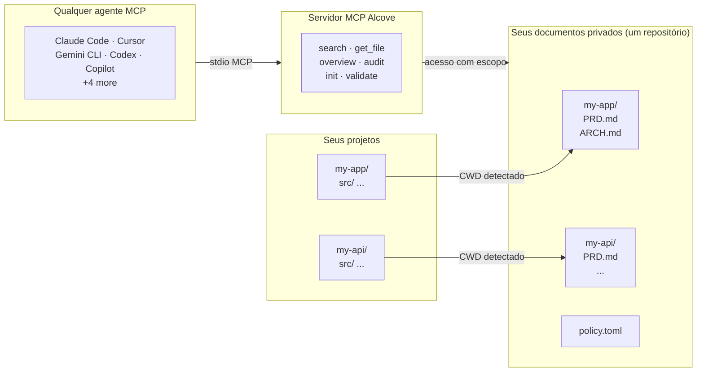

<p align="center">
  
</p>

<p align="center">Um lugar tranquilo para a documentação do seu projeto.</p>

<p align="center">
  <a href="../README.md">English</a> ·
  <a href="README.ko.md">한국어</a> ·
  <a href="README.ja.md">日本語</a> ·
  <a href="README.zh-CN.md">简体中文</a> ·
  <a href="README.es.md">Español</a> ·
  <a href="README.hi.md">हिन्दी</a> ·
  <a href="README.pt-BR.md">Português</a> ·
  <a href="README.de.md">Deutsch</a> ·
  <a href="README.fr.md">Français</a> ·
  <a href="README.ru.md">Русский</a>
</p>

<p align="center">
  <a href="https://crates.io/crates/alcove"></a>
  <a href="https://crates.io/crates/alcove"></a>
  <a href="../LICENSE"></a>
  <a href="https://buymeacoffee.com/epicsaga"></a>
</p>

O Alcove permite que qualquer agente de codificação com IA leia e gerencie a documentação privada do seu projeto — sem vazá-la em repositórios públicos.

Mantenha PRDs, decisões de arquitetura, mapas de segredos e runbooks internos em um só lugar. Todo agente compatível com MCP recebe as mesmas ferramentas, em todos os projetos, sem configuração por projeto.

## O problema

Você tem documentos internos que não devem estar no seu repositório público do GitHub. Mas seu agente de IA não consegue te ajudar adequadamente se não puder lê-los — ele inventa requisitos e ignora restrições que você já documentou.

Multiplique isso por vários projetos e vários agentes. Cada um tem configuração diferente. Toda vez que você troca, perde o contexto. E não existe uma forma padrão de organizar ou validar nada disso.

## Como o Alcove resolve isso

O Alcove mantém todos os seus documentos privados em **um único repositório compartilhado**, organizado por projeto. Qualquer agente compatível com MCP os acessa da mesma forma — seja no Claude Code, Cursor, Gemini CLI ou Codex.

```
~/projects/my-app $ claude "como a autenticação é implementada?"

  → Alcove detecta o projeto: my-app
  → Lê ~/documents/my-app/ARCHITECTURE.md
  → Agente responde com o contexto real do projeto
```

```
~/projects/my-api $ codex "revise o design da API"

  → Alcove detecta o projeto: my-api
  → Mesma estrutura de documentos, mesmo padrão de acesso
  → Projeto diferente, mesmo fluxo de trabalho
```

**Troque de agente a qualquer momento. Troque de projeto a qualquer momento. A camada de documentos permanece padronizada.**

## O que ele faz

- **Um repositório de documentos, vários projetos** — documentos privados organizados por projeto, gerenciados em um único lugar
- **Uma configuração, qualquer agente** — configure uma vez, todo agente compatível com MCP recebe o mesmo acesso
- **Detecta automaticamente seu projeto** a partir do CWD — sem necessidade de configuração por projeto
- **Acesso com escopo** — cada projeto vê apenas seus próprios documentos
- **Busca inteligente** — busca BM25 com ranking e indexação automática; encontra os documentos mais relevantes primeiro, recorre ao grep quando necessário
- **Busca entre projetos** — busque em todos os projetos de uma vez com `scope: "global"` — use como base de conhecimento pessoal
- **Documentos privados permanecem privados** — documentos sensíveis (mapa de segredos, decisões internas, dívida técnica) nunca tocam seu repositório público
- **Estrutura de documentos padronizada** — `policy.toml` garante documentos consistentes em todos os projetos e equipes
- **Auditoria entre repositórios** — encontra documentos internos mal posicionados no repositório do projeto, sugere correções
- **Validação de documentos** — verifica arquivos ausentes, templates não preenchidos, seções obrigatórias
- **Funciona com mais de 9 agentes** — Claude Code, Cursor, Claude Desktop, Cline, OpenCode, Codex, Copilot, Antigravity, Gemini CLI

## Por que Alcove

| Sem Alcove | Com Alcove |
|------------|------------|
| Documentos internos espalhados entre Notion, Google Docs, arquivos locais | Um repositório de documentos, estruturado por projeto |
| Cada agente de IA configurado separadamente para acesso a documentos | Uma configuração, todos os agentes compartilham o mesmo acesso |
| Trocar de projeto significa perder o contexto dos documentos | Detecção automática por CWD, troca instantânea de projeto |
| Buscas do agente retornam linhas aleatórias | Busca BM25 com ranking — melhores correspondências primeiro, indexação automática |
| "Buscar todas as minhas notas sobre autenticação" — impossível | Busca global em todos os projetos em uma única consulta |
| Documentos sensíveis com risco de vazar em repositórios públicos | Documentos privados fisicamente separados dos repositórios de projeto |
| Estrutura de documentos varia por projeto e membro da equipe | `policy.toml` garante padrões em todos os projetos |
| Sem como verificar se os documentos estão completos | `validate` detecta arquivos ausentes, templates vazios, seções faltando |

## Início rápido

```bash
cargo install alcove
alcove setup
```

Isso é tudo. `setup` guia você por tudo interativamente:

1. Onde seus documentos ficam
2. Quais categorias de documentos rastrear
3. Formato de diagrama preferido
4. Quais agentes de IA configurar (MCP + arquivos de habilidades)

Execute `alcove setup` novamente a qualquer momento para alterar as configurações. Ele lembra das suas escolhas anteriores.

## Instalar a partir do código-fonte

```bash
git clone https://github.com/epicsagas/alcove.git
cd alcove
make install
```

## Como funciona



Seus documentos são organizados em um diretório separado (`DOCS_ROOT`), uma pasta por projeto. O Alcove gerencia os documentos lá e os serve para qualquer agente de IA compatível com MCP via stdio. Seu agente chama ferramentas como `get_doc_file("PRD.md")` e obtém respostas específicas do projeto — independentemente de qual agente você está usando.

## Classificação de documentos

O Alcove classifica documentos nos seguintes níveis:

| Classificação | Onde fica | Exemplos |
|---------------|-----------|----------|
| **doc-repo-required** | Alcove (privado) | PRD, Arquitetura, Decisões, Convenções |
| **doc-repo-supplementary** | Alcove (privado) | Implantação, Integração, Testes, Runbook |
| **reference** | Alcove pasta `reports/` | Relatórios de auditoria, benchmarks, análises |
| **project-repo** | Seu repositório GitHub (público) | README, CHANGELOG, CONTRIBUTING |

A ferramenta `audit` escaneia o repositório de documentos e o diretório local do projeto, e sugere ações — como gerar um README público a partir do seu PRD privado, ou mover relatórios mal posicionados de volta para o alcove.

## Ferramentas MCP

| Ferramenta | O que faz |
|------------|-----------|
| `get_project_docs_overview` | Lista todos os documentos com classificação e tamanhos |
| `search_project_docs` | Busca inteligente — seleciona automaticamente BM25 com ranking ou grep, suporta `scope: "global"` para busca entre projetos |
| `get_doc_file` | Lê um documento específico pelo caminho (suporta `offset`/`limit` para arquivos grandes) |
| `list_projects` | Mostra todos os projetos no seu repositório de documentos |
| `audit_project` | Auditoria entre repositórios — escaneia o repo de documentos e o projeto local, sugere ações |
| `init_project` | Cria estrutura de documentos para um novo projeto (documentos internos+externos, criação seletiva) |
| `validate_docs` | Valida documentos contra a política da equipe (`policy.toml`) |
| `rebuild_index` | Reconstrói o índice de busca de texto completo (normalmente automático) |

## CLI

```
alcove              Inicia o servidor MCP (agentes chamam isso)
alcove setup        Configuração interativa — execute novamente a qualquer momento para reconfigurar
alcove validate     Valida documentos contra a política (--format json, --exit-code)
alcove index        Constrói ou reconstrói o índice de busca
alcove search       Busca documentos pelo terminal
alcove uninstall    Remove habilidades, configuração e arquivos legados
```

## Busca

O Alcove seleciona automaticamente a melhor estratégia de busca. Quando o índice de busca existe, usa **busca BM25 com ranking** (baseada em [tantivy](https://github.com/quickwit-oss/tantivy)) para resultados ordenados por relevância. Quando não existe, recorre ao grep. Você nunca precisa pensar nisso.

```bash
# Buscar no projeto atual (auto-detectado pelo CWD)
alcove search "authentication flow"

# Buscar em TODOS os projetos — sua base de conhecimento pessoal
alcove search "OAuth token refresh" --scope global

# Forçar modo grep se precisar de correspondência exata de substrings
alcove search "FR-023" --mode grep
```

O índice é construído automaticamente em segundo plano quando o servidor MCP inicia, e reconstruído quando detecta mudanças nos arquivos. Sem cron jobs, sem etapas manuais.

**Como funciona para agentes:** agentes simplesmente chamam `search_project_docs` com uma consulta. O Alcove cuida do resto — ranking, deduplicação (um resultado por arquivo), busca entre projetos e fallback. O agente nunca precisa escolher um modo de busca.

## Detecção de projeto

Por padrão, o Alcove detecta o projeto atual a partir do diretório de trabalho do seu terminal (CWD). Você pode sobrescrever com a variável de ambiente `MCP_PROJECT_NAME`:

```bash
MCP_PROJECT_NAME=my-api alcove
```

Útil quando seu CWD não corresponde a um nome de projeto no seu repositório de documentos.

## Política de documentos

Defina padrões de documentação para toda a equipe com `policy.toml` no seu repositório de documentos:

```toml
[policy]
enforce = "strict"    # strict | warn

[[policy.required]]
name = "PRD.md"
aliases = ["prd.md", "product-requirements.md"]

[[policy.required]]
name = "ARCHITECTURE.md"

  [[policy.required.sections]]
  heading = "## Overview"
  required = true

  [[policy.required.sections]]
  heading = "## Components"
  required = true
  min_items = 2
```

Arquivos de política são resolvidos com prioridade: **projeto** (`<project>/.alcove/policy.toml`) > **equipe** (`DOCS_ROOT/.alcove/policy.toml`) > **padrão integrado** (lista de arquivos core do config.toml). Isso garante qualidade consistente dos documentos em todos os seus projetos, permitindo substituições por projeto.

## Configuração

A configuração fica em `~/.config/alcove/config.toml`:

```toml
docs_root = "/Users/you/documents"

[core]
files = ["PRD.md", "ARCHITECTURE.md", "PROGRESS.md", "DECISIONS.md", "CONVENTIONS.md", "SECRETS_MAP.md", "DEBT.md"]

[team]
files = ["ENV_SETUP.md", "ONBOARDING.md", "DEPLOYMENT.md", "TESTING.md", ...]

[public]
files = ["README.md", "CHANGELOG.md", "CONTRIBUTING.md", "SECURITY.md", ...]

[diagram]
format = "mermaid"
```

Tudo isso é configurado interativamente via `alcove setup`. Você também pode editar o arquivo diretamente.

## Agentes suportados

| Agente | MCP | Habilidade |
|--------|-----|------------|
| Claude Code | `~/.claude.json` | `~/.claude/skills/alcove/` |
| Cursor | `~/.cursor/mcp.json` | `~/.cursor/skills/alcove/` |
| Claude Desktop | configuração da plataforma | — |
| Cline (VS Code) | VS Code globalStorage | `~/.cline/skills/alcove/` |
| OpenCode | `~/.config/opencode/opencode.json` | `~/.opencode/skills/alcove/` |
| Codex CLI | `~/.codex/config.toml` | `~/.codex/skills/alcove/` |
| Copilot CLI | `~/.copilot/mcp-config.json` | `~/.copilot/skills/alcove/` |
| Antigravity | `~/.gemini/antigravity/mcp_config.json` | — |
| Gemini CLI | `~/.gemini/settings.json` | `~/.gemini/skills/alcove/` |

## Idiomas suportados

O CLI detecta automaticamente o locale do seu sistema. Você também pode substituí-lo com a variável de ambiente `ALCOVE_LANG`.

| Idioma | Código |
|--------|--------|
| English | `en` |
| 한국어 | `ko` |
| 简体中文 | `zh-CN` |
| 日本語 | `ja` |
| Español | `es` |
| हिन्दी | `hi` |
| Português (Brasil) | `pt-BR` |
| Deutsch | `de` |
| Français | `fr` |
| Русский | `ru` |

```bash
# Substituir idioma
ALCOVE_LANG=pt-BR alcove setup
```

## Atualizar

```bash
cargo install alcove
```

## Desinstalar

```bash
alcove uninstall          # remove habilidades e configuração
cargo uninstall alcove    # remove o binário
```

## Licença

Apache-2.0
