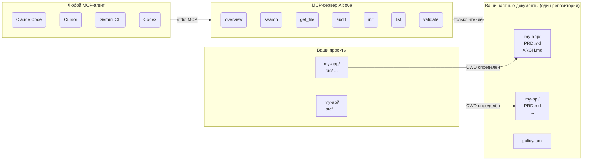

<p align="center">
  
</p>

<p align="center">Тихое место для документации вашего проекта.</p>

<p align="center">
  <a href="../README.md">English</a> ·
  <a href="README.ko.md">한국어</a> ·
  <a href="README.ja.md">日本語</a> ·
  <a href="README.zh-CN.md">简体中文</a> ·
  <a href="README.es.md">Español</a> ·
  <a href="README.hi.md">हिन्दी</a> ·
  <a href="README.pt-BR.md">Português</a> ·
  <a href="README.de.md">Deutsch</a> ·
  <a href="README.fr.md">Français</a> ·
  <a href="README.ru.md">Русский</a>
</p>

<p align="center">
  <a href="https://crates.io/crates/alcove"></a>
  <a href="https://crates.io/crates/alcove"></a>
  <a href="../LICENSE"></a>
  <a href="https://buymeacoffee.com/epicsaga"></a>
</p>

Alcove — это MCP-сервер, который предоставляет ИИ-агентам для кодирования ограниченный доступ только для чтения к документации вашего частного проекта — без утечки в публичные репозитории.

## Проблема

Вы одновременно разрабатываете несколько проектов, переключаясь между различными ИИ-агентами для кодирования. У каждого проекта есть внутренние документы — PRD, архитектурные решения, руководства по развёртыванию, карты секретов — которые не должны находиться в вашем публичном GitHub-репозитории.

Но ваш ИИ-агент не может помочь вам как следует, если не может их прочитать. Он выдумывает требования. Он игнорирует ограничения, которые вы уже задокументировали. И каждый раз при смене агента или проекта контекст теряется.

## Как Alcove решает эту проблему

Alcove хранит все ваши частные документы в **одном общем репозитории**, организованном по проектам. Любой MCP-совместимый агент обращается к ним одинаково — будь то Claude Code, Cursor, Gemini CLI или Codex.

```
~/projects/my-app $ claude "как реализована аутентификация?"

  → Alcove определяет проект: my-app
  → Читает ~/documents/my-app/ARCHITECTURE.md
  → Агент отвечает с реальным контекстом проекта
```

```
~/projects/my-api $ codex "проверь дизайн API"

  → Alcove определяет проект: my-api
  → Та же структура документов, тот же паттерн доступа
  → Другой проект, тот же рабочий процесс
```

**Меняйте агентов в любой момент. Меняйте проекты в любой момент. Документальный слой остаётся стандартизированным.**

## Основные возможности

- **Один репозиторий документов, несколько проектов** — частные документы организованы по проектам, управляются в одном месте
- **Одна настройка, любой агент** — настройте один раз, каждый MCP-совместимый агент получает одинаковый доступ
- **Автоопределение проекта** по CWD — без настройки для каждого проекта
- **Ограниченный доступ** — каждый проект видит только свои документы
- **Частные документы остаются частными** — конфиденциальные документы (карта секретов, внутренние решения, технический долг) никогда не попадают в публичный репозиторий
- **Стандартизированная структура документов** — `policy.toml` обеспечивает единообразие документов во всех проектах и командах
- **Кросс-репозиторный аудит** — находит внутренние документы, случайно отправленные на GitHub, и предлагает исправления
- **Валидация документов** — проверяет отсутствующие файлы, незаполненные шаблоны, обязательные разделы
- **Работает с 8+ агентами** — Claude Code, Cursor, Claude Desktop, Cline, OpenCode, Codex, Antigravity, Gemini CLI

## Почему Alcove

| Без Alcove | С Alcove |
|------------|----------|
| Внутренние документы разбросаны по Notion, Google Docs, локальным файлам | Один репозиторий документов, структурированный по проектам |
| Каждый ИИ-агент настраивается отдельно для доступа к документам | Одна настройка, все агенты разделяют одинаковый доступ |
| Смена проекта означает потерю документального контекста | Автоопределение по CWD, мгновенное переключение проекта |
| Конфиденциальные документы рискуют утечь в публичные репозитории | Частные документы физически отделены от репозиториев проектов |
| Структура документов различается у каждого проекта и члена команды | `policy.toml` обеспечивает стандарты во всех проектах |
| Нет способа проверить, полны ли документы | `validate` обнаруживает отсутствующие файлы, пустые шаблоны, недостающие разделы |

## Быстрый старт

```bash
cargo install alcove
alcove setup
```

Вот и всё. `setup` проведёт вас через всё интерактивно:

1. Где находятся ваши документы
2. Какие категории документов отслеживать
3. Предпочтительный формат диаграмм
4. Какие ИИ-агенты настроить (MCP + файлы навыков)

Перезапустите `alcove setup` в любое время для изменения настроек. Он запоминает ваши предыдущие выборы.

## Установка из исходников

```bash
git clone https://github.com/epicsagas/alcove.git
cd alcove
make install
```

## Как это работает



Документы организованы в отдельном каталоге (`DOCS_ROOT`), по одной папке на проект. Alcove читает оттуда и передаёт любому MCP-совместимому ИИ-агенту через stdio. Ваш агент вызывает инструменты вроде `get_doc_file("PRD.md")` и получает ответы, специфичные для проекта — независимо от того, какой агент используется.

## Классификация документов

Alcove классифицирует документы на три уровня:

| Классификация | Расположение | Примеры |
|--------------|-------------|---------|
| **doc-repo-required** | Alcove (частный) | PRD, Architecture, Decisions, Conventions |
| **doc-repo-supplementary** | Alcove (частный) | Deployment, Onboarding, Testing, Runbook |
| **project-repo** | GitHub-репозиторий (публичный) | README, CHANGELOG, CONTRIBUTING |

Инструмент `audit` проверяет оба расположения и предлагает действия — например, создание публичного README из вашего частного PRD или перенос неправильно размещённых отчётов обратно в alcove.

## Инструменты MCP

| Инструмент | Функция |
|-----------|---------|
| `get_project_docs_overview` | Список всех документов с классификацией и размерами |
| `search_project_docs` | Поиск по ключевым словам во всех документах проекта |
| `get_doc_file` | Чтение конкретного документа по пути |
| `list_projects` | Показать все проекты в хранилище документов |
| `audit_project` | Кросс-репозиторный аудит с предложенными действиями |
| `init_project` | Создание структуры документов для нового проекта из шаблона |
| `validate_docs` | Валидация документов по командной политике (`policy.toml`) |

## CLI

```
alcove              Запустить MCP-сервер (агенты вызывают это)
alcove setup        Интерактивная настройка — перезапустите для переконфигурации
alcove validate     Валидация документов по политике (--format json, --exit-code)
alcove uninstall    Удалить навыки, конфигурацию и устаревшие файлы
```

## Политика документов

Определите командные стандарты документации с помощью `policy.toml` в вашем хранилище документов:

```toml
[policy]
enforce = "strict"    # strict | warn

[[policy.required]]
name = "PRD.md"
aliases = ["prd.md", "product-requirements.md"]

[[policy.required]]
name = "ARCHITECTURE.md"

  [[policy.required.sections]]
  heading = "## Overview"
  required = true

  [[policy.required.sections]]
  heading = "## Components"
  required = true
  min_items = 2
```

Файлы политики разрешаются с приоритетом: **проект** > **команда** > **по умолчанию**. Это обеспечивает единообразное качество документов во всех проектах, позволяя при этом переопределения на уровне проекта.

## Конфигурация

Конфигурация находится в `~/.config/alcove/config.toml`:

```toml
docs_root = "/Users/you/documents"

[core]
files = ["PRD.md", "ARCHITECTURE.md", "PROGRESS.md", "DECISIONS.md", "CONVENTIONS.md", "SECRETS_MAP.md", "DEBT.md"]

[team]
files = ["ENV_SETUP.md", "ONBOARDING.md", "DEPLOYMENT.md", "TESTING.md", ...]

[public]
files = ["README.md", "CHANGELOG.md", "CONTRIBUTING.md", "SECURITY.md", ...]

[diagram]
format = "mermaid"
```

Все настройки выполняются интерактивно через `alcove setup`. Вы также можете редактировать файл напрямую.

## Поддерживаемые агенты

| Агент | MCP | Навык |
|-------|-----|-------|
| Claude Code | `~/.claude.json` | `~/.claude/skills/alcove/` |
| Cursor | `~/.cursor/mcp.json` | `~/.cursor/skills/alcove/` |
| Claude Desktop | конфигурация платформы | — |
| Cline (VS Code) | VS Code globalStorage | — |
| OpenCode | `~/.config/opencode/opencode.json` | `~/.opencode/skills/alcove/` |
| Codex CLI | `~/.codex/config.toml` | — |
| Antigravity | `~/.antigravity/settings.json` | — |
| Gemini CLI | `~/.gemini/settings.json` | `~/.gemini/skills/alcove/` |

## Поддерживаемые языки

CLI автоматически определяет локаль вашей системы. Вы также можете переопределить её с помощью переменной окружения `ALCOVE_LANG`.

| Язык | Код |
|------|-----|
| English | `en` |
| 한국어 | `ko` |
| 简体中文 | `zh-CN` |
| 日本語 | `ja` |
| Español | `es` |
| हिन्दी | `hi` |
| Português (Brasil) | `pt-BR` |
| Deutsch | `de` |
| Français | `fr` |
| Русский | `ru` |

```bash
# Переопределить язык
ALCOVE_LANG=ru alcove setup
```

## Обновление

```bash
cargo install alcove
```

## Удаление

```bash
alcove uninstall          # удалить навыки и конфигурацию
cargo uninstall alcove    # удалить бинарный файл
```

## Лицензия

Apache-2.0
