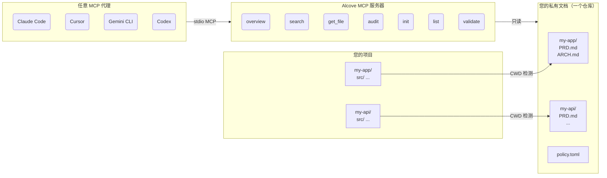

<p align="center">
  
</p>

<p align="center">项目文档的安静之所。</p>

<p align="center">
  <a href="../README.md">English</a> ·
  <a href="README.ko.md">한국어</a> ·
  <a href="README.ja.md">日本語</a> ·
  <a href="README.zh-CN.md">简体中文</a> ·
  <a href="README.es.md">Español</a> ·
  <a href="README.hi.md">हिन्दी</a> ·
  <a href="README.pt-BR.md">Português</a> ·
  <a href="README.de.md">Deutsch</a> ·
  <a href="README.fr.md">Français</a> ·
  <a href="README.ru.md">Русский</a>
</p>

<p align="center">
  <a href="https://crates.io/crates/alcove"></a>
  <a href="https://crates.io/crates/alcove"></a>
  <a href="../LICENSE"></a>
  <a href="https://buymeacoffee.com/epicsaga"></a>
</p>

Alcove 是一个 MCP 服务器，为 AI 编码代理提供对私有项目文档的范围化只读访问权限——不会将文档泄露到公共仓库中。

## 问题所在

您同时开发多个项目，在不同的 AI 编码代理之间来回切换。每个项目都有内部文档——PRD、架构决策、部署手册、密钥映射——这些不应该存在于公开的 GitHub 仓库中。

但如果 AI 代理无法读取这些文档，就无法正确帮助您。它会凭空编造需求，忽略您已经记录的约束条件。而且每次切换代理或项目时，都会丢失上下文。

## Alcove 如何解决这个问题

Alcove 将所有私有文档保存在**一个共享仓库**中，按项目组织。任何兼容 MCP 的代理都以相同方式访问它们——无论您使用的是 Claude Code、Cursor、Gemini CLI 还是 Codex。

```
~/projects/my-app $ claude "认证是如何实现的？"

  → Alcove 检测项目：my-app
  → 读取 ~/documents/my-app/ARCHITECTURE.md
  → 代理使用实际项目上下文回答
```

```
~/projects/my-api $ codex "审查 API 设计"

  → Alcove 检测项目：my-api
  → 相同的文档结构，相同的访问模式
  → 不同的项目，相同的工作流
```

**随时切换代理。随时切换项目。文档层保持标准化。**

## 主要功能

- **一个文档仓库，多个项目** —— 私有文档按项目组织，集中管理
- **一次设置，任意代理** —— 配置一次，所有兼容 MCP 的代理获得相同的访问权限
- **基于 CWD 自动检测项目** —— 无需每个项目单独配置
- **范围化访问** —— 每个项目只能看到自己的文档
- **私有文档保持私密** —— 敏感文档（密钥映射、内部决策、技术债务）永远不会进入公共仓库
- **标准化文档结构** —— `policy.toml` 在所有项目和团队中强制执行一致的文档规范
- **跨仓库审计** —— 发现意外推送到 GitHub 的内部文档并建议修复
- **文档验证** —— 检查缺失文件、未填充模板、必需章节
- **支持 8+ 个代理** —— Claude Code、Cursor、Claude Desktop、Cline、OpenCode、Codex、Antigravity、Gemini CLI

## 为什么选择 Alcove

| 没有 Alcove | 使用 Alcove |
|-------------|-------------|
| 内部文档分散在 Notion、Google Docs、本地文件中 | 一个文档仓库，按项目结构化 |
| 每个 AI 代理需要单独配置文档访问 | 一次设置，所有代理共享相同的访问权限 |
| 切换项目意味着丢失文档上下文 | CWD 自动检测，即时切换项目 |
| 敏感文档有泄露到公共仓库的风险 | 私有文档与项目仓库物理隔离 |
| 文档结构因项目和团队成员而异 | `policy.toml` 在所有项目中强制执行标准 |
| 无法检查文档是否完整 | `validate` 捕获缺失文件、空模板、缺失章节 |

## 快速开始

```bash
cargo install alcove
alcove setup
```

就这么简单。`setup` 以交互方式引导您完成所有设置：

1. 文档存放位置
2. 要跟踪的文档类别
3. 首选图表格式
4. 要配置的 AI 代理（MCP + 技能文件）

随时重新运行 `alcove setup` 来更改设置。它会记住您之前的选择。

## 从源码安装

```bash
git clone https://github.com/epicsagas/alcove.git
cd alcove
make install
```

## 工作原理



文档组织在单独的目录（`DOCS_ROOT`）中，每个项目一个文件夹。Alcove 从那里读取并通过 stdio 提供给任何兼容 MCP 的 AI 代理。代理调用 `get_doc_file("PRD.md")` 等工具来获取项目特定的回答——无论您使用的是哪个代理。

## 文档分类

Alcove 将文档分为三个层级：

| 分类 | 位置 | 示例 |
|------|------|------|
| **doc-repo-required** | Alcove（私有） | PRD, Architecture, Decisions, Conventions |
| **doc-repo-supplementary** | Alcove（私有） | Deployment, Onboarding, Testing, Runbook |
| **project-repo** | GitHub 仓库（公开） | README, CHANGELOG, CONTRIBUTING |

`audit` 工具检查两个位置并建议操作——例如从私有 PRD 生成公开 README，或将错误放置的报告移回 alcove。

## MCP 工具

| 工具 | 功能 |
|------|------|
| `get_project_docs_overview` | 列出所有文档及其分类和大小 |
| `search_project_docs` | 跨所有项目文档进行关键词搜索 |
| `get_doc_file` | 按路径读取特定文档 |
| `list_projects` | 显示文档仓库中的所有项目 |
| `audit_project` | 跨仓库审计并建议操作 |
| `init_project` | 从模板为新项目创建文档框架 |
| `validate_docs` | 根据团队策略（`policy.toml`）验证文档 |

## CLI

```
alcove              启动 MCP 服务器（代理调用）
alcove setup        交互式设置——随时重新运行以重新配置
alcove validate     根据策略验证文档（--format json, --exit-code）
alcove uninstall    移除技能、配置和遗留文件
```

## 文档策略

在文档仓库的 `policy.toml` 中定义团队级文档标准：

```toml
[policy]
enforce = "strict"    # strict | warn | off

[[policy.required_docs]]
file = "PRD.md"
aliases = ["prd.md", "product-requirements.md"]

[[policy.required_docs]]
file = "ARCHITECTURE.md"
sections = [
  { heading = "## Overview" },
  { heading = "## Components", min_items = 2 },
]
```

策略文件按优先级解析：**项目** > **团队** > **默认**。这确保了所有项目具有一致的文档质量，同时允许按项目进行覆盖。

## 配置

配置文件位于 `~/.config/alcove/config.toml`：

```toml
docs_root = "/Users/you/documents"

[core]
files = ["PRD.md", "ARCHITECTURE.md", "PROGRESS.md", "DECISIONS.md", "CONVENTIONS.md", "SECRETS_MAP.md", "DEBT.md"]

[team]
files = ["ENV_SETUP.md", "ONBOARDING.md", "DEPLOYMENT.md", "TESTING.md", ...]

[public]
files = ["README.md", "CHANGELOG.md", "CONTRIBUTING.md", "SECURITY.md", ...]

[diagram]
format = "mermaid"
```

所有设置都可通过 `alcove setup` 交互式完成。您也可以直接编辑文件。

## 支持的代理

| 代理 | MCP | 技能 |
|------|-----|------|
| Claude Code | `~/.claude.json` | `~/.claude/skills/alcove/` |
| Cursor | `~/.cursor/mcp.json` | `~/.cursor/skills/alcove/` |
| Claude Desktop | 平台配置 | — |
| Cline (VS Code) | VS Code globalStorage | — |
| OpenCode | `~/.config/opencode/opencode.json` | `~/.opencode/skills/alcove/` |
| Codex CLI | `~/.codex/config.toml` | — |
| Antigravity | `~/.antigravity/settings.json` | — |
| Gemini CLI | `~/.gemini/settings.json` | `~/.gemini/skills/alcove/` |

## 支持的语言

CLI 会自动检测系统区域设置。您也可以使用 `ALCOVE_LANG` 环境变量覆盖。

| 语言 | 代码 |
|------|------|
| English | `en` |
| 한국어 | `ko` |
| 简体中文 | `zh-CN` |
| 日本語 | `ja` |
| Español | `es` |
| हिन्दी | `hi` |
| Português (Brasil) | `pt-BR` |
| Deutsch | `de` |
| Français | `fr` |
| Русский | `ru` |

```bash
# 覆盖语言
ALCOVE_LANG=zh-CN alcove setup
```

## 更新

```bash
cargo install alcove
```

## 卸载

```bash
alcove uninstall          # 移除技能和配置
cargo uninstall alcove    # 移除二进制文件
```

## 许可证

Apache-2.0
