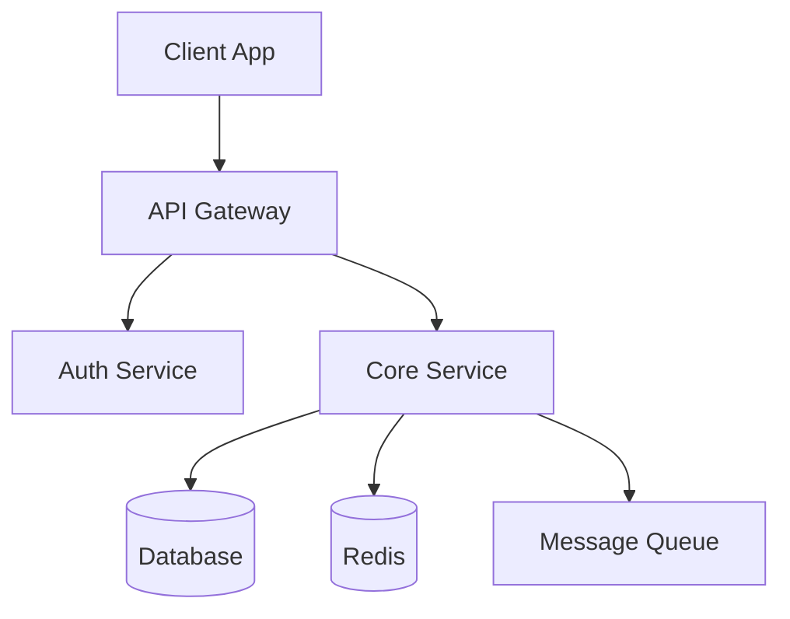
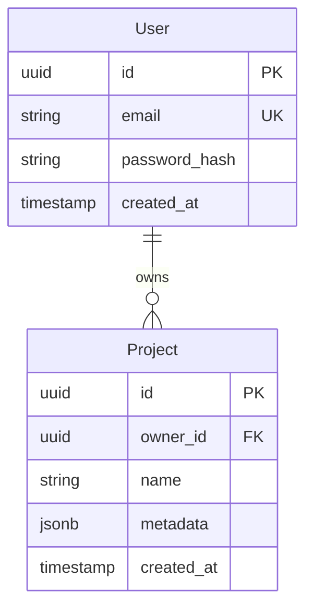

# ProjectName — Architecture

> **Version**: 0.1.0
> **Updated**: 2026-03-06

## Overview

<!-- High-level system diagram. Agents use this to understand component boundaries. -->



## Tech Stack

| Layer | Technology | Version | Rationale |
|-------|-----------|---------|-----------|
| Language | Rust | 1.82+ | Performance, memory safety |
| Framework | Axum | 0.8+ | Async, type-safe routing |
| Database | PostgreSQL | 16+ | JSONB, extensibility |
| Cache | Redis | 7+ | Session, caching |
| Message Queue | NATS | 2.10+ | Lightweight, high throughput |

## Directory Structure

```
src/
├── main.rs              # Entrypoint
├── config/              # Environment configuration
│   └── mod.rs
├── api/                 # HTTP handlers
│   ├── mod.rs
│   ├── routes.rs
│   └── middleware/
├── domain/              # Business logic
│   ├── models/
│   └── services/
├── infra/               # External integrations
│   ├── db/
│   ├── cache/
│   └── queue/
└── errors/              # Error type definitions
    └── mod.rs
```

## Data Model



## API Design

### Authentication

| Method | Endpoint | Description |
|--------|----------|-------------|
| POST | `/auth/register` | User registration |
| POST | `/auth/login` | Login, issue JWT |
| POST | `/auth/refresh` | Token renewal |

### Core Resources

| Method | Endpoint | Description |
|--------|----------|-------------|
| GET | `/projects` | List with pagination |
| POST | `/projects` | Create |
| GET | `/projects/:id` | Get by ID |
| PATCH | `/projects/:id` | Partial update |
| DELETE | `/projects/:id` | Delete |

## Key Design Decisions

<!-- Summary only. Move detailed rationale to DECISIONS.md if needed. -->

| Decision | Options | Choice | Rationale |
|----------|---------|--------|-----------|
| Database | PostgreSQL vs SQLite | PostgreSQL | Concurrency, JSONB support |
| Auth | Session vs JWT | JWT | Stateless, microservice-ready |
| Architecture | Monolith vs MSA | Modular Monolith | Minimize initial complexity, split later |

## Error Handling

```
AppError
├── Auth(AuthError)         → 401, 403
├── Validation(String)      → 400
├── NotFound(String)        → 404
├── Database(sqlx::Error)   → 500
└── Internal(anyhow::Error) → 500
```

## Security

- JWT RS256 signing: access token 15min / refresh token 7d
- Password hashing: Argon2id
- Rate limiting: 100 req/min per IP
- CORS: explicit origin allowlist
- SQL injection prevention: sqlx query bindings only
